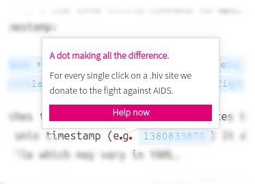

December 1st is World AIDS Day and we have prepared something for your homepage
which will support our cause in an unobtrusive and witty way: **turn the
fullstops of your page into pink dots**.

Our friends from [SinnerSchrader](http://sinnerschrader.hiv/) built a script
which once integrated into your site will color a random amount of dots inside
your text elements on the page in pink. If a user clicks on a dot, a little
popup will show up with a short info text and a link to
[click4life.hiv](http://click4life.hiv/). You'll find some of those pink dots in
this text, too.

Head over to [mydotfor.hiv/dothivify](http://mydotfor.hiv/dothivify/) to
download the script. They even built a configurator to adapt the script to your
needs. Afterwards you need to add it to your websites source code, just before
the `</body>` tag. **Make sure to test it**–as with all software there might be
bugs.

As always with our projects at dotHIV the source code
[is available at GitHub](https://github.com/dothiv/dothivify).

Please let me know in the comments or by your
[preferred means of communication](https://coderbyheart.com/) once you've got
the script running.

Thank your for supporting [dotHIV](http://click4life.hiv/)!
