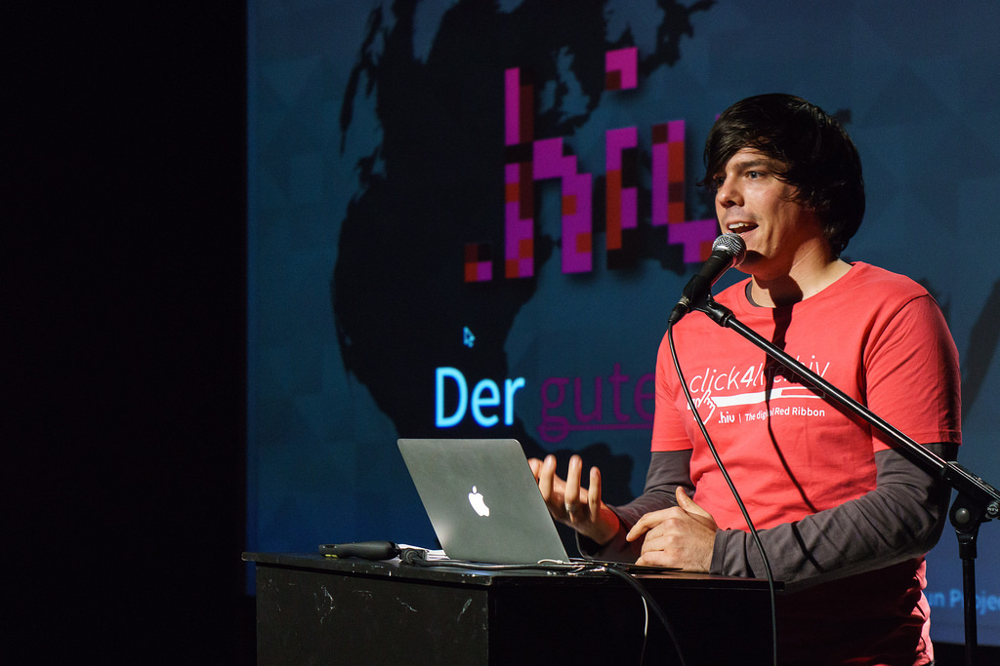

Over 1,500 working hours will have been logged to my time-tracking tool when I
push the last commit to [our repository](https://github.com/dothiv) end of
March 2015. Those 1,500 hours were in part the most fulfilling time I spent
working I ever–or are you able to claim to be writing code for something that
literally will save people's lives? So it comes with a little sadness that we
won't be able to work on [dotHIV](https://click4life.hiv/) how we used to …

This means: from April 1st 2015 I'm available to join a new team where I can
craft software, my leadership skills to the organization and my wit to the daily
stand-up.

I used to work as a freelancer, but having been part of an amazing team provides
something that is missing if you are a keyboard for hire: relationships and
colleagues–which is equally important to me as being able to work remotely from
a [coworking space](http://die-zentrale-ffm.de/).

I'm looking to join a team as a lead-developer or CTO because I know that I can
contribute more than S.O.L.I.D. code and software that is deployable
everyday–even on fridays. I believe that there are better ways to work than
building waterfall projects in open plan offices and I can help you transform
not only the way you build software but how you talk to your clients.

I did join dotHIV last year because I wanted to build a project that has a
purpose and serves a real need–not some made up first-world problem. This is
still true and this is what I will ask you when we talk: **Why does working at
your company matter?**

And while we are at it … these are some of the questions we'll talk about. They
should give you feeling about what I am looking for in an employer:

- Do you have defined your core values and mission statement?
- Do you default to transparency?
- Are the employees responsible for business critical decisions?
- Do you do regular team events (OpenSpaces, Hackathons, Code Retreats)?
- Do your employees have personal development goals and do you review them on a
  regular basis?
- Do you have a mentorship / sponsor program?
- Do you do estimates for waterfall projects?
- Can I choose my own hardware?
- Do you have unlimited vacation days?
- How large is the conference budget for employees?
- Do you default to remote work?
- Do you support contributions to open source software?
- Can you deploy on a daily basis?

Learn more about me at these sites and if you think I could be a match for your
team, [talk to me](mailto:m@coderbyheart.com).

- [LinkedIn profile](https://www.linkedin.com/in/markustacker)
- [GitHub profile](https://github.com/coderbyheart)
- [Angel.co profile](https://angel.co/coderbyheart)
- [XING profile](https://www.xing.com/profile/Markus_Tacker)
