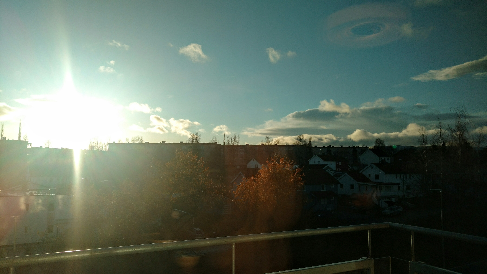

This week I started to notice how long the shadows are during the day since the
sun is barely getting above the hills that surround Trondheim. The photo above
was taken at 2pm and shows how the sun is already close to the horizon.

But this week I compensated for the reducing sunlight:

<blockquote class="twitter-tweet" data-lang="en">
{ Browser, Editor, Console }<a href="https://twitter.com/hashtag/newsetup?src=hash&amp;ref_src=twsrc%5Etfw">#newsetup</a> <a href="https://t.co/V7AgFoD2mV">pic.twitter.com/V7AgFoD2mV</a>
&mdash; Markus Tacker 💻👨 (@coderbyheart) <a href="https://twitter.com/coderbyheart/status/927577937217572866?ref_src=twsrc%5Etfw">November 6, 2017</a></blockquote>

### Jobs / Hiring 💪🏻

From my team:

<blockquote class="twitter-tweet" data-lang="en">
Your are the first to know:  my team is hiring an experienced web developer 👩/👨 to join our Trondheim 🇳🇴 team:<a href="https://t.co/FJXHcvbKAJ">https://t.co/FJXHcvbKAJ</a> <a href="https://twitter.com/hashtag/job?src=hash&amp;ref_src=twsrc%5Etfw">#job</a>
&mdash; Markus Tacker 💻👨 (@coderbyheart) <a href="https://twitter.com/coderbyheart/status/919970952489861122?ref_src=twsrc%5Etfw">October 16, 2017</a></blockquote>

If you wonder, why Trondheim is a great place to live:

<blockquote class="twitter-tweet" data-lang="en">
Some impressions from my new workplace, Nordic Semiconductor and Trondheim 🇳🇴<a href="https://t.co/hujW6Agggy">https://t.co/hujW6Agggy</a>
&mdash; Markus Tacker 💻👨 (@coderbyheart) <a href="https://twitter.com/coderbyheart/status/928623601707823104?ref_src=twsrc%5Etfw">November 9, 2017</a></blockquote>

From my network:

<blockquote class="twitter-tweet" data-lang="en">
Nicht nur die <a href="https://twitter.com/dbsystel?ref_src=twsrc%5Etfw">@dbsystel</a> sucht, sondern auch ich:  Für mein <a href="https://twitter.com/hashtag/crossfunktionales?src=hash&amp;ref_src=twsrc%5Etfw">#crossfunktionales</a>  <a href="https://twitter.com/hashtag/PMOTeam?src=hash&amp;ref_src=twsrc%5Etfw">#PMOTeam</a> suche ich zwei <a href="https://twitter.com/hashtag/Koordinationstalente?src=hash&amp;ref_src=twsrc%5Etfw">#Koordinationstalente</a> .  Wer also immer mal mit mir arbeiten und somit noch mehr Spaß bei der Arbeit haben möchte, hätte jetzt genau die Chance dazu ;-) <a href="https://t.co/13DszkGqn5">https://t.co/13DszkGqn5</a>
&mdash; Eileen Siersleben (@ESiersleben) <a href="https://twitter.com/ESiersleben/status/928351023407812609?ref_src=twsrc%5Etfw">November 8, 2017</a></blockquote>

<blockquote class="twitter-tweet" data-lang="en">
Come and visit the Demo Day at Google in Munich on November 27. Get to know our latest Full Stack Developers. <a href="https://twitter.com/hashtag/munich?src=hash&amp;ref_src=twsrc%5Etfw">#munich</a> <a href="https://twitter.com/hashtag/developers?src=hash&amp;ref_src=twsrc%5Etfw">#developers</a> <a href="https://twitter.com/hashtag/google?src=hash&amp;ref_src=twsrc%5Etfw">#google</a> <a href="https://t.co/5i1N8InFKX">pic.twitter.com/5i1N8InFKX</a>
&mdash; CodeDoor (@Code_Door) <a href="https://twitter.com/Code_Door/status/927502280701685760?ref_src=twsrc%5Etfw">November 6, 2017</a></blockquote>

<blockquote class="twitter-tweet" data-lang="en">
I&#39;m presently available for freelance work, or part-time contracts  emelia@brandedcode.com<a href="https://twitter.com/hashtag/nodejs?src=hash&amp;ref_src=twsrc%5Etfw">#nodejs</a> <a href="https://twitter.com/hashtag/graphql?src=hash&amp;ref_src=twsrc%5Etfw">#graphql</a> <a href="https://twitter.com/hashtag/react?src=hash&amp;ref_src=twsrc%5Etfw">#react</a>
&mdash; Emelia (@ThisIsMissEm) <a href="https://twitter.com/ThisIsMissEm/status/925726195941076992?ref_src=twsrc%5Etfw">November 1, 2017</a></blockquote>

I wrote a post on how to build a professional network:

<blockquote class="twitter-tweet" data-lang="en">
How to build a professional network if you are early in your career:<a href="https://t.co/NXE1edra8i">https://t.co/NXE1edra8i</a>
&mdash; Markus Tacker 💻👨 (@coderbyheart) <a href="https://twitter.com/coderbyheart/status/927504106402603008?ref_src=twsrc%5Etfw">November 6, 2017</a></blockquote>

### Tech 🚀

True.

<blockquote class="twitter-tweet" data-lang="en">
&quot;What&#39;s the most used language in programming?&quot;  &quot;Profanity.&quot;
&mdash; Dan Bader (@dbader_org) <a href="https://twitter.com/dbader_org/status/928445538516852736?ref_src=twsrc%5Etfw">November 9, 2017</a></blockquote>

Writing modular software is important, but what makes for a good module?

<blockquote class="twitter-tweet" data-lang="en">
How to use modules to hide complexity: Ashley Williams dives deep into the topic in this philosophical and very well thought out talk.<a href="https://t.co/yBp8Nm6gPh">https://t.co/yBp8Nm6gPh</a>
&mdash; Markus Tacker 💻👨 (@coderbyheart) <a href="https://twitter.com/coderbyheart/status/929348101609021442?ref_src=twsrc%5Etfw">November 11, 2017</a></blockquote>

Someone visualized the one sound that influenced my life the most:

<blockquote class="twitter-tweet" data-lang="en">
The sound of the ☎️ dialup, pictured<a href="https://t.co/LB2g7ZDhfg">https://t.co/LB2g7ZDhfg</a> <a href="https://t.co/Z4ipa3arc4">pic.twitter.com/Z4ipa3arc4</a>
&mdash; Markus Tacker 💻👨 (@coderbyheart) <a href="https://twitter.com/coderbyheart/status/927597969297289216?ref_src=twsrc%5Etfw">November 6, 2017</a></blockquote>

### JavaScript 🛠

Using React means you need to learn a new set of paradigms, find some of them
here:

<blockquote class="twitter-tweet" data-lang="en">
Good read on <a href="https://twitter.com/hashtag/React?src=hash&amp;ref_src=twsrc%5Etfw">#React</a> patters:<a href="https://t.co/FcQdBDmI6y">https://t.co/FcQdBDmI6y</a>
&mdash; Markus Tacker 💻👨 (@coderbyheart) <a href="https://twitter.com/coderbyheart/status/928883943277039618?ref_src=twsrc%5Etfw">November 10, 2017</a></blockquote>

You know that you **own** your dependencies, right?!

<blockquote class="twitter-tweet" data-lang="en">
Good talk on <a href="https://twitter.com/hashtag/JavaScript?src=hash&amp;ref_src=twsrc%5Etfw">#JavaScript</a> security:<a href="https://t.co/7UQj21Hah3">https://t.co/7UQj21Hah3</a>
&mdash; Markus Tacker 💻👨 (@coderbyheart) <a href="https://twitter.com/coderbyheart/status/928393488747696128?ref_src=twsrc%5Etfw">November 8, 2017</a></blockquote>

Since I am seeing this (and it violates the
[SOLID](<https://en.wikipedia.org/wiki/SOLID_(object-oriented_design)>)
principles):

<blockquote class="twitter-tweet" data-lang="en">
Here is my <a href="https://twitter.com/hashtag/JavaScript?src=hash&amp;ref_src=twsrc%5Etfw">#JavaScript</a> 🔧 best practice tip of the day 📆: Do not execute code in a module without being called. Bootstrapping/configuring of modules must be done in one place 📍 not all around the app 🌐.
&mdash; Markus Tacker 💻👨 (@coderbyheart) <a href="https://twitter.com/coderbyheart/status/928177969394257920?ref_src=twsrc%5Etfw">November 8, 2017</a></blockquote>

### Diversity 🌈

This is what Nordic Engineers look like:

<blockquote class="twitter-tweet" data-lang="en">
Today we had a great time talking to girls in <a href="https://twitter.com/hashtag/highschool?src=hash&amp;ref_src=twsrc%5Etfw">#highschool</a> visiting our stand on <a href="https://twitter.com/NTNU?ref_src=twsrc%5Etfw">@NTNU</a> <a href="https://twitter.com/hashtag/teknologicamp?src=hash&amp;ref_src=twsrc%5Etfw">#teknologicamp</a> in <a href="https://twitter.com/hashtag/trondheim?src=hash&amp;ref_src=twsrc%5Etfw">#trondheim</a>🙋🏼 <a href="https://t.co/jpHOwaiSVj">pic.twitter.com/jpHOwaiSVj</a>
&mdash; Nordic Semiconductor (@NordicTweets) <a href="https://twitter.com/NordicTweets/status/927632650747236353?ref_src=twsrc%5Etfw">November 6, 2017</a></blockquote>

### Culture ✌️

[nohello.com](http://www.nohello.com/) got it right, (also, check out
[VSRE](http://vsre.info/)!).

<blockquote class="twitter-tweet" data-lang="en">
Please Don&#39;t Say Just Hello In Chat  12:32 you: Hi 12:32 co-worker: Hello. ## CO-WORKER WAITS WHILE YOU PHRASE YOUR QUESTION 12:34 you: I&#39;m working on [something] and I&#39;m trying to do [etc...] 12:35 co-worker: Oh, that&#39;s [answer...]<a href="https://t.co/tFYx3bzj9Q">https://t.co/tFYx3bzj9Q</a>
&mdash; Markus Tacker 💻👨 (@coderbyheart) <a href="https://twitter.com/coderbyheart/status/928591011672215557?ref_src=twsrc%5Etfw">November 9, 2017</a></blockquote>

If you don't have time to try things out at work, you might ask to run a _Kata_:

<blockquote class="twitter-tweet" data-lang="en">
&#39;When do you do katas? Negotiate with to take some time out of your work day. It&#39;s a really important investment for the company&#39; <a href="https://twitter.com/Singsalad?ref_src=twsrc%5Etfw">@Singsalad</a>
&mdash; Ladies of Code (@ladiesofcode) <a href="https://twitter.com/ladiesofcode/status/927980320862896129?ref_src=twsrc%5Etfw">November 7, 2017</a></blockquote>

### Conferences + Usergroups 💡

<blockquote class="twitter-tweet" data-lang="en">
Our first batch of Early Tickets is on sale NOW! <a href="https://t.co/MMGNvcYewp">https://t.co/MMGNvcYewp</a>
&mdash; JSConf EU (@jsconfeu) <a href="https://twitter.com/jsconfeu/status/928185361360179201?ref_src=twsrc%5Etfw">November 8, 2017</a></blockquote>

<blockquote class="twitter-tweet" data-lang="en">
Tickets for FemtoConf 2018 are now on sale: <a href="https://t.co/3XYt4V2lj8">https://t.co/3XYt4V2lj8</a> Be quick and get yours now! :)
&mdash; FemtoConf (@FemtoConf) <a href="https://twitter.com/FemtoConf/status/927914799614263300?ref_src=twsrc%5Etfw">November 7, 2017</a></blockquote>

### Listening to 🎧

- [Above & Beyond #ABGT250 Live at The Gorge Amphitheatre, Washington State](https://youtu.be/CMXiCR2gQw0)
- [Salmiakki Sessions 148](https://soundcloud.com/darude/salmiakki-sessions-148-309-studio-live)
  by Darude
- The [Hurry Slow Podcast](http://hurryslowly.co/)

---

> Remember to [follow me on Twitter](https://twitter.com/coderbyheart)! DMs are
> open!
> [I'm happy to answer your questions](https://twitter.com/coderbyheart/status/929317763067383808)
> ...
