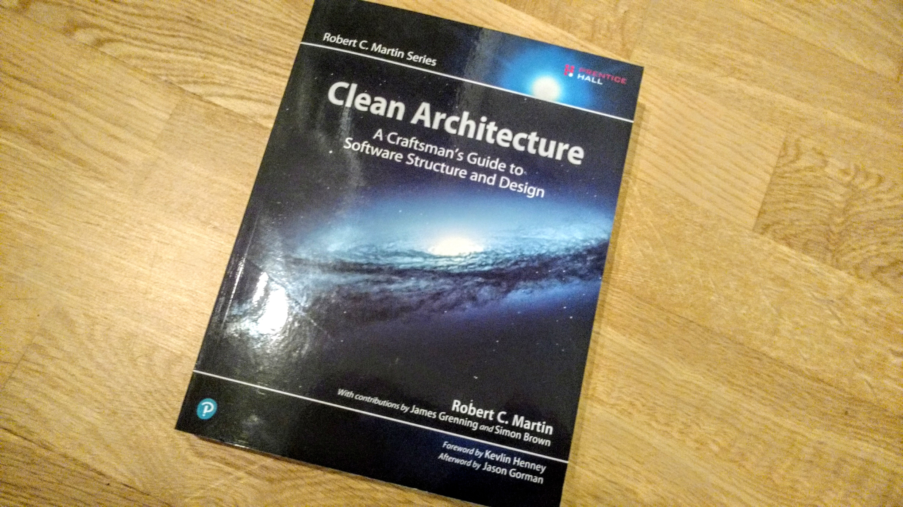

[_Clean Architecture_](http://amzn.to/2CKO0LN) is the latest book in the _Clean
[...]_ series, following _Clean Code_, and _The Clean Coder_ written by the
Software Crafts*man* Robert C. "Uncle Bob" Martin who most recently became an
outcast of the worldwide Software Crafters Community for opinions he expressed
in his personal blog regarding diversity.

In the book we are spared from his personal opinions, and only slightly
confronted with a tiny dose of everyday sexism, and another big portion of
"_Uncle Bob has seen it all_" in the 50 page Appendix on _Architecture
Archaeology_ in which Martin uncovers stories about his work dating back to the
early 70s which merely serves to support the validity of the ideas and concepts
that have been presented in the previous chapters. It reads like another attempt
to infuse Martin's legend with substance, which is odd, since he spent the
Preface and Introduction chapters on this topic already.

What I liked about the book is his attempt to guide the reader through
techniques and principles that lead to _good_ architecture but also provide a
slightly superficial explanation of these topics. He debunks object-operation
and is able to reveal the core principles of every software and what good
architecture should enable:

## good architecture makes software easy to change

and easy to change means that the cost of change is magnitudes lower than the
value the change provides. His concepts are designed to enable a very long
software lifetime by keeping developer productivity high of years into a
software project.

For me personally there weren't any new revelations to be discovered but I liked
Martin's way to re-define and sharpen existing ideas using simple language. The
chapters surf just below the surface and never dive too deep, which will be
problem for unexperienced software developers and architects since they will
most likely not be able to connect the dots.

## what matters is the domain

I especially like Part IV of the book in where Martin stresses the idea that
good architecture abstracts away _concrete implementations_ from the beginning.
This idea has been presented in the previous chapters already with a focus on
implementation on the module level. Part IV makes this idea more tangible by
explaining why and how secondary components (I'd call them that) like databases,
UI and frameworks should be separated from the software core.

By page 210 you have already encountered all there is to know in the book so
don't be taken away away by the page count. The remaining chapters flesh out the
main idea:

> Write high-level abstractions for everything that is not your core business
> domain, and don't let secondary component concepts leak into your business
> domain.

Despite its excess _Uncle Bob Grandeur_ and idiotic and pointless cartoons I
would recommend this book to experienced architects and software developers
since it reinforces and clarifies proven concepts, which I am using on a daily
basis.
