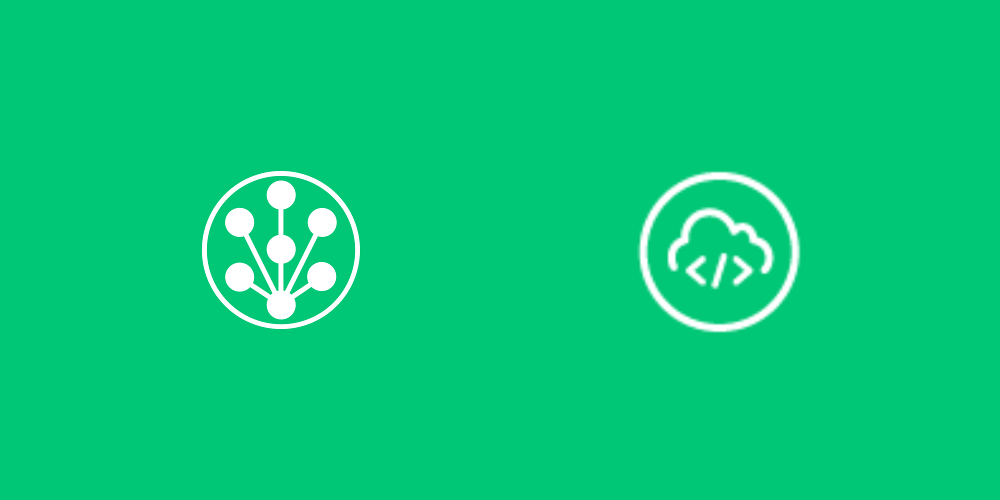
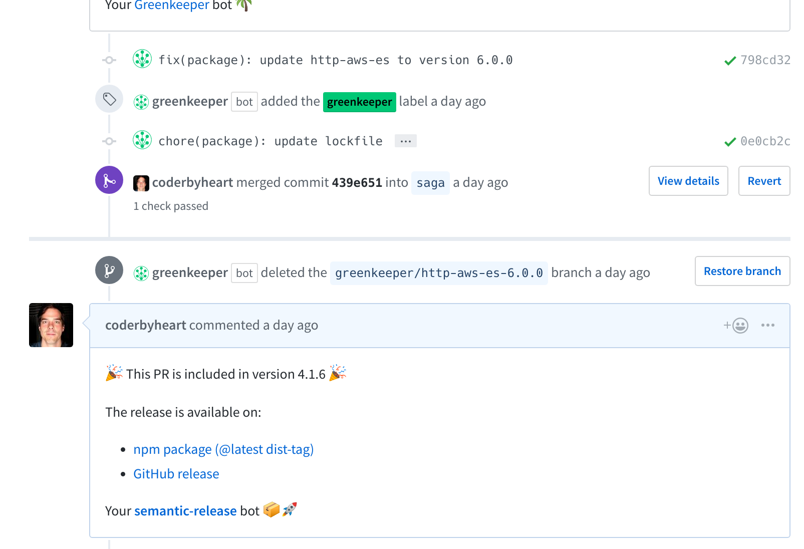

I recently had the opportunity to look into some fundamental Continuous
Integration and Deployment techniques we use to build
[nrfcloud.com](https://nrfcloud.com/). We rely heavily on AWS, so it was natural
to look into using [AWS CodeBuild](https://aws.amazon.com/de/codebuild/) as a
task runner for our private repositories.

I previously had a fantastic experience working with
[Travis CI](https://travis-ci.com/), but it adds a hefty fixed price to an
infrastructure. On AWS CodeBuild costs occur only during the runtime of jobs
(which are run in Docker containers). This, and a potential better integration
with other AWS services, gave me the initial reason to look into using it as the
main task runner for our TypeScript projects.

If you work with JavaScript the number one reason for changes in your software
are **dependencies**. The number of dependencies that changes on a daily basis
is staggering. The only sane way to deal with this _quirk_ of the JavaScript
eco-system is to fully embrace it. Roll with the tide and make sure your
software runs with the latest version of its dependencies.

One precondition is to **have tests**. The benefits of tested software,
especially in a fast-moving environment, are manifold and I have been practicing
TDD for many years. Tests will ensure that a piece of software still works if
you change a dependency.

Another invaluable helper is [Greenkeeper](https://greenkeeper.io/): it will
send you a pull-request if a dependency is updated, which will in turn trigger a
CI build. If everything works fine, you are left with merging a PR. It's a
1-click solution to updating dependencies and it makes working with dependencies
fun again.

Since npm 5 there is also a new and improved lockfile:
[`package-lock.json`](https://docs.npmjs.com/files/package-lock.json), which is
a huge improvement over the old shrinkwrap. It ensures that when running
`npm ci` only the exact dependencies described in the lockfile will be
installed. This enables [reproducible builds](https://reproducible-builds.org/)
builds of our package and we can be certain that we have the exact same executed
code in production that we ran when testing.

Greenkeeper has an addon called
[`greenkeeper-lockfile`](https://github.com/greenkeeperio/greenkeeper-lockfile)
which takes care of updating the lockfile just for the dependency after a
successful test run.

A changed dependency also calls for a new release of the host package, and this
in turn will trigger updates and releases to packages that depend on the host
package. Managing this manually _would simply be insane_, or just plain
monotonous. But thankfully to
[`semantic-release`](https://github.com/semantic-release/semantic-release) the
process of release new versions can also be automated! (I have explained the
whole the process in
[these slides](https://docs.google.com/presentation/d/1TSnZOaey_5J48d5tAKci8YjOtWkR3D6C2NG6_XKseZU/edit)
in 2016).

All of the tools above require Node.js v8 andw when I started to run the first
of our packages on AWS CodeBuild the official Node.js Docker image did only
support Node.js v4 and v6. This
[has been fixed on May 2nd](https://github.com/aws/aws-codebuild-docker-images/issues/45#issuecomment-385828419)
and CodeBuild now has an official Node.js v8.11 image.

I already had begun to add CodeBuild support to
[`env-ci`](https://github.com/pvdlg/env-ci), which Greenkeeper uses to detect if
it is running in a CI environment and in which. Since the official images uses
an outdated Git version (1.9) it required
[some back and forth](https://github.com/pvdlg/env-ci/pull/28) until we figured
it out.

The next task was to get `greenkeeper-lockfile` to work in AWS CodeBuild runs
which I have implemented
[in this PR](https://github.com/greenkeeperio/greenkeeper-lockfile/pull/151).
Also here I needed to deal with a quite old Git version and figuring out
CodeBuilds way of cloning the repo. It also does not provide all the necessary
details about the build in the environments so I needed to persist that during
the build, since `greenkeeper-lockfile` will apply changes to the repository --
it is updating the lockfile and commit this back to the PR.

Using a `buildspec.yml` like this we finally can have automated library releases
and dependency management on AWS CodeBuild!

```
version: 0.2
phases:
  install:
    commands:
      - echo "updating git ..."; apt-get update; apt-get install -y python-software-properties software-properties-common; add-apt-repository ppa:git-core/ppa; apt-get update; apt-get install -y git
      - npm install -g npm@
      - npm install -g nRFCloud/greenkeeper-lockfile
      - npx greenkeeper-lockfile-update
      - npm ci --no-audit
  build:
    commands:
      - npm test
  post_build:
    commands:
      - npx greenkeeper-lockfile-upload
      - npx semantic-release
```

Notes:

- we update git to the latest stable version, since `semantic-release`
  [now depends on >=2.0.0](https://github.com/semantic-release/semantic-release/compare/v15.4.4...v15.5.0)
- we run `npm install -g npm@` to ensure we are running the latest stable npm
- we use our
  [patched version of greenkeeper-lockfile](https://github.com/nRFCloud/greenkeeper-lockfile)
- we disable audit on `npm ci`
  [to not slow down the install](https://twitter.com/coderbyheart/status/994089445346435073)

And here is the result on a real PR:


