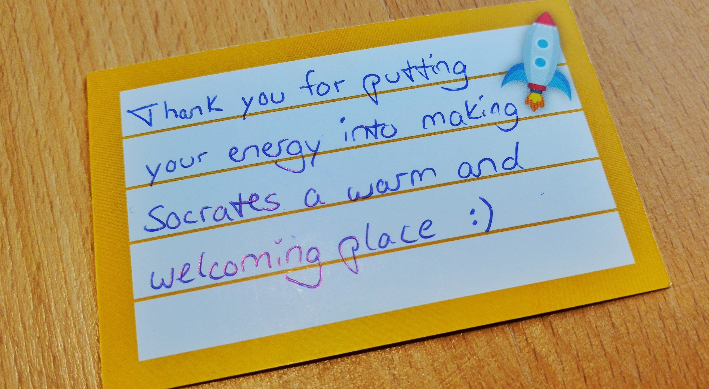

The SoCraTes conferences are dear to my heart, and
[the one in Soltau](https://www.socrates-conference.de/) every year is my most
important conference date every year. This year some of us shared that we were
attending and happy to be a [ConferenceBuddy](https://www.conferencebuddy.io/):

<blockquote class="twitter-tweet" data-lang="en">
Anybody going to <a href="https://twitter.com/SoCraTes_Conf?ref_src=twsrc%5Etfw">@SoCraTes_Conf</a> who‘d like to have a <a href="https://twitter.com/ConfBuddy?ref_src=twsrc%5Etfw">@ConfBuddy</a>?   🙋‍♂️ I’m here for you!  (and I expect many others would love to be your buddy too, just in case 🙂)
&mdash; Benjamin Reitzammer (@benjamin) <a href="https://twitter.com/benjamin/status/1029742801767067648?ref_src=twsrc%5Etfw">August 15, 2018</a></blockquote>

<blockquote class="twitter-tweet" data-lang="en">
Going to <a href="https://twitter.com/SoCraTes_Conf?ref_src=twsrc%5Etfw">@SoCraTes_Conf</a> and don&#39;t know anyone? Feel intimidated by all the strangers? I&#39;m happy to be your <a href="https://twitter.com/ConfBuddy?ref_src=twsrc%5Etfw">@ConfBuddy</a> to help you have a fantastic experience at  <a href="https://twitter.com/hashtag/socrates2018?src=hash&amp;ref_src=twsrc%5Etfw">#socrates2018</a> and make new friends!  Join the <a href="https://twitter.com/hashtag/buddies?src=hash&amp;ref_src=twsrc%5Etfw">#buddies</a> channel in our Slack! <a href="https://t.co/IOHblVy0oB">pic.twitter.com/IOHblVy0oB</a>
&mdash; Markus Tacker 🇳🇴 (@coderbyheart) <a href="https://twitter.com/coderbyheart/status/1030010907840192513?ref_src=twsrc%5Etfw">August 16, 2018</a></blockquote>

I also created a public **#buddies** channel in the
[conference Slack](https://socrates-conference.slack.com/), where I posted
opportunities for buddies to meet at the first night of the conference (the
evening where everyone arrives). 26 people joined.

On the first day of the open-space at the marketplace in the morning, I
announced that if somebody felt that they would like to meet a buddy, I would be
happy to meet during lunch.

**And then, nobody showed up.**

But this is totally what I expected to happen. SoCraTes Soltau is by far the
most inclusive tech event I know, and everybody behaves incredibly welcoming and
respectful. It is a safe space and also still kind of an insider-event, since it
is organized by the community and non-profit. You usually know about SoCraTes
because you know someone, who knows it.

But (!) I have received positiv feedback explicitlty referring to
ConferenceBuddy and how it reduced the barrier for newcomers to feel welcome at
the event.

So, this is actually a success story for ConferenceBuddy, because it's like the
phone number in a conference code of conduct: it needs to be there and you have
to make sure that somebody answers it all the time, but its a good thing if
nobody calls.

And here is how a participant put it:

<blockquote class="twitter-tweet" data-lang="en">
Being myself very shy, timid and introvert and having been quite a lot to conferences alone, I know that feeling. This is a very interesting initiative. 👏<a href="https://twitter.com/ConfBuddy?ref_src=twsrc%5Etfw">@ConfBuddy</a> is for everyone who wants to attend a tech conference but is afraid to go alone.<a href="https://t.co/boofp7gqYE">https://t.co/boofp7gqYE</a>
&mdash; Thierry de Pauw (@tdpauw) <a href="https://twitter.com/tdpauw/status/1030076022153199616?ref_src=twsrc%5Etfw">August 16, 2018</a></blockquote>

<blockquote class="twitter-tweet" data-lang="en">
All of the <a href="https://twitter.com/SoCraTes_Conf?ref_src=twsrc%5Etfw">@SoCraTes_Conf</a> conferences are very shy and introvert people friendly ! All the attendees seem to be naturally <a href="https://twitter.com/hashtag/ConfBuddy?src=hash&amp;ref_src=twsrc%5Etfw">#ConfBuddy</a> !! <a href="https://twitter.com/hashtag/socrates2018?src=hash&amp;ref_src=twsrc%5Etfw">#socrates2018</a> <a href="https://t.co/Kjo0FITPvH">https://t.co/Kjo0FITPvH</a>
&mdash; Thierry de Pauw (@tdpauw) <a href="https://twitter.com/tdpauw/status/1033731158918475776?ref_src=twsrc%5Etfw">August 26, 2018</a></blockquote>
