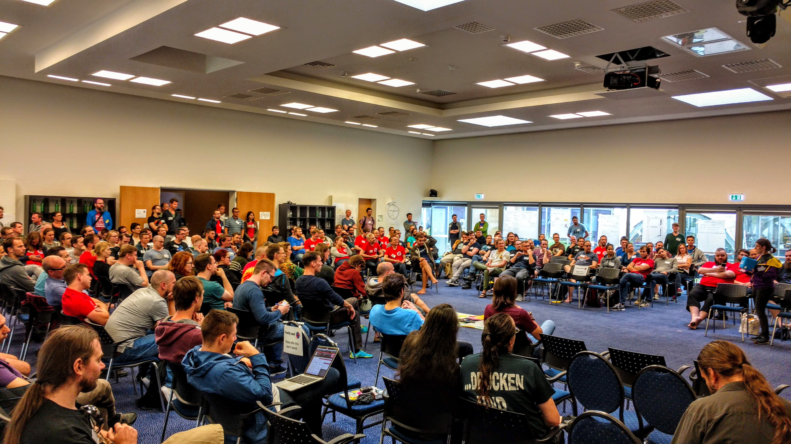
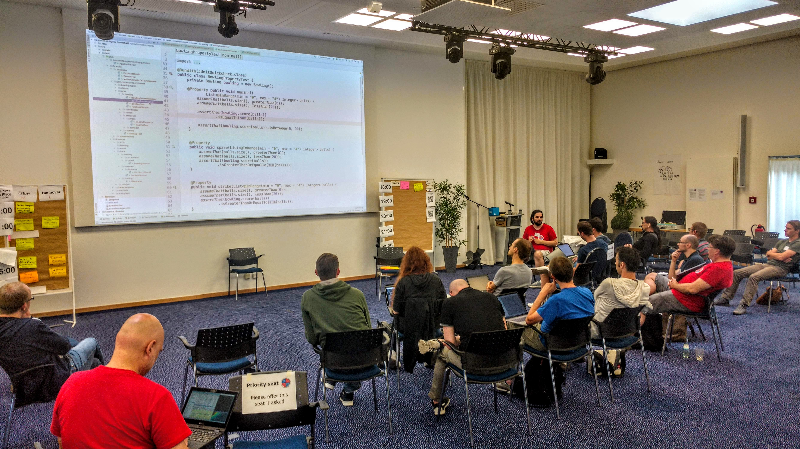

When I left SoCraTes 2018 this year I was as energized as the years before:

<blockquote class="twitter-tweet" data-lang="en">
My state after <a href="https://twitter.com/hashtag/socrates2018?src=hash&amp;ref_src=twsrc%5Etfw">#socrates2018</a>: it&#39;s this bitter sweet feeling between sadness, tiredness, enthusiasm and thankfulness.  I have so many thoughts I want structure and persist to a document, but they are just too many and so many are interconnected.
&mdash; Markus Tacker 🇳🇴 (@coderbyheart) <a href="https://twitter.com/coderbyheart/status/1033960643307687936?ref_src=twsrc%5Etfw">August 27, 2018</a></blockquote>

[I have blogged about my experiences before](https://coderbyheart.com/the-magic-of-socrates-conference/),
I called it _Magic_. It's magic because it is a place where I get to meet
friends I have known for years, and we all arrive with the strong urge to learn
from each other to be a better human in tech, in an open-space setting where
everybody can be a teacher, and a student—at the same time.

This is so entirely different compare to regular conferences, because nobody is
put on a stage. There is no stage, no list of speakers. We are all equals and
those with many years of experience working in our industry know not to use
experience as an excuse to not listen.

But this is not really news and upon reflecting I think I witnessed a very
important change for the first time. This year I noticed that session related to
diversity were proposed by members of underprivileged groups and it happened
with a level of naturalness which made it evident that SoCraTes has become a
safe-space for everyone. Big Kudos to the organizers who have been pushing to be
more inclusive for many years now.

I cannot stress enough how important this is for me, to be invited to join a
session where women shared their experience with sexual harassment. It provides
a view to what I need to look out for, in my own behavior and this of my
coworkers which I would not otherwise.

<blockquote class="twitter-tweet" data-conversation="none" data-lang="en">
I have been struggling with finding a mentor for the last years I met hundreds this weekend <a href="https://twitter.com/SoCraTes_Conf?ref_src=twsrc%5Etfw">@SoCraTes_Conf</a>.  Thank you <a href="https://twitter.com/hashtag/socrates2018?src=hash&amp;ref_src=twsrc%5Etfw">#socrates2018</a>.
&mdash; Markus Tacker 🇳🇴 (@coderbyheart) <a href="https://twitter.com/coderbyheart/status/1033960647158050818?ref_src=twsrc%5Etfw">August 27, 2018</a></blockquote>

I invite you to join our community and make it even more diverse:
https://www.softwarecrafters.org/
