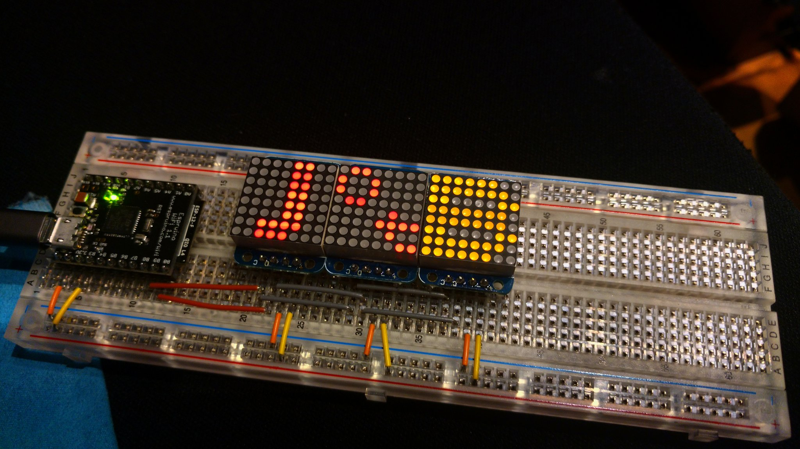

After my talk _Prototyping products for the Internet of Things using JavaScript_
([Slides](https://docs.google.com/presentation/d/1vMFDSY8kn52SxnC_iEUcmJ7SJY8jpfi__oAulxE-uvQ/edit?usp=sharing))
I was interviewed by [Alexandra M. Sims](https://twitter.com/Amsimss), part of
the questions were asked by the audience. I really loved how they added this Q&A
segment to every talk and that attendees could post questions and get them
answered even if they could not make it to a session.

You can watch the full video on
[YouTube](https://www.youtube.com/watch?v=6rBHje_ciGM).

I have selected some interesting questions on #JavaScript:

<blockquote class="twitter-tweet" data-conversation="none" data-lang="en">
I advocated in one slide ( <a href="https://t.co/jzR2lhfzyq">https://t.co/jzR2lhfzyq</a> ) to go <a href="https://twitter.com/hashtag/JavaScript?src=hash&amp;ref_src=twsrc%5Etfw">#JavaScript</a> full-stack, so the question is: How can I convince my organization to embrace this? <a href="https://t.co/YTrXF2ee93">pic.twitter.com/YTrXF2ee93</a>
&mdash; Markus Tacker 🇳🇴 (@coderbyheart) <a href="https://twitter.com/coderbyheart/status/1038791853431312384?ref_src=twsrc%5Etfw">September 9, 2018</a></blockquote>

<blockquote class="twitter-tweet" data-conversation="none" data-lang="en">
As a <a href="https://twitter.com/hashtag/CTO?src=hash&amp;ref_src=twsrc%5Etfw">#CTO</a> or Tech lead, how did I work towards a <a href="https://twitter.com/hashtag/change?src=hash&amp;ref_src=twsrc%5Etfw">#change</a> like that (switch to a new technology that I was convinced about)? <a href="https://t.co/U9CQ5GiAOQ">pic.twitter.com/U9CQ5GiAOQ</a>
&mdash; Markus Tacker 🇳🇴 (@coderbyheart) <a href="https://twitter.com/coderbyheart/status/1038791857818533888?ref_src=twsrc%5Etfw">September 9, 2018</a></blockquote>

<blockquote class="twitter-tweet" data-conversation="none" data-lang="en">
Seriously, do I want to run <a href="https://twitter.com/hashtag/JavaScript?src=hash&amp;ref_src=twsrc%5Etfw">#JavaScript</a> on <a href="https://twitter.com/hashtag/iot?src=hash&amp;ref_src=twsrc%5Etfw">#iot</a> devices? <a href="https://t.co/ELY9tAOJwd">pic.twitter.com/ELY9tAOJwd</a>
&mdash; Markus Tacker 🇳🇴 (@coderbyheart) <a href="https://twitter.com/coderbyheart/status/1038791862239289345?ref_src=twsrc%5Etfw">September 9, 2018</a></blockquote>
