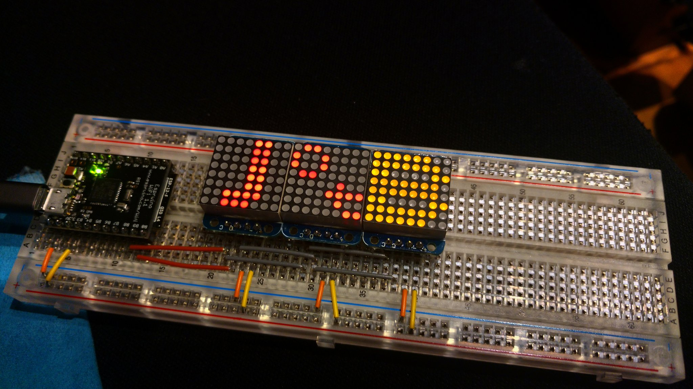

<blockquote class="twitter-tweet" data-lang="en">
Receiving two cool speaking offers this week reminded me to share this segment during my <a href="https://twitter.com/JOTB2018?ref_src=twsrc%5Etfw">@JOTB2018</a> talk on why YOU should propose a talk to a conference NOW! I am happy to help you with finding, writing proposals and talks, and would be happy to listen to a practice run! DM me! <a href="https://t.co/eUHdBNjfDI">pic.twitter.com/eUHdBNjfDI</a>
&mdash; Markus Tacker 🇳🇴 (@coderbyheart) <a href="https://twitter.com/coderbyheart/status/1041408149276774400?ref_src=twsrc%5Etfw">September 16, 2018</a></blockquote>

If you think you want to talk about something you are _passionate_ about you are
already a step further than 99%.

Write a proposal — 99.9% don’t.

See [speaking.io](https://speaking.io/) for great resources on how to get
started. Also check out
[this thread](https://twitter.com/jesslynnrose/status/1041242744998572032) on
Twitter.

Submit to conferences that cover travel expenses
([#paytospeak](https://twitter.com/search?f=tweets&vertical=default&q=%23paytospeak&src=typd))  
and have a **good** Code of Conduct.

If they don’t, ask why!

Find conferences who are calling for proposals on: [SeeCFP](http://seecfp.com/)
or [Papercall](https://www.papercall.io/).

---

More resources on public speaking:

- [Speak Easy](https://twitter.com/spkeazee) mentors speakers to encourage
  diversity at tech conferences
