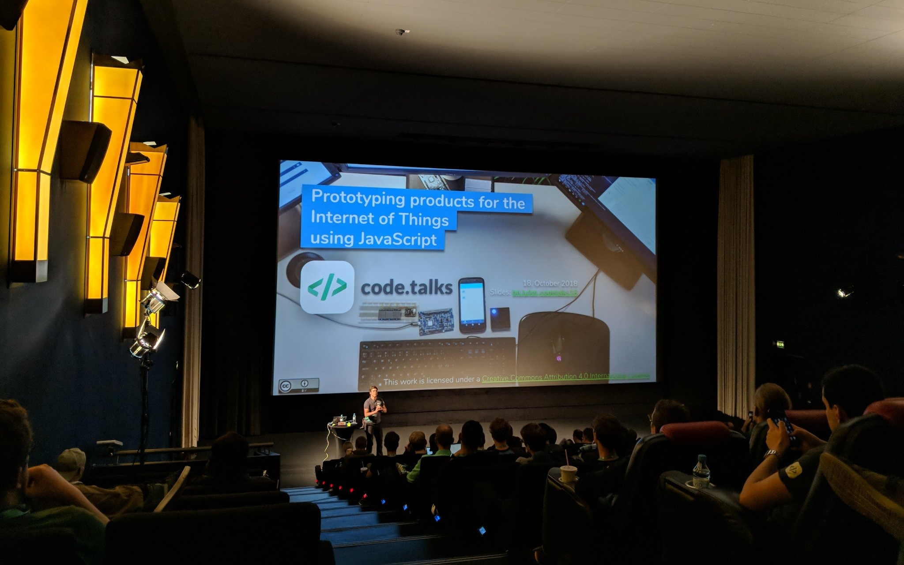

My 2018 conference talk focused on how to prototype for the Internet of Things
using the language we all love: JavaScript.

In this talk I explain why the Internet of Things, or in short _IoT_, is a very
exciting field how we as engineers can start to explore this space with its very
own restrictions and challenges. Because today we can no longer focus only on
technical solutions but need to be able to develop _connected experiences_ for
our clients&mdash;they are not able to innovate on their own any more and depend
on the expertise of consultancies and contractors.

A part that did not make it into the 45 minutes I had at code.talks was a look
at the protocol that will power the next generation of connected devices: MQTT a
lightweight pub/sub protocol which has some significant improvements over HTTP.
You will find the slides in the talk and it is am important part to explore when
starting to look into this topic.

[Here is the recording](https://www.youtube.com/watch?v=HpNv8Ahb2MU) and here
are
[the Slides](https://docs.google.com/presentation/d/1E1PcSo463K_1uQTKYZ6IDgOwEwaxrirpTYMvgiL0as4/edit?usp=sharing).
I brought a demo application to the conferences which I have
[published on GitHub](https://github.com/coderbyheart/iot-proto-js) and it runs
on an [Espruino Wifi](http://www.espruino.com/WiFi).

_Happy connecting!_
