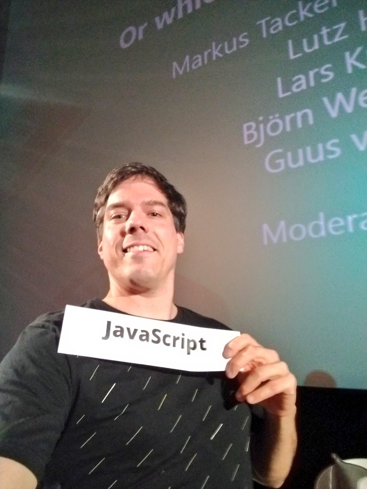

At [code.talks Hamburg 2018](https://www.codetalks.de/) I was in the panel about
backend languages.

<blockquote class="twitter-tweet" data-lang="en">
Let&#39;s start the language panel <a href="https://twitter.com/codetalkshh?ref_src=twsrc%5Etfw">@codetalkshh</a> <a href="https://twitter.com/hashtag/codetalks?src=hash&amp;ref_src=twsrc%5Etfw">#codetalks</a> <a href="https://t.co/11ZsQEUk5T">pic.twitter.com/11ZsQEUk5T</a>
&mdash; Markus Tacker 🇧🇻 (@coderbyheart) <a href="https://twitter.com/coderbyheart/status/1053254437026914304?ref_src=twsrc%5Etfw">October 19, 2018</a></blockquote>

You can see the whole session
[on YouTube](https://www.youtube.com/watch?v=7n3ROn3yABY) …

Here are the sections where I speak on behalf of the language that I love:
**JavaScript**!

<blockquote class="twitter-tweet" data-lang="en">
At <a href="https://twitter.com/codetalkshh?ref_src=twsrc%5Etfw">@codetalkshh</a> I was in the panel about <a href="https://twitter.com/hashtag/backend?src=hash&amp;ref_src=twsrc%5Etfw">#backend</a> languages. You can see the whole session on YouTube: <a href="https://t.co/KYe2MAJiHs">https://t.co/KYe2MAJiHs</a>  Here are the sections where I speak on behalf of the language that I love: <a href="https://twitter.com/hashtag/JavaScript?src=hash&amp;ref_src=twsrc%5Etfw">#JavaScript</a> &gt; <a href="https://t.co/KE1PnMeIQi">pic.twitter.com/KE1PnMeIQi</a>
&mdash; Markus Tacker 🇧🇻 (@coderbyheart) <a href="https://twitter.com/coderbyheart/status/1064131345058856961?ref_src=twsrc%5Etfw">November 18, 2018</a></blockquote>

## Where will JavaScript be in 5 years?

<blockquote class="twitter-tweet" data-conversation="none" data-lang="en">
Where will <a href="https://twitter.com/hashtag/JavaScript?src=hash&amp;ref_src=twsrc%5Etfw">#JavaScript</a> be in 5 years? <a href="https://t.co/SXE2Y7Mwb6">pic.twitter.com/SXE2Y7Mwb6</a>
&mdash; Markus Tacker 🇧🇻 (@coderbyheart) <a href="https://twitter.com/coderbyheart/status/1064131350767288321?ref_src=twsrc%5Etfw">November 18, 2018</a></blockquote>

## And will JavaScript _still_ be there in 5 years?

<blockquote class="twitter-tweet" data-conversation="none" data-lang="en">
And will <a href="https://twitter.com/hashtag/JavaScript?src=hash&amp;ref_src=twsrc%5Etfw">#JavaScript</a> still be there in 5 years? <a href="https://t.co/805mZq51s6">pic.twitter.com/805mZq51s6</a>
&mdash; Markus Tacker 🇧🇻 (@coderbyheart) <a href="https://twitter.com/coderbyheart/status/1064131358879031296?ref_src=twsrc%5Etfw">November 18, 2018</a></blockquote>

## Does JavaScript scale both in the technical sense and within teams?

<blockquote class="twitter-tweet" data-conversation="none" data-lang="en">
Does <a href="https://twitter.com/hashtag/JavaScript?src=hash&amp;ref_src=twsrc%5Etfw">#JavaScript</a> scale both in the technical sense and within teams? <a href="https://t.co/bFWFk9Az1S">pic.twitter.com/bFWFk9Az1S</a>
&mdash; Markus Tacker 🇧🇻 (@coderbyheart) <a href="https://twitter.com/coderbyheart/status/1064131366416195584?ref_src=twsrc%5Etfw">November 18, 2018</a></blockquote>

## Is JavaScript a good language for programming beginners?

<blockquote class="twitter-tweet" data-conversation="none" data-lang="en">
Is <a href="https://twitter.com/hashtag/JavaScript?src=hash&amp;ref_src=twsrc%5Etfw">#JavaScript</a> a good language for programming beginners? <a href="https://t.co/yol4yIIggc">pic.twitter.com/yol4yIIggc</a>
&mdash; Markus Tacker 🇧🇻 (@coderbyheart) <a href="https://twitter.com/coderbyheart/status/1064131378634268672?ref_src=twsrc%5Etfw">November 18, 2018</a></blockquote>

Check out [CodeDoor](http://codedoor.org/) - they help people from
underrepresented groups learn to program!

## Not _everything_ is perfect with JavaScript

<blockquote class="twitter-tweet" data-conversation="none" data-lang="en">
But obviously not everything is perfect with <a href="https://twitter.com/hashtag/JavaScript?src=hash&amp;ref_src=twsrc%5Etfw">#JavaScript</a>: <a href="https://t.co/xoCHTdPVPR">pic.twitter.com/xoCHTdPVPR</a>
&mdash; Markus Tacker 🇧🇻 (@coderbyheart) <a href="https://twitter.com/coderbyheart/status/1064131386318176257?ref_src=twsrc%5Etfw">November 18, 2018</a></blockquote>
