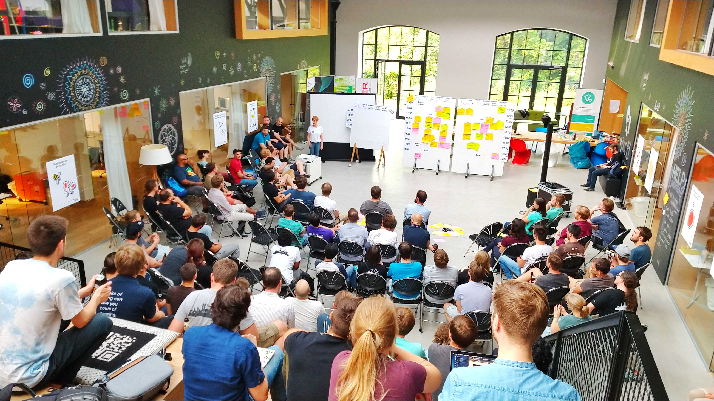

After two years of absence I was able to attend the 2019 edition of
[JSCraftCamp](https://jscraftcamp.org) thanks to the very generous conference
policy my employer [Nordic Semiconductor](https://www.nordicsemi.com/) has.
(This meant flying from Trondheim to Munich but I compensated this flights CO₂
emissions with [Atmosfair](https://www.atmosfair.de/en/).)

In this post I want to write about how I experienced JSCraftCamp and my key
take-a-aways.

## About JSCraftCamp

JSCraftCamp is a BarCamp style event focusing on all things JavaScript and takes
place every year in Munich in the
[beautiful offices](https://www.google.com/maps/place/Virtual+Identity+AG+M%C3%BCnchen/@48.0970276,11.5430163,17z/data=!3m1!4b1!4m5!3m4!1s0x479e75eb96bfb00b:0x2cd12f60e6a5c63c!8m2!3d48.097024!4d11.545205)
of [Virtual Identity AG](https://www.virtual-identity.com/) next to the Isar.
This location is exceptionally well suited for an Open Space, since it offers
many indoor and outdoor spaces to gather around a whiteboard, beamer or table
&mdash; and the way the building is layed out creates a lot of possibilities to
interact or relax.

<https://twitter.com/coderbyheart/status/1152127446721933313?embed>

JSCraftCamp belongs to a bigger family of
[Software Craft](https://softwarecrafters.org) conferences around the globe and
is entirely organized by the community. The event is free for attendees and all
costs (e.g. for Coffee, Food, Location) are covered directly by sponsors. If you
want to sponsor this event in the future, check out
[this dedicated page](http://jscraftcamp.org/sponsoring.html) &mdash; sponsoring
starts at 100 €.

It was great so see that Sponsors also came from the community and took part in
the open space, this created a much better atmosphere compared to other
conferences where sponsors engage with a much stronger focus on hiring and
selling services.

With over 100 participants signed up for both days, most of them showed up on
Friday. The Saturday saw more no-shows. I guess this is understandable given
that the weather on Saturday was really good.

## Food

A word on food, because this is always one of the big headaches when organizing
a conference: it's time to default to plant-based food.

It was sad to see that the BBQ during the party on Friday focused mostly on
serving supermarket meat, while vegetarians and especially vegans had a hard
time finding a decent option.

<https://twitter.com/coderbyheart/status/1152265721059139584?embed>

I recommend conference organizers to look into options that can be prepared in
advance and can serve everyone: chilies, lentil soups, or pastas can all be
prepared in big portions, in advance and without needing to use meat or dairy
ingredients.

<https://twitter.com/Frerichs_S/status/1152525241840799747?embed>

I really loved the lunch: Burritos were served with meat, but also in sufficient
quantities as vegetarian and vegan option, and everybody could be served at once
...

Coffee supply by [Peerigion](https://peerigon.com/) was amazing, they even had
milk alternatives!

<https://twitter.com/peerigon/status/1152129002032812034?embed>

## Marketplace

<https://twitter.com/coderbyheart/status/1152135865201770497?embed>

This was my first marketplace which was facilitated by
[Cecilia Maria Zannini](https://twitter.com/cm_zannini) and she did an
incredible job of opening up the space and creating an inclusive and welcoming
atmosphere. You could really tell that she cared deeply about making these two
days special.

<https://twitter.com/coderbyheart/status/1152129402890854400?embed>

Both days had a good variety of sessions:

<https://twitter.com/ajitsonlion/status/1152143860237307905?embed>

<https://twitter.com/NarigoDF/status/1152504992286289920?embed>

## My key take-aways

I tried to find a good balance between sharing and helping others while also
getting input on some of things I am struggling with.

### fp-ts

This was a pull session on [fp-ts](https://github.com/gcanti/fp-ts) where we
tried for an hour to fix a seemingly trivial function code example I had, where
I wanted to turn a non-functional exception throwing code into an implementation
which does not rely on exceptions for flow control.

After we did not manage to solve it in the session, I pushed
[the most simple example on GitHub](https://github.com/coderbyheart/jscc19-no-exceptions-controller/blob/a8dee68b01b4482a0f4ffda3d3bbb088aed55085/controller.ts).

After going back and forth and getting more feedback from attendees, I finally
managed to solve it on the next day:

<https://twitter.com/coderbyheart/status/1152591342079565825?embed>

This is why I love Open Spaces so much!

### Ask me anything: GraphQL

<https://twitter.com/coderbyheart/status/1152545454137253888?embed>

The questions I got made once again clear that GraphQL seems to be a technology
that offers great benefits but those benefits are not immediately obvious to
everyone. In this session I mostly talked about concerns of backend engineers
and what they need to know in order to be open towards the adoption of a GraphQL
API.

### Brown Bag: Hexagonal Architecture

During lunch I hosted a session on hexagonal architecture, by giving a
walk-through the code base of a recent project of mine but I ended up running
out of time because it took longer than expected to come to the _core_ starting
from the outermost view of our system. I started with the
[C4 model's](http://c4model.com/) context diagram which is great for explaining
the entire system but I should have prepared this session a little better to
actually receive more feedback &mdash; which was the point for me to host this
session: get other peoples opinion about the system I designed.

<https://twitter.com/coderbyheart/status/1152546213830516736?embed>

<https://twitter.com/_sasidhar/status/1152888906041503744?embed>

### Learn to collaborate

<https://twitter.com/coderbyheart/status/1152190229601820672?embed>

This was a great session around the topic I am working on for
[my next talk](https://coderbyheart.com/talks/): how can I become better at
collaborating?

We collected skills and actions that make us better collaborators, and the main
takeaway for me of this session was that it seems that we can grow our set of
strategies to deal with communication or collaboration issues, but it is hard to
change your own empathy &mdash; some of the "skills" mentioned on the flipchart
are harder to change than others but it's possible to improve here in similar
ways like with programming. I just don't work on improving them as structured
right now.

### Package registries

<https://twitter.com/seriousManual/status/1152232064206475264?embed>

In this session we mostly talked about how we can deal with the no longer
unlikely event that [npm](https://www.npmjs.com/) will shut down. We looked at
some alternatives and especially for browsers there is already good support of
fetching dependencies without bundling them from CDNs.

The pain point will be moving away from a centralized service which will create
more problems in terms of reliability (if fetching dependencies from many
external sources) or costs (managing your own registry).

Things to look into are:

- [entropic](https://github.com/entropic-dev/entropic)
- using nix:
  [https://github.com/adnelson/nixfromnpm](https://github.com/adnelson/nixfromnpm/blob/master/README.md)
- and for browsers to user [script type=module](https://v8.dev/features/modules)
  and resolve dependencies from URLs.

<https://twitter.com/coderbyheart/status/1152451215978110979?embed>

## More

There is even more to discover even now that the JSCraftCamp is over:

- the hashtag
  [#jscc19](https://twitter.com/search?q=%23jscc19&src=typed_query&f=live)
  tracks what happened during the event
- there is the
  [#jscraftcamp_org](https://app.slack.com/client/T0A7W9V7C/C2M4QC7NC) channel
  on the [Software Crafters](https://softwarecrafters.org) Slack to keep in
  touch and follow up
- you can find the session notes for all sessions in
  [this repository](https://github.com/jscraftcamp/jscc19-sessions).

## Thanks

<https://twitter.com/coderbyheart/status/1152628944795054081?embed>
