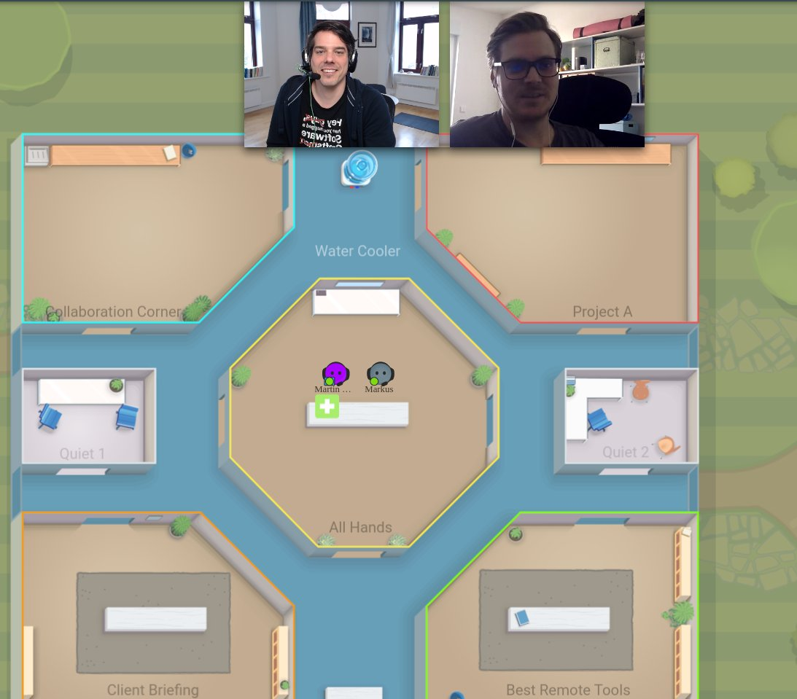
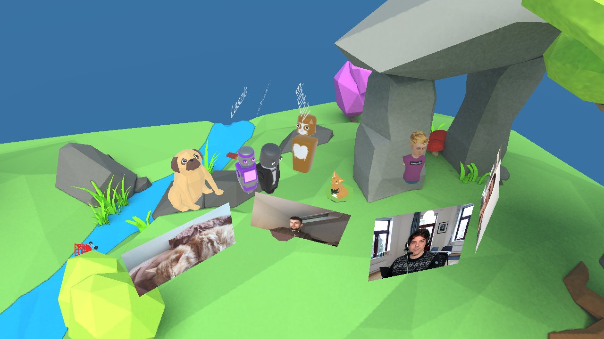

It’s week three from most likely many, many weeks to come in which we will work
in a setting that many of us are not used to: from their hjemmekontor. It means
we see our lovely colleagues only occasionally and as small flat rectangles on
our screens … this makes it very hard to connect on the human level, which is
now even more important in these times of crisis and uncertainties. While we are
privileged to be able to move our daily work seamlessly into a remote setup,
many of us worry about their families and relatives in other countries. It’s
important to not only check in daily about any blockers, but also be on the
lookout for the personal wellbeing of our colleagues. While a video call might
be the closest thing at hand, you might also try to experiment with other ways
to stay connected during the day.

[SoCoCo](https://www.sococo.com/) for example emulates the physical office, and
while everybody hangs out there all day, you can also visualize your current
situation: free to chat with everyone or focused on a specific project by
putting your avatar in the respective room.

[Discord](https://discordapp.com/) also is a very convenient way to have a voice
channel open all day, if something comes up, you can just talk and reach
everybody who is listening …

If you want to turn up the fun factor a bit, try
[Mozilla Hubs](https://hubs.mozilla.com/), a VR chat that runs in your browser -
no signup or download necessary. It works great without VR goggles and the
spatial audio feature allows us to interact virtually even with bigger groups.

If you’d like to try out some of these tools,
[I am having an open remote coffee hour every workday from 15-16:00 Oslo time](https://twitter.com/coderbyheart/status/1239476222452813825)
where we try out these offers.
