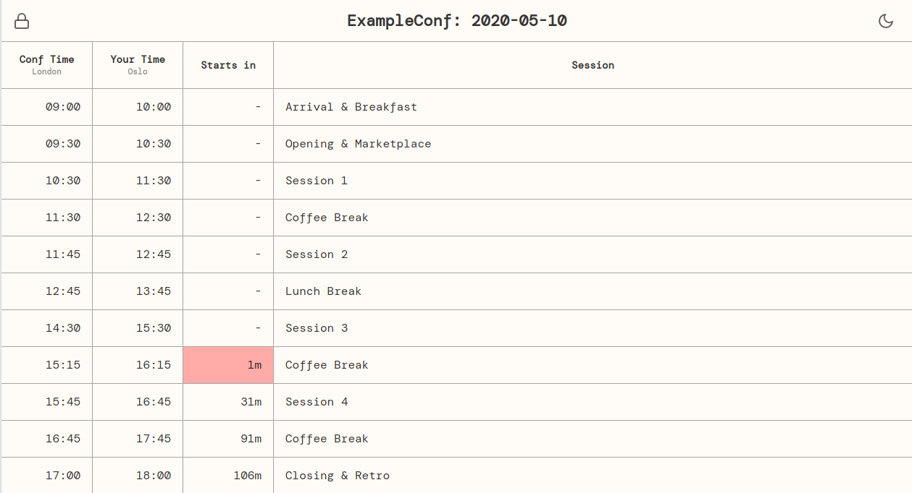

[_Local Schedule_](https://localschedule.netlify.app/) is a small tool I
published this week which helps with running and attending virtual and #remote
conferences: You can create a shareable schedule with times in your local
timezone. It also shows the time to the next session and a colored warning if
it's less than 5 minutes.

The tool is [open-source](https://github.com/coderbyheart/localschedule#readme),
free and requires no registration.
