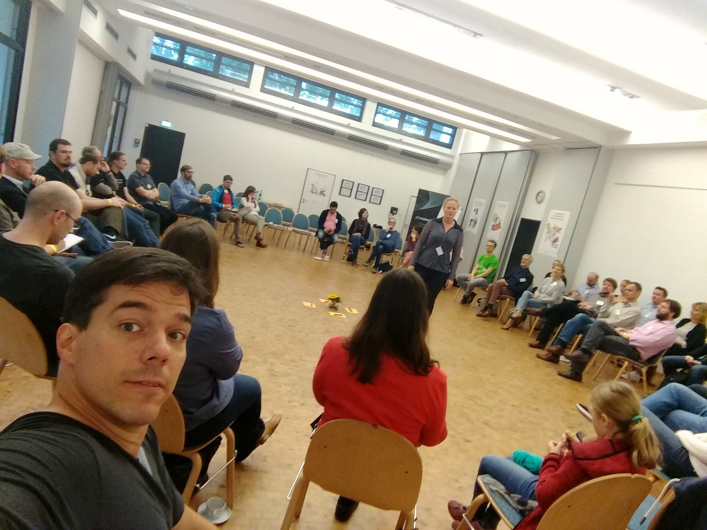
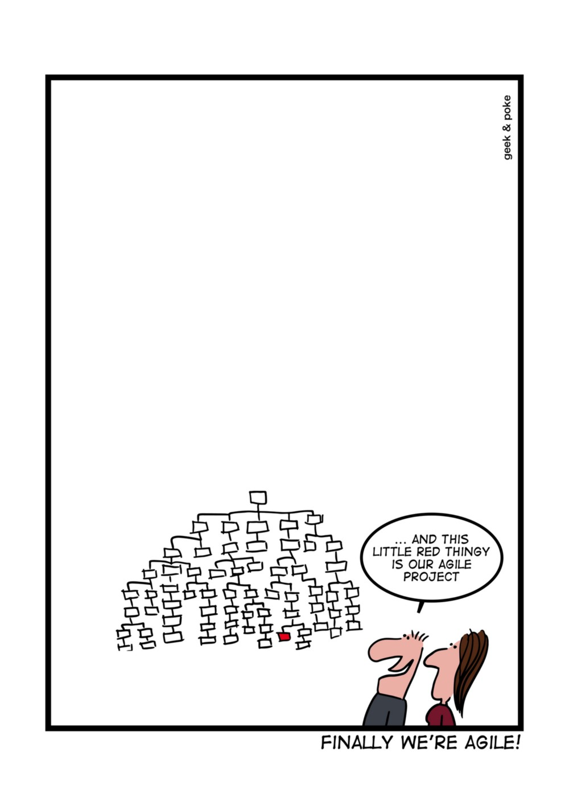
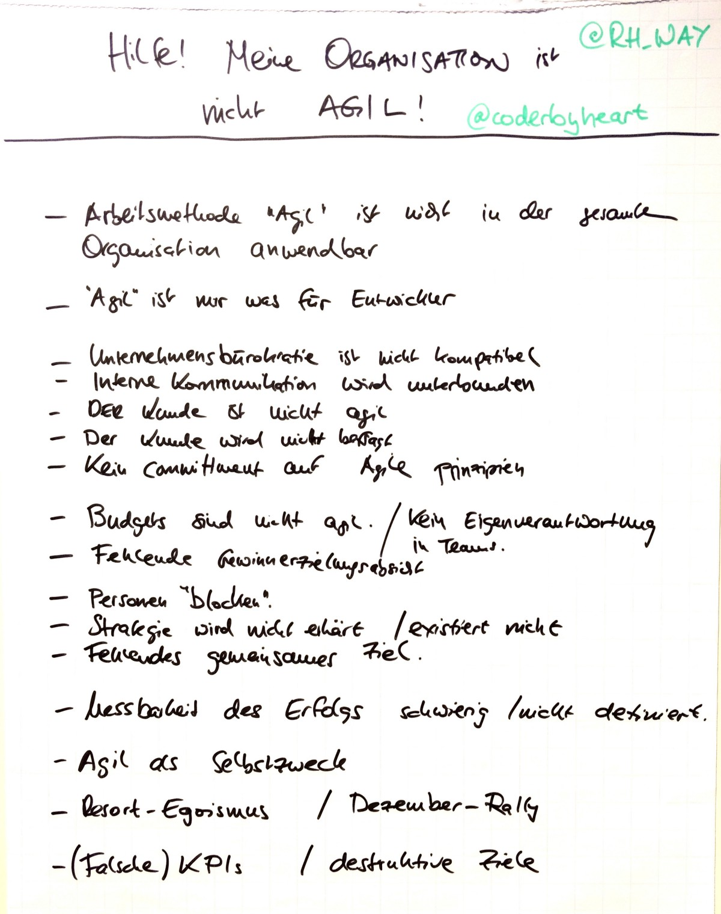

I was a first-timer at this years [Agile Cologne XXL][1], a two-day open-space
dedicated to the exchange about the [Agile Movement][2]. Needless to say I was
not sure, what to expect, given that I didn't know anybody from the roughly 80
attendees. But it turned out to be a very well organized event and I had two
great days, learning and sharing in an open-space format (you can find the
session plans here: [Sunday][su], [Monday][mo]). Most of the attendees were
either scrum masters, product owners or consultants that teach people how to
fill this roles. Tech people were rather underrepresented, which actually is a
good thing: I find getting to know other perspectives to be very helpful in your
day to day work. Especially we as developers are notoriously sticking to "our
people" … _if we leave our workplace at all_.

## _Agile_ as a starter for organizational transformation?

Now for the part that kept me busy during these two days; a lot of the sessions
dealt with variants of this question:

> How can my team and I work in an agile fashion, while the rest of my
> organisation is not agile?

The experience of many attendees is, that many companies are running their agile
projects mainly for two reasons that are driven by management

1. increase the output of IT projects,
2. make more profit.

Oftentimes it seems to be a decision based on hearsay (["We've heard about this
new thing, that everyone else does, so lets do it, too!"][gap]). Improving
product quality and customer satisfactions rarely are the driving factors nor is
improving the working conditions for employees.

The missing understanding of the core values behind the agile movement and the
disposition as experiments obviously leads to a lot of friction and conflicts
between the agile teams and the rest of the company and puts these teams under
extra pressure. Now they are not only quested with the success of the project
using a new way to work with which they have no experience but with leading the
implementing agile within the whole organization.

These endeavors are bound to fail and the failure will be attributed to
shortcomings of the agile methodology and not to the inability of classical,
hierarchical structures to support agile teams at all.

To ask for advice how to make these agile teams or projects "work" in these
circumstances is one option, but that does not fix the root cause of the
problem: the organization itself.

Network organizations are an enabler for agility, self-organisation and creates
a focus on delivering customer value. These are environments in which agile
teams can thrive and will be successful.

So I set out and collected problems agile teams face in order to show, that
there are indeed solutions to these problem, but they usually are not that
obvious and need to be applied at a different level in order to become
effective.

You can find the long list [here][probs], and I'm sure it can easily be extended
even further. After I had this material, I used the evening in the hotel to
compile our tools and measures of choice we use to fix these problems. I wanted
to show, that there is a solution to every single problem. It might not be
simple, but we've done it in the past. [This flipchart][solution] gives you an
idea. "Unfortunately" we had a very lively discussion, so the note-taking-part
on my side came a little short but I was able to show a fix for every problem,
and I might go into some of them in the comments, if you are interested.

## _Agile_ is a seed, and seeds need a soil

My takeaway from the conference is that agile practitioners need to identify the
root causes for the problems and stop trying to handle the symptoms.

You can't just plant an agile project into your organization without providing
the grounds for it to grow roots.

[1]: http://agilecologne.de/
[2]: http://agilemanifesto.org/
[su]:
  https://www.flickr.com/photos/tacker/30109096515/in/album-72157671333742283/
[mo]:
  https://www.flickr.com/photos/tacker/29481516243/in/album-72157671333742283/
[gap]: http://geek-and-poke.com/geekandpoke/2016/4/26/finally-agile
[probs]:
  https://www.flickr.com/photos/tacker/29994987272/in/album-72157671333742283/
[solution]:
  https://www.flickr.com/photos/tacker/29481083554/in/album-72157671333742283/
