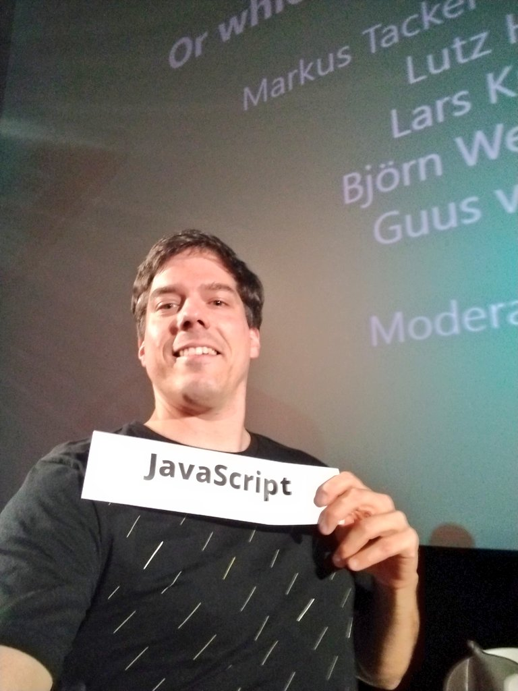

At [code.talks Hamburg 2018](https://www.codetalks.de/) I was in the panel about
backend languages.

<https://twitter.coderbyheart.com/status/1053254437026914304>

You can see the whole session on YouTube:

<https://www.youtube.com/embed/7n3ROn3yABY>

Here are the sections where I speak on behalf of the language that I love:
**JavaScript**!

<https://twitter.coderbyheart.com/status/1064131345058856961>

## Where will JavaScript be in 5 years?

<https://twitter.coderbyheart.com/status/1064131350767288321>

## And will JavaScript _still_ be there in 5 years?

<https://twitter.coderbyheart.com/status/1064131358879031296>

## Does JavaScript scale both in the technical sense and within teams?

<https://twitter.coderbyheart.com/status/1064131366416195584>

## Is JavaScript a good language for programming beginners?

<https://twitter.coderbyheart.com/status/1064131378634268672>

Check out [CodeDoor](http://codedoor.org/) - they help people from
underrepresented groups learn to program!

## Not _everything_ is perfect with JavaScript

<https://twitter.coderbyheart.com/status/1064131386318176257>
