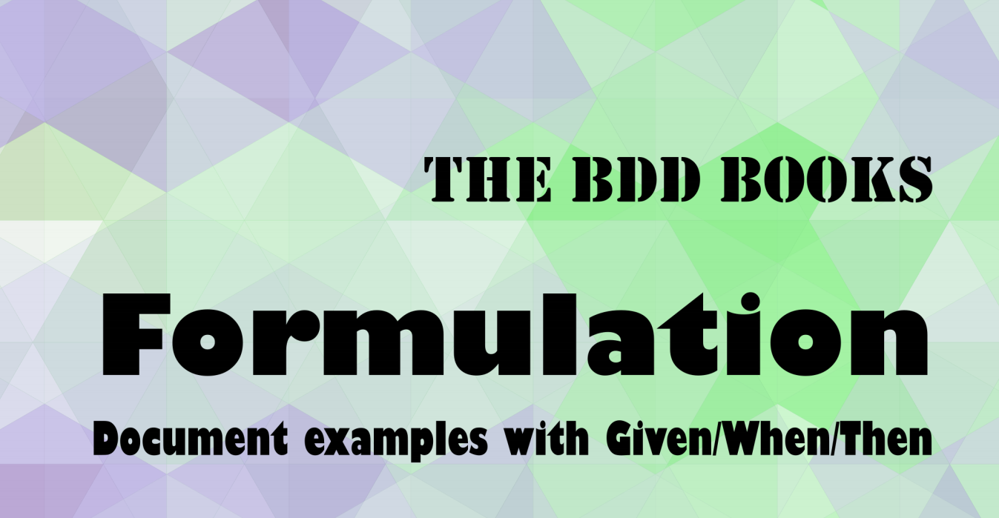

Let me start by stating something most of you most likely know, I am a big fan
of Behavioural Driven Design (BDD),
[I have spoken about it at multiple conferences](./it-does-not-run-on-my-machine)
and I use it on a daily basis. Therefore I was really excited to learn from
[Gáspár](https://twitter.com/gasparnagy) and [Seb](https://twitter.com/sebrose)
who are without a doubt some of the most knowledgeable people to write about
this topic ... which they are not shy to tell you directly in the beginning of
the book:

> Together Seb and Gáspár have over 60 years of software experience which they
> put to good use developing and delivering training and coaching for
> organizations worldwide.

It's a somewhat bold disclaimer in the beginning of the book, and I wish they
wouldn't have chosen this "let me tell you..." move, because the content in this
book really speaks for itself.

## The Book to understand the toolset Gherkin provides

[Gherkin](https://cucumber.io/docs/gherkin/) is a language to describe behaviour
of _any system_ in feature files with three words: **Given**, **When**,
**Then**. There, now you have _learned_ the language, however it takes a lot of
practice to apply this tool in practice. And here is where the book takes us on
a journey with a team implementing a pizza ordering software.

Along this example we learn the fundamentals of the language, and many hands-on,
very well explained best practice on how to use Gherkin to not only describe the
properties of the software system, but also how to do it in a way that enables
all stakeholder to take part and in such a way that it creates a _living
documentation_; one that never is outdated.

This promise is magically and the authors manage to lift the curtain and share
their years of experience with this tool.

## BDD is reverse decoupled TDD

> Start with the end in mind.

As with test-driven-development (TDD), BDD is ideally written before the
implementation, and this is one of the big take-aways for me: where I would TDD
with small examples working towards a complete feature, BDD works best if the
end-result is written first: if the _Then ..._ is defined first, it is easier to
focus only on the absolute necessary *Given*s and *When*s&mdash;a point that the
books stresses at multiple occasions: focus on keeping scenarios brief (or
`BRIEF`, the acronym that is used in the book).

## BDD is for everyone, and any time

You should pick up this book today and learn about this tool, because it can be
introduced in a project at any time: a chapter about legacy code is included.

I especially liked their description of how feature files can serve different
audiences and pick them up where they need the documentation to be, for example
using a different domain language, or (how I typically use BDD) on a lower
level, without implementing steps but driving an API client.

While most of the book centers around writing feature files that can be used to
drive automation tests, the author specifically mention the importance of
testers and their expertise, because it is not about automating tests, but about
aligning all stakeholders and the software that is getting build:

> Never underestimate the domain knowledge of the people who worked on the
> project. Testers in particular will have acquired a deep understanding of the
> product through their time spent testing it.

## When I read The BDD Books: Formulation Then I become a better Software Crafter

I really like the overall structure of the book, the chapters are not too long
and don't overstretch their topic. Throughout the book the authors provide their
personal view which helps to underline important aspects. It will be a good
source to revisit again and again.

[The BDD Books: Formulation](http://bddbooks.com/) is available
[on LeanPub](https://leanpub.com/bddbooks-formulation) and
[on Amazon](https://www.amazon.com/-/en/dp/B093NCN3FZ).

I've read the Kindle version of the book which I would not fully recommend
because even the smallest font size would not fit the feature listings on my
screen (a 10th generation Kindle Paperwhite). This is fine if you are familier
with the Gherkin syntax and can skim the feature definitions. I would recommend
to read the PDF version which has a better layout, or get the printed version
(from the PDF).
