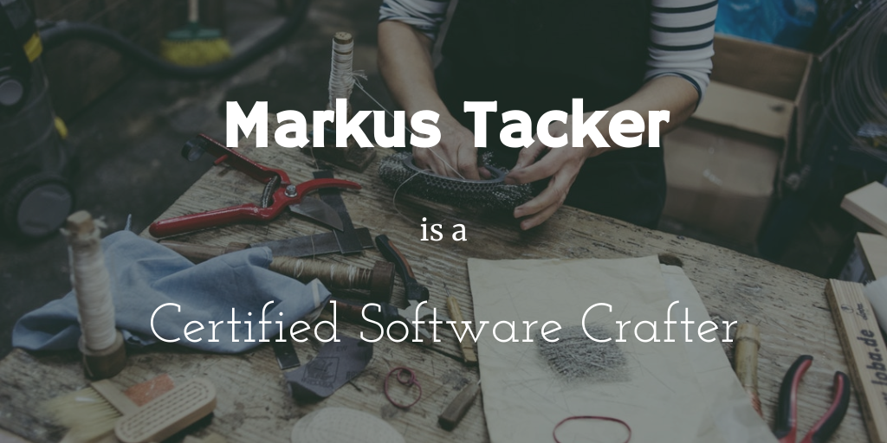

Here is a question for you to think about:

> How can I make a better job tomorrow?

Congratulations, I hereby certify you to be a full-fledged, badass Software
Craftsperson. You are welcome! \*

Do not let book authors, speakers, consultancies or anybody tell you which steps
are required to be considered a true Software Crafter. It usually involves
giving them money as the first step, so I would call them biased.

---

\* Quite literally: we welcome everybody to join
[our community Slack](http://slack.softwarecrafters.org), regardless of
profession, experience, skin color, gender, or other attributes because we
believe that only diversity will help us to find the best solutions to the big
and small problems we are lucky to be facing every day.
