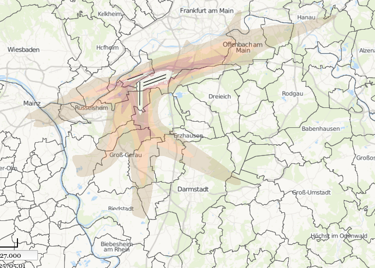
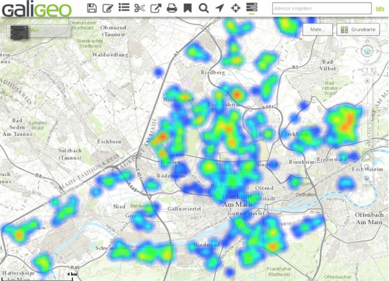

I recently participated in the first meeting of the
[Open Knowledge Lab Frankfurt](http://usergroups.rheinmainrocks.de/~oklabffm).
The verdict of the meeting was that local OKLabs should focus on building
projects that serve a real need and not just be interesting from a developers
perspektive … otherwise it wont get noticed by the public and ultimately by
local authorities–which are an important source of open data.

So here is my idea:  
**find the best place to live given the criteria that are important to me and
visualize this on a map.**

Let me show you some pictures to illustrate my idea: heat maps help to visualize
geologically coded events. The first example from
[umwelthaus.org](http://cadenza.umwelthaus.org/pages/map/default/index.xhtml) is
a heat map of the aircraft noise measured during the day:

The second example from [crime-radar.com](http://www.crime-radar.com/) is the
number of crimes committed in Frankfurt's city limits:

If you combine those two you'll get a good idea which neighbourhoods to avoid if
you were to move into this region.

And those are just two possible datasource. For me I'd like to see visualization
for:

- public transport time to my workplace
- prices for land and houses
- availability of fast internet access
- proximity to bioreserves, hiking trails, lakes
- population density
- election results

This would enable me to pan around a map and find places that would fit my
preferred living conditions.

Feel free to submit it to the
[TEDxRheinMain Datanauts Contest](http://datanauts.tedxrheinmain.de/), I won't
because I'd be forced to comply to their
[overly one-sided terms and conditions](https://gist.github.com/coderbyheart/344fbd403cfb536d530f).

Also there is the
[Open Data Hackathon](http://www.meetup.com/OKLabFfm/events/219670248/) this
Saturday at the best coworking space around:
[Die Zentrale](http://die-zentrale-ffm.de/). A perfect event to getting this
started …

## **Update**

One of the 10 winning ideas of the event is
[_settlement spotter_](http://datanauts.tedxrheinmain.de/contest-submissions/settlement-spotter/)–which
is exactly what I asked them to build!

> Use big data and feedback from various independent sources, leverage federal
> and public sources, open sources from the industry to create a map that will
> allow a user to draw a picture. Create an online environment to help an
> individual decide and plan his move to a place where his living requirements
> are met perfectly.

I'm looking forward to seeing this project come to life.
