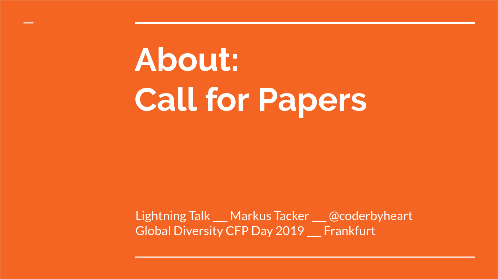

At this year's
[Global Diversity CFP Day](https://www.globaldiversitycfpday.com/) I gave a
lightning talk about Call for Proposals. You can watch the recording
[here](https://www.youtube.com/embed/jzqCzGXT7hw). The slides are available
[here](https://docs.google.com/presentation/d/1Jmsf7aU2saJBzrWMCFrtxfiofWOSvS62BKKMRLDhb_Q/edit?usp=sharing).

Below is are the main talking points I cover

---

## Structure of a Proposal

In order to prepare a good proposal we need to look at what conference
organizers expect from a submission.

These are the elements that you need to prepare:

### Speaker Profile

You might think that only _what_ you talk about matters, but it is actually the
other way around. Conference organizers create a space to network, and the time
**around** the talks is actually where most attendees will see the value in. It
matters very much to find a diverse set of speakers and that is why you should
not miss out the oportunity to answer the question: _Why should I talk to you?_.

A good speaker profile should have:

- less than 100 words
- be written in third person (conference organizers will copy&paste this to
  their website)
- have a mix of background information on your experience and interesting trivia
  about you

Here is how my speaker profile looks like (92 words, 596 characters):

> Markus is a coder by heart and an organizational hacker by passion. As a
> software crafter he uses his 20+ years of experience working as a software
> developer, consultant, coach, mentor, and founder to build cloud-based
> solutions for the Internet of Things using JavaScript. His professional career
> has been greatly influenced by taking an active role in communities, whether
> as a participant, contributor, initiator, or speaker. He especially enjoys the
> diverse and deep discussion of the Software Craft Community. He lives in
> Trondheim, Norway and enjoys plowing through deep snow on snowshoes.

### Abstract

A great abstract distilles down the main takeaway of your talk into a **very
short form**. It takes a lot of work to remove the unneccessary fluff from the
text and highlight _what the main takeaway of your talk is_.

Part of the abstract is the title which also needs to be an eye-catcher.

Remember, your proposal can be one of hundreds so you need to catch the
attention of the conference committee member within a few seconds.

In your abstract

- make the title 100 characters or less
- fit the main idea in a tweet 280 characters

On many submission forms there is often not much more space for the abstract.
500 characters is still safe, and if you absolutely cannot fit your idea in a
tweet, prepare multiple variants of the abstract.

Here is how my abstract looks like (title has 63 characters, text has 288
characters):

> **Integration testing a cloud-native application with JavaScript**  
> In this talk I will take you through the challenge of testing a cloud-native
> application. I will cover the challenges when developing solutions on top of
> serverless components which you cannot run on your own machine and how I
> designed a BDD driven approach to run the integration tests.

### Notes

Once you have prepared this abstract, basically all conferences allow for to
provide additional notes. This is your opportunity to provide more context to
your abstract and also **a second chance** to highlight the most important
aspects of your talk. This is also a good place to provide more background
information on why you are passionate to share this talk.

The notes for my submissions look like this:

> In my current project at Nordic Semiconductor I am building a RESTful API for
> interacting with the next generation of IoT devices. This solution is build on
> top of AWS using serverless components. Not only the implementation of the
> business logic is done in JavaScript, but I have developed the entire CI/CD
> solution in JavaScript. In this talk I will cover the challenges when
> developing solutions on top of serverless components which you cannot run on
> your own machine and how I designed a BDD driven approach to run the
> integration tests, because I absolutely love tests. It showcases that
> JavaScript can be used in a truly full-stack manner today and that we can
> cover Development, DevOps and Testing with the one language we love. I am also
> really passionate about showcasing the BDD approach to testing which is in my
> opinion a fantastic way to drive test and at the same time have a living
> documentation.

### 5 key learnings

I see conferences which have started to explicitely ask for it, but in my
experience providing this list in the notes is really helpful for the conference
committee. Explain in 5 bullet points what your audience will take away from
your talk, the most important one first.

1. The first key learning is easy, rephrase your abstract and you are done.
2. I spoke about this because it really helps to understand the topic.
3. This is also important, but might not apply everywhere.
4. If you were really listening this is a cool bit to remember.
5. Stretch goal!

Here is the real example from my talk:

> 1. How the cloud native test-pyramid looks like
> 2. Infrastructure as code is key, because configuration of cloud-native
>    services are part of the solution
> 3. how BDD can be used to write re-usable test instructions
> 4. to write tests that behave like real users (retry if failed multiple times)
>    instead of programming shortcuts, because this will give better information
>    to system design
> 5. use “real” test doubles backed by queues to monitor outcome of test cases

### Keywords

The _SEO_ for talks is mainly used to cluster talk submission for the commitee,
but some websites also publish them for the attendees to filter talks. They are
not used that often, but you should prepare 5-10 keywords in advance.

These are the keywords for my talk:

> JavaScript IoT BDD Serverless AWS

## Where to find CfPs

Once you have your proposal ready it is time to submit it. The most important
place to find out about Call for Proposals is Twitter. Follow conferences and
speakers because this will be the first place were you will learn about new
announcements.

There are also sites that aggregate CfPs and provide a list and a regular email
about new CfPs. Check out:

- [seecfp.com](http://seecfp.com/)
- [papercall.io](https://www.papercall.io/events)
- [callingallpapers.com](https://www.callingallpapers.com/)
- [cfpland.com](https://www.cfpland.com/)

## Submitting

<https://twitter.com/mary_grace/status/1090988453226074113?embed>

Once start submitting remember that you will receive rejections, and quite a lot
of them. It's hard to give a ratio, because it depends on your talk and which
conferences you select, but getting 9 out of 10 submissions rejected is totally
normal. So oversubmit!

Another reason for that is that it is hard to plan month ahead. Some CfP end
more than half a year in advance. It is impossible to know whether you will be
actually able to attend. You always will be asked after your proposal has been
accepted to confirm your attendence. This typically happens at a time where it
is easier to plan ahead and figure out those conflicts. Don't feel bad to turn
down an opportunity to talk, the conference will not have a hard time finding a
replacement, especially if you decline right away.

It helps to track your submissions, I use a
[Trello board](https://trello.com/b/xbvmarCL/iot-javascript-cloud-developer-conferences)
to keep an overview. Because you also do not want to submit to the same
conference twice...

## #paytospeak

I also need to mention
[#paytospeak](https://twitter.com/search?q=%23paytospeak&src=typd) here, because
it's important to understand that we as speakers are actively hindering the
diversification of the speaking community if we accept speaking opportunities
for which we pay the expenses out of our own pockets.

**If you are not getting reimburst for your expenses as a speaker there is a
high chance that you are benefiting off someone who cannot afford to attend.**

There are two great blog posts on this topics which I highly recommend you to
read:

- [nataliewarnert.com/askforpay-instead-of-paytospeak/](http://nataliewarnert.com/askforpay-instead-of-paytospeak/)
- [www.cassandrahl.com/blog/why-i-dont-pay-to-speak/](http://www.cassandrahl.com/blog/why-i-dont-pay-to-speak/)

## Code of Conducts

<https://twitter.com/pati_gallardo/status/1058282328177471488?embed>

If you apply to a conference I highly encourage you to check out their Code of
Conduct. Having **no** is a red flag, but having a single-paragraph one mit even
be worse.

There are Code of Conducts, like

> “Don’t be a jerk.”

and there are **good** Code of Conducts because they are

- concrete, so it is clear to everyone what inacceptable behaviour is
- enforcible, so there are clear guidelines on what will happen in case
  something happens
- and everyone has of the staff has been trained on how to handle incidents

A good example is the
[JSConf Code of Conduct](https://2019.jsconf.eu/code-of-conduct/).

## Now, go and become a speaker!

<https://twitter.com/devdevcharlie/status/1090367939889397760?embed>

You can find more resources on public speaking here:

- [speaking.io](https://speaking.io/)
- [twitter.com/AgileTD/status/1098262053519835139](https://twitter.com/AgileTD/status/1098262053519835139)
- [agiletestingdays.com/blog/it-always-starts-with-an-idea/](https://agiletestingdays.com/blog/it-always-starts-with-an-idea/)

I am also always
[happy to help](https://twitter.com/coderbyheart/status/940636875794067456).
Feel free to reach out to me! If I can help you with your talk proposal, send me
a Google Doc!
