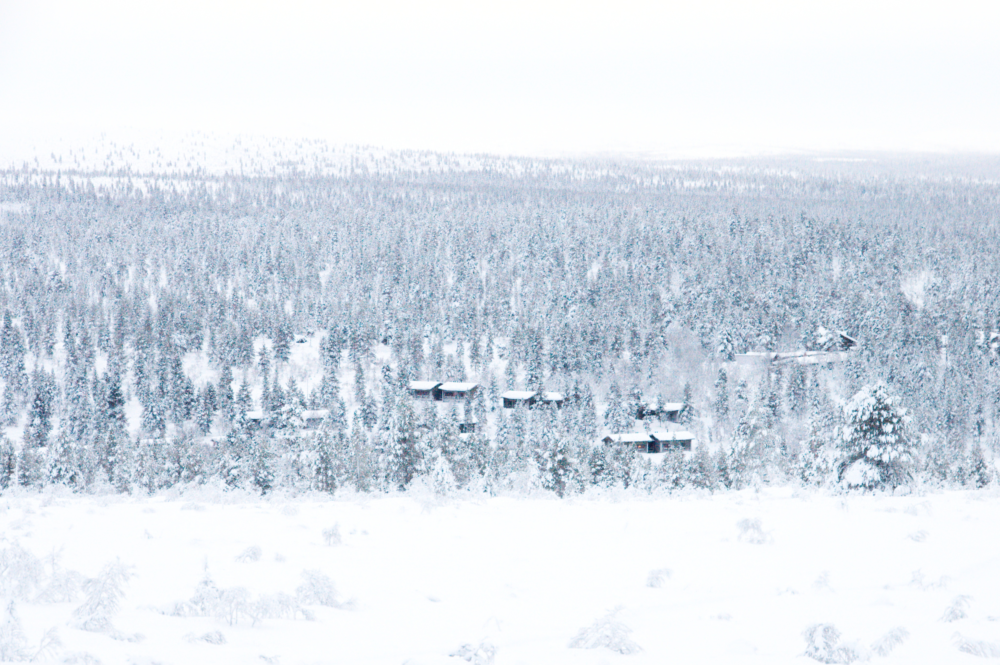

For the last week we have been in [Kiilopää][kiilopaa], a national park in the
arctic circle to attend [codefreeze][cf] which brings the [Software Craft and
Testing Conferences][socrates] to one of the most remote places I have ever
visited. I was drawn there by the [pictures I saw on Twitter][hashtagcf] of last
year and this year, I could contribute a fair share of my own.

The conference has been a breathtaking experience and we will definitely be go
there again, not only for the conference, but for the beautiful nature that the
national park offers. And with a direct flight from Frankfurt to Ivalo, which is
just a 40 minute bus drive from Kiilopää it is easy to go there for us. We even
had Finns, that had longer journeys to reach this remote spot in the arctic
circle where there is basically nothing for hundreds of kilometers.

The national park itself is around 40 kilometers in diameter and preservers a
natural fern forest with very old trees, they can reach up to 300 years before
they die and will then keep standing for another 50 or more years.

[Soumen Latu][sl] is a charitable organization in Finland that aims to preserve
the nature which operates the Fjell Center where we stayed. It's a small village
with a main building where you will get great food basically all day, which has
a rental shop and a public sauna that is on all day. Next to it is a hostel for
groups and a hotel with rooms for one to two persons. We stayed in one of the
roughly 40 cabins that house two to ten people. Our log cabin of 50 m² was
equipped with it's own sauna and a fireplace.

## Absolute Silence

With the next supermarket being 26 km away and the airport around 40 km, no
industry a ban for snowmobiles in the area the nights were absolutely silent.
And even at day, when being just a few hundred meters away from the main
building, you would hear _not a thing_.

The masses of snow, that blanketed the area created an incredible atmosphere and
a fascinating black and white backdrop for the many outdoor activities you could
have: between 1000 and 1500 the sun was above the horizon—not visible from the
fjell center, though—and here we did nordic skiing, snowshoe trips and
backcountry ski trips guided by the volunteers of the Soumen Latu association
that come to Kiilopää to stay there for two or more weeks receiving free
accommodation for their services. The trips were free of charge, you only had to
rent the necessary equipment in the rental shop at the main building for a
reasonable price—e.g a pair of snowshoes and poles for 10 € per day.

## Perfect winter vacation: snow and sauna

The trips would take you to the area around which offers a lot of variety: dense
forests with deep snow, prepared tracks for nordic skiing or you could go above
the treeline on top of the Kiilopää—the 600m high mountain that the center is
named after. Usually you would start in the morning around 10—that's when
breakfast ends—and be home in the early afternoon—it got dark around 1500—to
take a nap and then go to the sauna. And even with sauna there is variety: you
have the _normal_ finnish sauna in the cabin with an electric oven, it heats up
quickly to 100° and you can set it up in advance, to time it perfectly for your
return. But there is also smoke sauna, a big sauna for roughly 30 people that is
warmed at noon with a open wooden fire which heats up a big pile of stones that
keep the warmth for hours. The smoke sauna can then be used between 1500 and
2000 and has a totally different heat which is less intense and you can stay
there for three hours—once in a while you will go out and take _the dip_, a
small pond that is kept ice-free by a flowing water source and has a temperature
of around 1°. It sounds scary at first, but it's actually a great feeling,
especially when your feet start to freeze to the ground after leaving the water
…

## The codefreeze unconference

To be honest, we never planned to make this trip about the conference, it was a
great occasion to be there but it was clear that this would be more of a leisure
trip, which is why I didn't make this trip on the company budget. But we had
three and a half days, starting on Monday afternoon where we had a _proper_
unconference, you can see for yourself [on the trello board for the
week][timetable], given the small group—around 20 attendees—we still managed to
fill the timetable with a great variety of topics. But a lot of discussion
happened outside of the sessions and that's what made it especially great to be
here. Although you had so many outdoor activities, everybody would always return
to the main building for food, or the sauna, or some of the cabins where the
discussions continued or new topics arised.

For me it was the best conference experience I could imagine and it was also the
best winter vacation I ever had. We will definitely return to Kiilopää and not
only during codefreeze season but also in the summer, to hike in the woods there
from hut to hut. I'm very grateful for [Aki][aki] adding this experience to my
life. I will never forget my first codefreeze.

[kiilopaa]: http://www.kiilopaa.fi/en/home.html
[cf]: http://codefreeze.fi
[socrates]: https://socrates-conference.de/
[hashtagcf]:
  https://twitter.com/search?f=tweets&vertical=default&q=%23codefreeze&src=typd
[sl]: https://www.suomenlatu.fi/
[timetable]: https://trello.com/b/zIYeI0me/codefreeze-2017
[aki]: https://www.linkedin.com/in/rinkkasatiainen/de
[flickr]: https://www.flickr.com/photos/tacker/albums/72157677944796900
