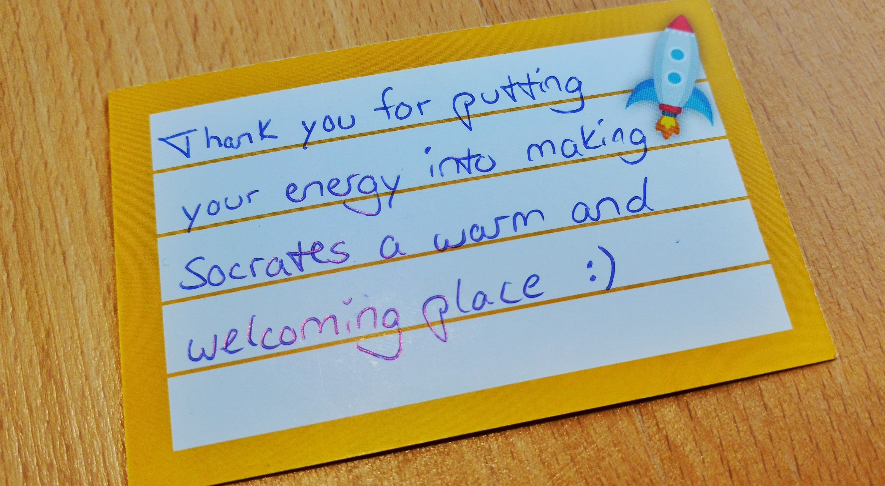

The SoCraTes conferences are dear to my heart, and
[the one in Soltau](https://www.socrates-conference.de/) every year is my most
important conference date every year. This year some of us shared that we were
attending and happy to be a [ConferenceBuddy](https://www.conferencebuddy.io/):

<https://twitter.com/benjamin/status/1029742801767067648?embed>

<https://twitter.com/coderbyheart/status/1030010907840192513?embed>

I also created a public **#buddies** channel in the
[conference Slack](https://socrates-conference.slack.com/), where I posted
opportunities for buddies to meet at the first night of the conference (the
evening where everyone arrives). 26 people joined.

On the first day of the open-space at the marketplace in the morning, I
announced that if somebody felt that they would like to meet a buddy, I would be
happy to meet during lunch.

**And then, nobody showed up.**

But this is totally what I expected to happen. SoCraTes Soltau is by far the
most inclusive tech event I know, and everybody behaves incredibly welcoming and
respectful. It is a safe space and also still kind of an insider-event, since it
is organized by the community and non-profit. You usually know about SoCraTes
because you know someone, who knows it.

But (!) I have received positiv feedback explicitlty referring to
ConferenceBuddy and how it reduced the barrier for newcomers to feel welcome at
the event.

So, this is actually a success story for ConferenceBuddy, because it's like the
phone number in a conference code of conduct: it needs to be there and you have
to make sure that somebody answers it all the time, but its a good thing if
nobody calls.

And here is how a participant put it:

<https://twitter.com/tdpauw/status/1030076022153199616?embed>

<https://twitter.com/tdpauw/status/1033731158918475776?embed>
