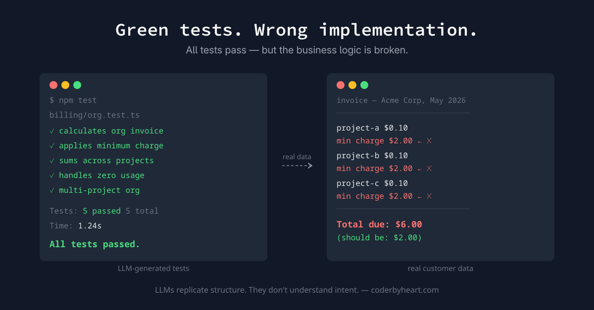

> **tl;dr** LLMs are excellent at scaffolding code that follows an existing
> pattern. They are not equipped to design new domain concepts. When you let one
> do design work, you get code that looks right, tests that pass, and an
> implementation that quietly misses the point. Worse: you own none of the
> understanding, so when something breaks, you're debugging a library you didn't
> write.

When all the tests are green but the implementation is wrong, you have a
problem. And you have made that problem yourself.

This week I introduced a new concept into an existing billing system. We
currently bill on a per-project basis. The new requirement was to introduce
_organizations_: an organization owns multiple projects, and instead of one
invoice per project, the organization owner gets a single consolidated invoice.

Same billing rules. Same pricing logic. Just applied to a higher-level entity.

The existing implementation was well-tested and solid. This looked like a
perfect LLM task: the pattern is established, the tests are clear, the scope is
bounded. I asked the LLM to introduce the organization concept, told it to look
at the existing tests, and make it work for an organization owning multiple
projects.

The initial results were promising. New modules, new method names, new test
files, good coverage. There was a small bit of hand-holding needed around how we
identify organizations—they use a different ID format than projects—but overall
it looked like a win.

Then I started wiring the new domain logic into the actual consumers, and the
cracks appeared.

## The tests were lying

The issues were not dramatic. No obvious failures. They were _subtle_—quiet
mismatches between what the tests assumed and what the business actually
required. I went back to the domain implementation to fix something. Then again.
Then again. Four times in total.

A concrete example: our billing has a minimum charge rule. If your total monthly
usage comes to less than $2.00, you still pay $2.00.

In the per-project billing, this is simple: sum the usage, apply the rate, check
against the floor. The LLM ported this rule to the organization level by
applying it _per project_. Three projects using $0.10 each would result in a
$6.00 bill instead of $2.00, because each project individually hits the minimum.

The minimum charge belongs on the organization invoice—the thing the customer
actually pays—not on each individual project. But the concept of _the invoice_
was implicit in the per-project implementation. It was just the natural unit. At
the organization level it becomes a derived concept, only meaningful after
summing across all projects. The LLM didn't understand that this rule needed to
be lifted to a higher abstraction level. It only saw the mechanics: here is a
rule, apply it at each step.

The tests didn't catch this because the generated test data wasn't adversarial.
Two projects, charges above the minimum, everything sums correctly—all green.
The discrepancy only surfaced when I ran real customer usage data through both
the old and new implementations side by side.

## Debugging code you didn't write

What I underestimated is the cost of _not_ having written the code yourself.

Every time I hit a bug I was in the position of debugging a third-party library
I didn't write and don't fully understand. I'd look at the symptom, form a
hypothesis, and ask the LLM for a targeted fix—without truly grasping whether
that fix would hold in other situations. This is the `console.log` debugging
mode: poking at the surface, observing behavior, inferring structure. Slow,
fragile, and deeply unsatisfying.

A feedback loop makes it worse: each fix feels small. _Just change this one
thing, then it will work._ So you keep delegating back to the LLM. But the LLM
can only act on what you describe. It doesn't understand your goal—it
understands your instruction. It will dutifully add a parameter, loop over
projects, apply the calculation, and miss the point entirely.

## Scaffolding vs. design

The mistake was misclassifying the task.

There are things LLMs are excellent at in an existing codebase. Scaffolding a
new REST route that follows the same pattern as the 25 others in the project?
Perfect. Generate the handler, the CDK construct, wire it into the existing
infrastructure. The output is obviously correct by inspection because the
pattern is unambiguous.

Introducing a new domain concept that changes how the entire billing model is
structured is a _design_ task. It requires understanding intent. It requires
knowing which implicit assumptions need to become explicit, which rules belong
at which level of abstraction, what the code is _for_—not just what it _does_.

LLMs can replicate structure. They cannot reason about intent.

## What I should have done

Written it myself.

Not because the LLM couldn't produce working-looking code—it clearly could. But
because the process of writing domain logic _is_ how you discover the domain.
The resistance you feel when you try to implement a rule at the wrong
abstraction level, the moment you realize the minimum charge can't live on the
project anymore—those are discoveries that only happen when _you_ are making the
decisions.

By outsourcing the implementation, I outsourced the understanding. And
understanding is not optional when things go wrong.

The LLM saved me roughly two hours of initial implementation and cost me several
times that in confused debugging and rework. The irony is that the task that
looked _most_ suited to LLM delegation—structured, well-precedented, bounded—
turned out to require exactly the kind of judgment LLMs don't have.

Use an LLM to follow a pattern. Don't use it to design one.
