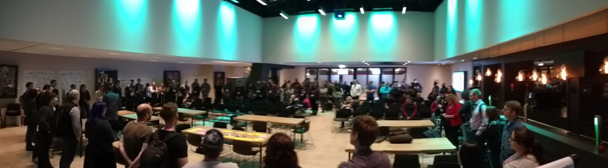
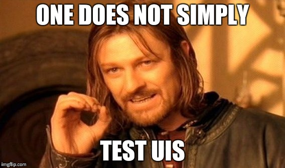

This week I went to the beautiful city of Amsterdam to attend the
[European Testing Conference 2018](http://europeantestingconference.eu/2018/).
This conference hasn't been on my radar previously, but what caught my attention
was the level of detail the organizers (most notably [Franzi] and [Maaret] put
into creating an attendee-focused, inclusive and diverse event.

<https://twitter.com/lisacrispin/status/965498092429684738?embed>

I initially had submitted an older [talk][talks] if mine on testing REST-APIs
using BDD which was not accepted, but the experience during the submission
process made me want to go to this conference any way.

<https://twitter.com/maaretp/status/900672218816032768?embed>

Other than my [usual][socrates] [conferences][codefreeze], the ticket price was
notable (800 €) but given the fact the this conference offered free tickets to
underrepresented groups, organized child care, and paid their speakers. This is
(unfortunately) exceptional! I was happy to use the conference budget my
employer [Nordic Semiconductor][nordic] grants us to support this!

<https://twitter.com/EuroTestingConf/status/936305287308472320?embed>

<https://twitter.com/AdharaIT/status/958464191135977473?embed>

## What did I learn?

The two-day programme was a great mixture of up-front keynotes, talks, and
workshops as well as interactive sessions. The keynotes were carefully selected
to not be vendor-sales-pitches but focus on high level ideas about testing,
communication and team-dynamics.

### Keynotes

[Gojko Adzic](https://twitter.com/gojkoadzic) explained that we are seeing a
revolution in the field of UI testing.

<https://twitter.com/coderbyheart/status/965511538059726848?embed&conversation=none>

This was very insightful since I grew up with the notion in mind:

It looks like it's time to rethink this paradigm. Tools like the one Gojko wrote
(an open-source tool called [Appraise](https://github.com/AppraiseQA/appraise/))
or payed tools like [Applitools](https://applitools.com/) which i learned about
from another participant during the networking session are greatly simplifying
visual testing.

---

[Lanette Creamer](https://twitter.com/lanettecream) spoke about the importance
of communication and how to better understand and improve the skills as a
tester. Although this talk was mainly geared towards testers, I still enjoyed
her insights into what it means to be a tester and improved my understanding of
this role.

<https://twitter.com/coderbyheart/status/965622543557283843?embed&conversation=none>

---

[Zeger van Hese](https://twitter.com/TestSideStory) held a great keynote on
being a sceptic. He stressed the point that it is important to (constantly)
question information you have been given in order keep making the best
decisions.

<https://twitter.com/coderbyheart/status/965870628048957440?embed&conversation=none>

He recommended
[a set of context-free questions](//assets.contentful.com/bncv3c2gt878/4mvcQWNWhWQ0sgiKWCakEU/cce06a8bdc4d3e274ca47eb72d60fbe0/Gause_-_Context-Free_Questions.pdf)
to identify important aspects about a project in an unbiased way.

---

The closing keynote by [Pamela Gay](https://twitter.com/starstryder) was
meticulously executed and fascinating from beginning to end. It provided a great
insight into the work of the [Cosmoquest](https://cosmoquest.org/x/) project,
which uses crowd-sourced data to solve mission-critical problems in
space-travel. One might think that it's a long stretch to _testing_ but the
learning of this talk for me was:

<https://twitter.com/coderbyheart/status/965984483370569728?embed&conversation=none>

Ergo, not all problems can be solved using software. A great reminder to stay
humble.

### Talks

There were four talk slots, each with four talks in parallel. I attended three
of them, since I spent most of the fourth talk time talking with other
attendees.

<https://twitter.com/coderbyheart/status/965913802951790592?embed>

In this highly interesting talk [Matthew Butt](https://twitter.com/bnathyuw)
explained his way to enable testing in software that depends on services, which
cannot be run locally. Since cloud-based services (like machine-learning) is
becoming more and more coming, we have parts in our software which can not
longer be run locally on a developer machine (e.g. for legal reasons). What to
do if the provider does not provide a test-environment / stub for this service?
**Adapters**, all the way. IMO this concept is getting to few attention. We are
happily following the
[SOLID](<https://en.wikipedia.org/wiki/SOLID_(object-oriented_design)>)
principle, but we are pulling interfaces from dependencies into our
implementation. If we write adapters for them we can hide implementation detail
of a service behind an easier (to mock) interface and can simplify testing of
individual components. Matthew did a good job in illustrating this. You can find
his slides
[here](https://blog.matthewbutt.com/2018/02/20/european-testing-conference-unit-testing-the-hard-stuff-slides/).

---

<https://twitter.com/coderbyheart/status/965590736669413378?embed&conversation=none>

The talk was a tester's perspective of working with microservices, which
provided some value for me since Emily was concerned with orchestrating the
collaboration between different teams working in with a microservice
architecture. Most important takeaway from her talk: version your microservices
so other teams or individuals can run integration tests and teams are
responsible to run the integration tests with their latest code, otherwise there
will be pain.

---

<https://twitter.com/coderbyheart/status/965517620396134400?embed>

Albeit providing no new insights to me, Lynoure tried to take a new angle on
_explaining how to write tests_: the mindset you put yourself in. Start from the
most minimal example you can think of and then stop and go talk to your
(business) stakeholders to actually figure out what the component you are about
to write is actually supposed to do. Don't let yourself get drawn into the
rabbit hole of writing too much, and too _complete_ software. Because you can
never know when you are done on your own, and the more code gets written, the
more resistance to change is becoming ingrained.

### Workshops

There were five workshops which were repeated on both days. This reduced the
[FOMO](https://en.wikipedia.org/wiki/Fear_of_missing_out) significantly and I
attended a workshop on BDD and one on Test Specification.

In Vernon Richard's workshop on Scripted vs. Exploratory testing we got to
experience the pain of scripted testing first hand.

<https://twitter.com/coderbyheart/status/965564137890828291?embed&conversation=none>

We
[were given](https://drive.google.com/open?id=1Qif0_-MEcuAXaqfTePoxcCUSFTH5Cu3JQflGmbNEakk)
an outdated test script and tasked with testing a changed UI. This was no fun.

After 30 minutes we switched to persona based testing, where we used the persona
to test a different website. Also we made significantly more progress here, and
it was way less mind-numbing, it still had a flaw: the persona was lacking a
clear goal, so it was not possible to evaluate whether the website under test
passed or failed.

Obviously the workshop was meant to show us the difference in these testing
methods through first hand experience and what would be needed to improved in
order to make them a useful tool.

This workshop provided a great insight for me into the way testers work, and how
we as developers can (and should) support them, as well as understanding the
value especially of persona-based testing. It is way more flexible, does not
need to be changed if implementation details are changed and provides
customer-focused, easy to reason about framework for testers. On the other hand,
it relies on testers understanding the domain and a lot of details about the
test subject in order to execute tests. Which in the end will be to the benefit
of the project.

---

The second workshop by [Seb Rose](https://twitter.com/sebrose) and
[Gáspár Nagy](https://twitter.com/gasparnagy) gave us a very well executed
tutorial on how to write better BDD scenarios. Working in groups on suboptimal
scenarios we worked towards writing one great at the end of the workshop. Their
insights and tips we easy to follow and execute.

<https://twitter.com/coderbyheart/status/965889984258506752?embed&conversation=none>

<https://twitter.com/coderbyheart/status/965899224062791680?embed&conversation=none>

From discussion with attendees one thing became clear though, too few teams are
using this technique which enables discussion of features between stakeholders
and developers and at the same time enforcing the implementation to follow these
talking points. It seems that many teams start the implementation through Jira
and other issue trackers instead of taking the time to formulate users stories.
It might be because it is easy to write tickets like "Export list of products as
CSV" in an issue, but hard to explain why a user needs this functionality in the
first place.

### Open Space

<https://twitter.com/coderbyheart/status/965939046492131328?embed>

Being an unconf fan I especially enjoyed this two-hour slot in the programme. It
was hard to choose from from the roughly 25 sessions:

<https://twitter.com/coderbyheart/status/965954415525064704?embed&conversation=none>

The first session was by someone working for a big oil company and they were
looking for a lean way to develop an alternative-energy car. It was fun to toy
around with that idea and imagine ways to enable this. Given the knowledge I
have collected working at Nordic and as the son of an automobile industry
veteran I could add some insights.

<https://twitter.com/coderbyheart/status/965954967256358914?embed&conversation=none>

---

<https://twitter.com/RidingWolf/status/965954663924322304?embed>

In the session on Continuous Deployment we talked about the do's and don'ts.
Basically: you want your CI runners to be
[Phoenix Servers](https://martinfowler.com/bliki/PhoenixServer.html).
[Chris Dräger](https://twitter.com/_chris_draeger_) who hosted this session
found [LambdaCD](http://www.lambda.cd/) to be his tool of choice. I would
recommend [Travis](https://travis-ci.org/) + Makefiles to solve this.

---

<https://twitter.com/coderbyheart/status/965962746415206401?embed&conversation=none>

_How to Kanban better_ started as a question on how to improve Kanban but this
session quickly turned into a team clinic, where we tried to find ways for a
team to improve their internal shortcomings, which were just being revealed by
using Kanban:

<https://twitter.com/coderbyheart/status/965964932960354305?embed&conversation=none>

## Summary

The [European Testing Conference](http://europeantestingconference.eu/) was a
fantastic experience for me, even being in the minority as a developer I felt
very included and welcome. The atmosphere was always very friendly and never
hostile or too opinionated. Amsterdam as a city did its best, we arrived a few
days earlier and had awesome weather, great food and beer.

I would definitely recommend to follow
[@EuroTestingConf](https://twitter.com/EuroTestingConf) and sign up for their
newsletter. We might see a new installment of this conference in 2019. Maybe in
Finland, given that there were so many Finns among the attendees already?

[talks]: https://coderbyheart.com/talks/
[franzi]: https://twitter.com/singsalad
[maaret]: https://twitter.com/maaretp
[codefreeze]: http://www.codefreeze.fi/
[socrates]: https://www.socrates-conference.de/
[nordic]: http://www.nordicsemi.com/eng/About-us/Career/Nordic-on-the-inside
