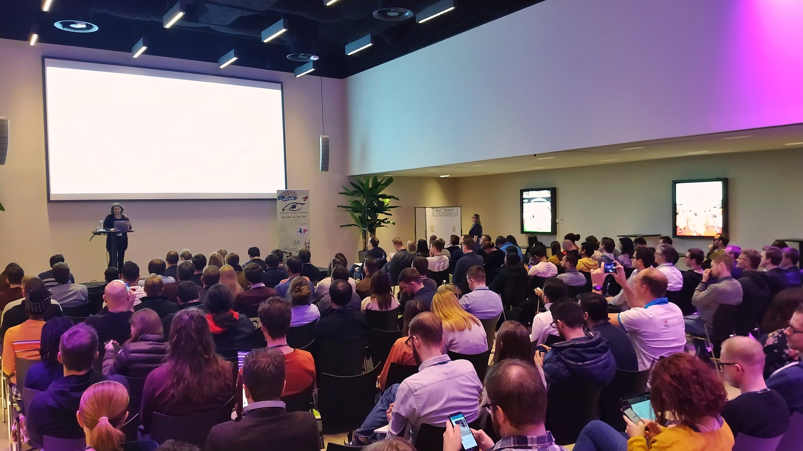

> This is the most diverse conference I have ever been to.

While this remark my friend [Patricia Aas](https://patricia.no/) makes during
the retrospective is about the attendees of the 2020 edition of the
[European Testing Conference](https://europeantestingconference.eu/), it
strongly resonates with me and I will extend it to the wide range of topics that
were covered in keynotes, talks, workshops, an open-space, lean coffee, the
hallways track, and evening get-togethers. I would use diversity further as the
decisive reason for the experiences I had sharing two days with people from
typically separated professions: testers and developers. Both were represented
plentiful, with industry veterans, newcomers and all shades in between. Finally,
attendees were coming from all over the world to meet with people who care about
quality, customers, mental health and bring the desire to learn, share and
teach.

<https://twitter.com/coderbyheart/status/1225330258569764864?embed>

It is a safe place to acknowledge that we, our behaviour and our skills are far
from perfect, to connect with others and figure out _together_ how to be better
humans who work on computers.

The closing keynote by [Ulrika Malmgren](https://twitter.com/Ulrikama)
summarized this perfectly:

<https://twitter.com/coderbyheart/status/1225807205783527424?embed>

It is our responsibility to have honest conversations about our work because we
happen to be influential to the lives of other with every keystroke and we owe
it to our users to deliver the best possible solution.

You can find all the content I discovered and highlights I had this year
[in my twitter feed under the hashtag #EuroTestConf](https://twitter.com/search?q=from%3Acoderbyheart%20%23EuroTestConf&src=typed_query&f=live),
but I would like to point out two specifically:

## Pact

[Pact](https://docs.pact.io/): Fast, easy and reliable testing for your APIs and
microservices during development.

With the help of [Nelis](https://twitter.com/nelisboucke),
[Matteo](https://twitter.com/matteo_pierro), and
[Bernardo](https://twitter.com/bernardobridge) I got a good impression of its
usefulness for my area of work. I plan to look more into it for providing
stronger documentation of my public APIs, which right now are described for
other developers using Gherkin Scenarios. It would be straightforward to create
pact contracts out of these scenarios which would provide a significant benefit
for the frontend developers which consume these APIs. It would also provide a
explicit, safe and unambiguous way to communicate API requirements and changes,
which currently is done using Confluence, Slack and email.

## 7 dimensions of quality

from:
[Discover to Deliver](https://www.ebgconsulting.com/blog/a-quick-dip-into-our-new-book-discover-to-deliver-agile-product-planning-analysis/)

<https://twitter.com/coderbyheart/status/1225389623448342528?embed>

This is super useful technique to uncover blind spots in a project and can be
done with straightforward exercises which don't take up too much time. I will
add this to my toolbox when talking about (new) features.

The slides from this workshop have been uploaded
[here](https://www.slideshare.net/janetgregoryca/exploring-features-and-stories-for-shared-understanding-workshop).

## The End

2020 was the last year for European Testing Conference, I will miss it deeply
and I am grateful for the three years I got to attend it, because every year
helped me to become a better developer but also because it provides an inspiring
proof that diversity in tech is not a pipe dream, but achievable.

## The Future

On Friday we met with some of the speakers and attendees from
[Domain Driven Design Europe](https://dddeurope.com/), one of them being
[Lisi Hocke](https://www.lisihocke.com/p/about-me.html) who spoke and attended
the European Testing Conference many times before. She could share first-hand
how large the overlap between the three communities is that were present at the
table: attendees and speakers of European Testing Conference, Domain Driven
Design Europe, and
[Softwarecrafters/SoCraTes Conferences](https://www.softwarecrafters.org/) share
the same DNA, and hopefull next year, we can bring these three communities
closer together.

<https://twitter.com/coderbyheart/status/1225859527255392256?embed>

---

I thank my employer [Nordic Semiconductor](https://www.nordicsemi.com/) for
enabling me to attend this event on company time and cost under our competence
improvement program.
[We are hiring!](https://www.nordicsemi.com/About-us/Vacant-Positions)
