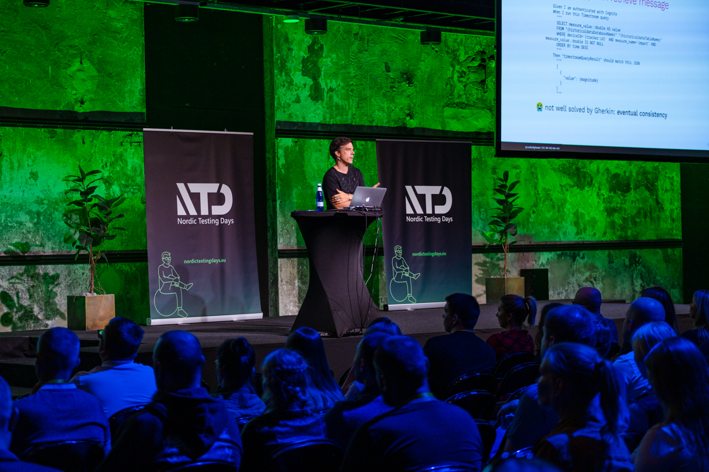

In my talk _Exploring better ways to write tests_ that I gave at this year's
[Nordic Testing Days](https://nordictestingdays.eu/) 2023 in Tallinn, I
discussed my journey from feeling dissatisfied with testing tools to creating my
own test runner. My goal of this talk was to inspire others to explore and
customize their tools rather than settling for the default options available.

For quite some time I have been working on cloud-based software system for IoT
devices. Initially, I used Gherkin for writing tests, but I encountered
limitations in expressing complex scenarios, dependencies, and handling eventual
consistency in cloud-based services. Let me explain how I began using Gherkin
and describe its format and keywords (given, when, then).

Facing challenges with Gherkin for my specific needs, I ran into issues with
expressing dependencies between features, directly embedding JSON in feature
files, managing eventual consistency problems, and dealing with
context-dependent scenarios. I also realized that I needed better documentation
beyond just tests. To address these issues, I decided to build my own custom
test runner, a process that took me three years to develop. The key improvement
was adopting Markdown for better formatting, hierarchical structure, code
blocks, and comments. I introduced the "soon" keyword to handle eventual
consistency in tests. Additionally, I utilized GitHub actions to summarize test
results in a more user-friendly format.

I also talked about the struggles I faced with architecture diagrams and their
maintenance. Auto-generated diagrams fell short, prompting me to explore the
concept of using test traces and observability to dynamically generate
architecture diagrams based on test runs. This approach would allow for more
focused and informative diagrams linked directly to actual usage.

In conclusion, I encouraged others to create tools tailored to their own needs.
I believe that developing personalized solutions can significantly enhance
efficiency and understanding in both testing and development workflows.

<https://www.youtube.com/embed/dZX7SbGOGn4>

The slides are available at
[bit.ly/better-test-tools](https://bit.ly/better-test-tools).

You can read up about my impression under the hashtag
[#NTD2023](https://chaos.social/@coderbyheart/tagged/ntd2023).

