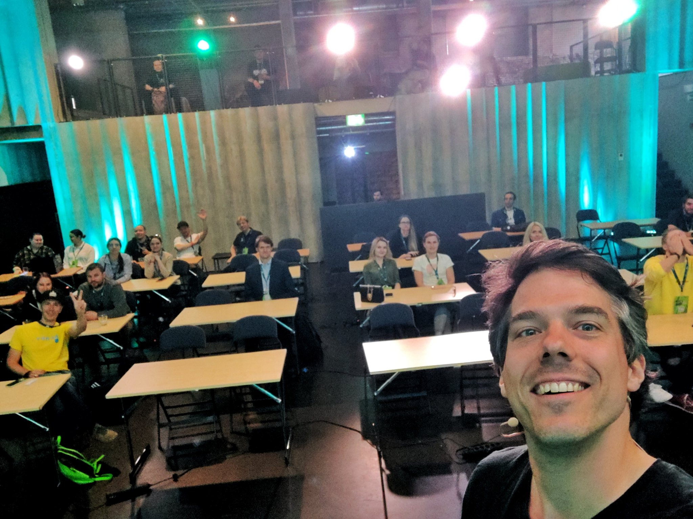

In this talk I am presenting my approach on testing embedded firmware using real
hardware which I gave at [Nordic Testing Day 2022 in Tallinn](./ntd2022).

Testing firmware in emulators drastically limits what actually gets tested and
it can quickly become very tedious to mock, fake and set up environments for
embedded firmware that needs to connect to cloud services.

I am taking a different route: let the firmware run on real hardware, and test
its behavior.

I show how I implemented these tests using Zephyr, AWS, and GitHub Actions.
However, this solution can be applied in any environment which cannot be run
inside a test runner.

The slides are available at [bit.ly/fwtesting](https://bit.ly/fwtesting).

Unfortunately there was no recording of the talk, but it got featured on
[@internetofshit](https://twitter.com/internetofshit):

<https://twitter.com/internetofshit/status/1532795048084983808?embed>

