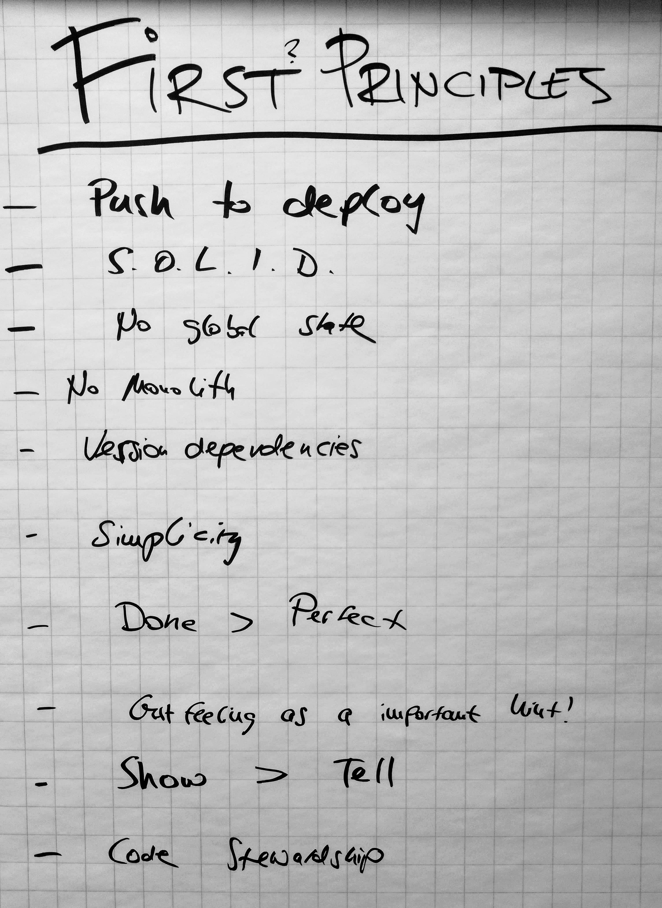
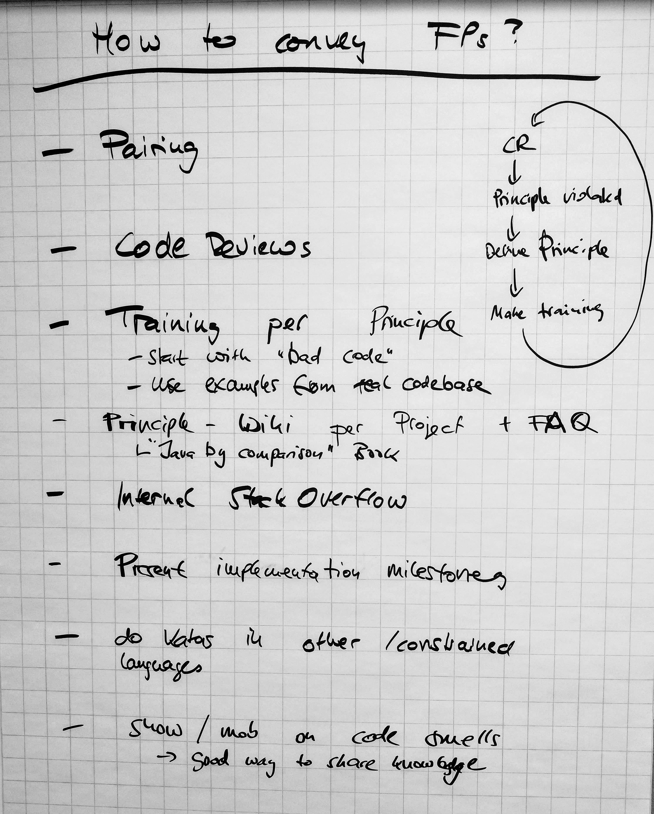
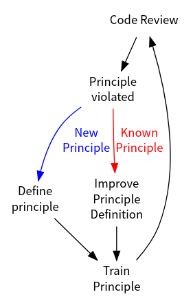

A question I brought to [SoCraTes 2018](https://coderbyheart.com/socrates-2018)
was one that formed in the recent months when I was onboarding a new developer
to a greenfield project. The project they going to work on is developed as a
[walking skeleton](https://codeclimate.com/blog/kickstart-your-next-project-with-a-walking-skeleton/).
Although the architecture is complete, there is not enough flesh on it to
clearly see the _patterns_ I have used when designing it. Right now every
component looks like a unicorn and it is hard to see the underlying principles
that went into the design—simply because there is not enough code to provide
good heuristics.

I was looking for a way to provide a resource _outside of the code_ which
documents the gut feelings that lead to this architecture. These gut feelings
are a result of reading books, articles and building many different software
projects, so there is not _one school_ of thought, but a amalgamation of
hundreds of resources and experiences that form the principles that influence my
decisions.

But what _are_ First Principles?

In this session I listed mine and we collected some more:

- Push to deploy
- S.O.L.I.D.
- No global state
- No monolith
- Version dependencies
- Simplicity
- Done > Perfect
- Show > Tell
- Code Stewardship

While some of those are fairly easy to explain (like S.O.L.I.D. where extensive
documentation [can easily be found](https://en.wikipedia.org/wiki/SOLID)),
others are horribly ambiguous, like _Simplicity_.

In the course of the session we then collected, how principles are shared within
teams. One recurring characteristic was that they are usually very project
specific and are best understood if they are explained using real examples from
the project's source code.

A good method to share these principles is pairing when concrete situations
arise.

Multiple participants shared that they had good experiences using an internal
Stackoverflow (or a home-grown solution similar to that), where developers would
bring up principles they discover or certain implementation details they did not
fully understand so it could be discussed what the underlying principle was, and
whether it still applies. This forum-style aproach can also serves as a good way
to document technical dept, and the decisions that lead to keeping it in the
system. It provides an easy way to regularly revisit these decisions after a
certain amount of time has passed and decide again whether to keep it or get rid
of it.

I was also looking for a way to provide documentation about _First Principles_
before code is written, especially to reduce frustration during code-reviews
when a violation of a principle is discovered and big changes are neccessary in
order to heal the pull-request.

Following the idea of continuous improvement (I think this is yet another First
Principle) I will try to follow this process:

This will lead over time to a collection of _First Principles_ which can be used
to train new developers.

The _Training_ part is important so we can discover bad and harmful principles
like _Simplicity_—if you can't train it, it is most likely a bad principle and
we should drop it. (The number of times a principle has been violated will be a
good indicator!).

I for myself have now started to collect first principles
[in a public repository](https://github.com/coderbyheart/first-principles/issues),
which will serve as a base for our internal collection.

> **Update January 2022:** I am now compiling my first principles in a series of
> [42 posts](/42-first-principles).
