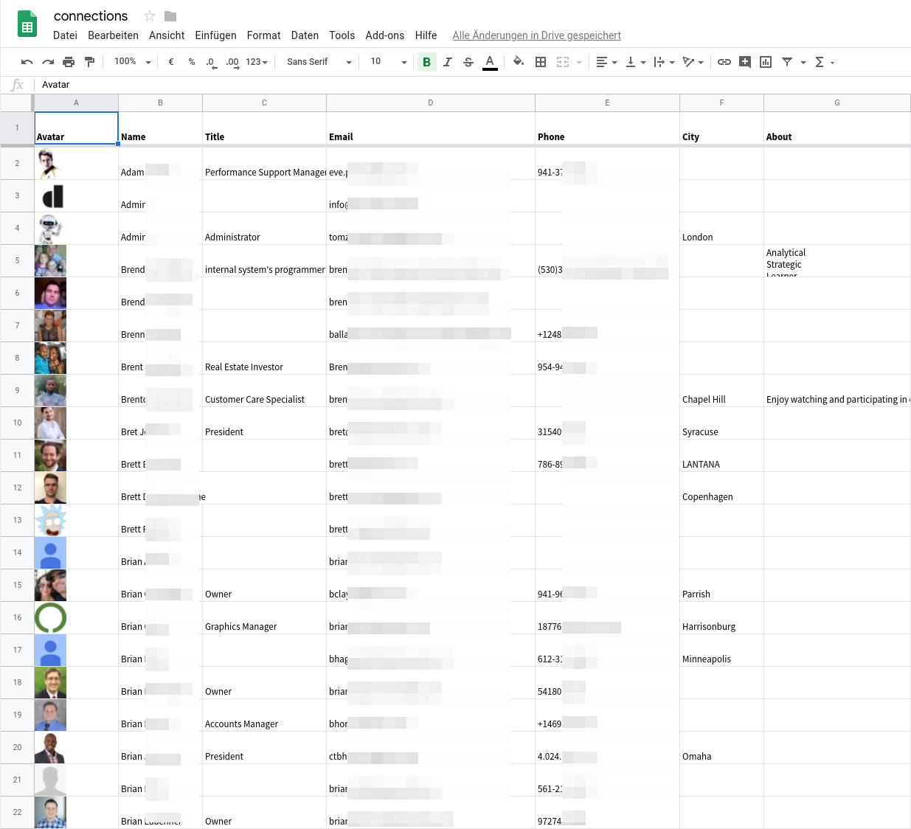
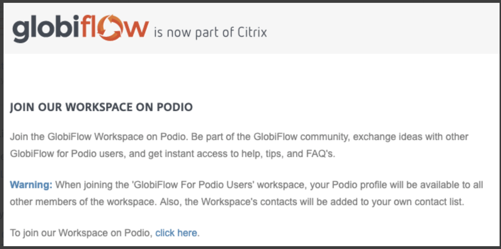

I've been a big fan of Podio for many years and I recently discovered a nice
_feature_: once you sign up to [Podio](https://podio.com/) and pay for the
Premium Plan: you become connected through more than 2,600 other premium users
through becoming part of the same Network in order to use their automation
product [globiflow](http://www.globiflow.com/).

This gives you access to extended personal information:

- Full name
- Title
- Email
- Phone Number
- City
- Personal description / About
- Photo
- State
- Country
- Skype
- Location
- Address
- Postcode
- Website
- IM

The information is presented in a nicely formatted way, so I was able to extract
the data for all users within a few minutes in a nice spreadsheet.

I think this is highly problematic because this provides a gold mine for
phishing attacks: I could find members who belong to the same organization and
use Podio as a pretext to send them arbitrary emails (_Hey Bratt, I shared this
Podio View with you!_) containing dangerous links.

## Two months ago I reached out to the Podio support

I asked them to remove this feature, however they claim that this is perfectly
fine.

I wrote:

> When you purchase Podio premium, and activate Globiflow, you are joining the
> Globiflow network, which will make over 2,600 connections available.  
> See also
> https://help.podio.com/hc/en-us/community/posts/360000702471-Mass-Delete-Connections  
> This is a serious violation of user privacy since the connections show Name,
> E-Mail, Photo and Phone of the job Title is exposed to anyone (who payed
> \$24).  
> Please remove this feature immediately.

This is the answer I received:

> I understand your concern of having so many connections added to your profile.
> But this is not necessarily a violation of user privacy because the profile
> details that a user is adding is an information that would be publicly
> available only to other podio users you are connected to.  
> Please refer to:
> https://help.podio.com/hc/en-us/articles/201019378-Updating-and-editing-your-profile
> which states that the profile details will be visible to other users as well.
> It is similar to having your contact and profile information added to your
> social or business collaboration platforms like Linkedin.

No, this is **not** what I would expect from a paid product like Podio.
Especially looking at the linked article, it does not state that "profile
details will be visible to other users" but instead uses "colleagues".

> Having a completed Podio profile really helps you and your colleagues "see"
> who you're working together with.

Colleagues are by definition not **all podio users**. With colleagues I (or the
manager of the podio account I belong to) has control over who sees my data.
This is not the case with the "connection" feature where I do not have ways to
control who sees my data.

I can only encourage Premium Podio users to educate themselves about this
_"feature"_ and reach out to the Podio support so this disclosure of extensive
personal information will be stopped.

## Update 4. July 2019

I received a reply from Podio support to the original request I made two month
ago:

> I understand your point of view here and thanks a lot for bringing this up.  
> We are working towards making this more transparent to users so that users can
> decide what information they would want to keep public.
>
> Will be releasing out information once we have more clarity on the plan and
> approach.

## Update 8. July 2019

Podio responded to
[the Twitter thread](https://twitter.com/Podio/status/1148152555177857026):

<https://twitter.com/Podio/status/1148152555177857026?embed&conversation=none>

## Update 11. July 2019

Podio updated the
[help article](https://help.podio.com/hc/en-us/articles/201019378-Updating-and-editing-your-profile)
and added a section which explains that profile information is shared with
everyone:

> **Public Profile Information** Profile information can be seen by all of your
> connections in Podio. This means all of your colleagues, external members that
> you collaborate with, and members inside of community workspaces that you’re
> apart of will all have the ability to view your Podio Profile information. You
> can edit and remove any unwanted profile information at anytime by editing
> your profile information.
>
> Shared Profile Information:
>
> - Profile Picture
> - Email
> - Phone
> - Location
> - Address

They also added a prominent warning presnted to GlobiFlow users when joining
that workspace:

In addition they plan to upldate the "Edit Profile" feature:

> For long term, we would also be updating our in-product "Edit Profile" page
> later to call out what all information is public and what is not, so that
> users can take an informed decision while adding their details.
