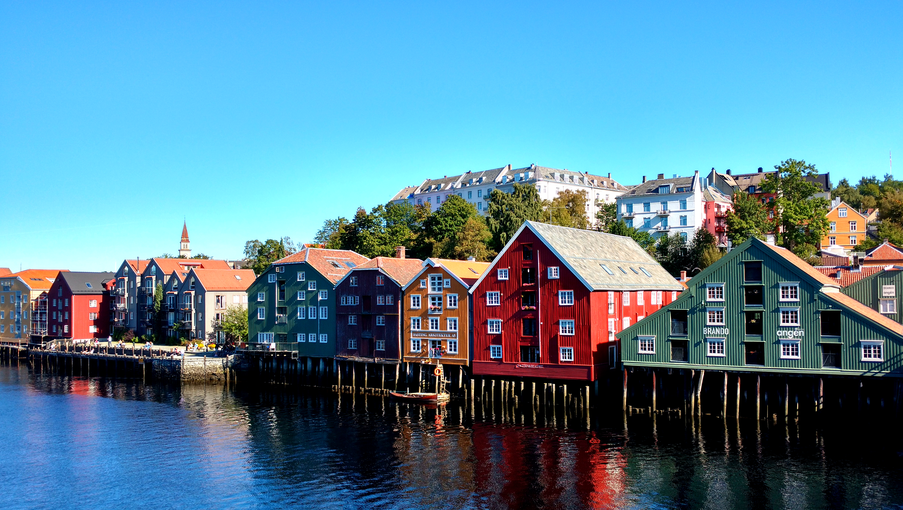

Celebrating 2,000 followers on [@coderbyheart](https://twitter.com/coderbyheart)
I decided to sum up my week on Twitter from now on every weekend.

### Tech 🚀

I've been using [Firefox Focus](https://www.mozilla.org/en-US/firefox/focus/)
now for two weeks and I really like it when reading articles from RSS feeds. It
blocks a lot of ads and does not pollute my history with one-shot visits.

Some asshole dude can't deal with a woman, again.

<https://twitter.com/jessfraz/status/902262783672291328>

The next thing regarding Facebook and licenses came up. This time:
[GraphQL](http://graphql.org/learn/).

<https://twitter.coderbyheart.com/status/902804396504961025>

This might explain why I like cooking AND Linux:

<https://twitter.com/douglax/status/901155475424550912>

### JavaScript 🛠

V8 is now on Twitter:

<https://twitter.com/v8js/status/902560466291093504>

I've learned a new term: NPM lego.

<https://twitter.coderbyheart.com/status/902791900104667136>

I am still struggling with TypeScript:

<https://twitter.coderbyheart.com/status/903619298215768064>

Also, I haven't completely ditched Promises, yet.

<https://twitter.coderbyheart.com/status/902646931226275840>

With [Chirr](https://getchirrapp.com/) I can finally effortless create a Twitter
thread. Like this one about my visit to Trondheims JavaScript UserGroup
[BartJS](https://www.meetup.com/de-DE/BartJS/):

<https://twitter.coderbyheart.com/status/903548864384438272>

### Web 🌍

Because <em>Web</em> is an ever changing target, our performance optimizations
strategies are also in constant need of revisiting them:

<https://twitter.com/fox/status/903190652401451008>

### Diversity 🌈

A longer article about [Project Include](https://twitter.com/projectinclude)
highlights some of their methods:

<https://twitter.com/projectinclude/status/903288925485228032>

### Culture✌️

Very well said:

<https://twitter.com/amokleben/status/903218809183535104>

> "We don't have enough experts" You 👏 have 👏 to 👏 start 👏 training 👏 some!

Nordic understands that, and investe in roughly 40 paid summer interns:

<https://twitter.com/NordicTweets/status/903216628048986112>

Also culture, but different:

<https://twitter.com/kcimc/status/902229612666658816>

### Conferences 💡

A reminder:

<https://twitter.com/uveavanto/status/902852536557871106>

[Franzi](https://twitter.com/Singsalad) has another:

<https://twitter.com/Singsalad/status/902626487471362048>

### Listening to 🎧

- [Joachim Pastor - Promesse](https://www.youtube.com/watch?v=GIFnJFuTIkw) (the
  long version!)
- [THE HAUNTED - Preachers Of Death](https://www.youtube.com/watch?v=UePeYXK0ISY)
  and the rest of
  [their new album](https://open.spotify.com/album/5GVpTi1IWHZWsb6FMUhwrN)
- [Every Country's Sun](https://open.spotify.com/album/5dICNeVi2fhMSPylzSvG6J),
  Mogwai's new album

> Remember to [follow me on Twitter](https://twitter.com/coderbyheart)! DMs are
> open!
> [I'm happy to answer your questions](https://twitter.coderbyheart.com/status/895631124021563394)
> ...
