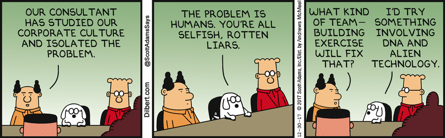

Once again, Scott Adams nailed it in one of his
[recent comics](http://dilbert.com/strip/2017-12-30):

> _Boss:_ Our consultant has studied our corporate culture and isolated the
> problem. _Dogbert:_ The problem is humans. You're all selfish, rotten liars.
> _Boss:_ What kind of team-building exercise will fix that? _Dogbert:_ I'd try
> something involving DNA and alien technology.

It is one of my fundamental learning as an agile consultant and practitioner:
**Humans are Liars**. They lie about their feelings, performance, thoughts,
coworkers, progress, ..., in order to protect themselves. And this is the root
cause for all organizational problems. Humans are really great in adapting to
existing organizational deficits and turning them to something which they can
operate in with the least amount of energy necessary.

In order to break this pattern and create a workplace that enables humans to
focus on their positive skills (creativity, problem solving, …) these three
factors are key in a workplace culture:

It should be safe to be vulnerable

Fear of Shame is an important driver for telling lies, and if we remove this
fear from our workplaces, we remove the need for lying. Brené Brown is doing
fantastic research on this topic and you should start reading and watching her
material [here](https://www.ted.com/speakers/brene_brown).

It should be transparent

Transparency enables to uncover defects, if information and data is available
without restriction, there is no use in lying about it or covering it up. It
also disables power structures that are build on information possession and
selective distribution of information. You can start reading about this topic in
[this article](https://www.fastcompany.com/3036794/why-a-transparent-culture-is-good-for-business).

It should be free of incentives that promote individualized results

In creative industries, there are no individual performance goals that will not
hurt the company. Our work output is too complex to define goals for individual
contributors. If done nevertheless they are easily gamed (by lying) towards the
benefit on the individual.
[Here](https://www.forbes.com/sites/groupthink/2014/06/07/the-dark-side-of-bonus-and-incentive-programs/#4af5e680756d)
is a good article to get you started.
