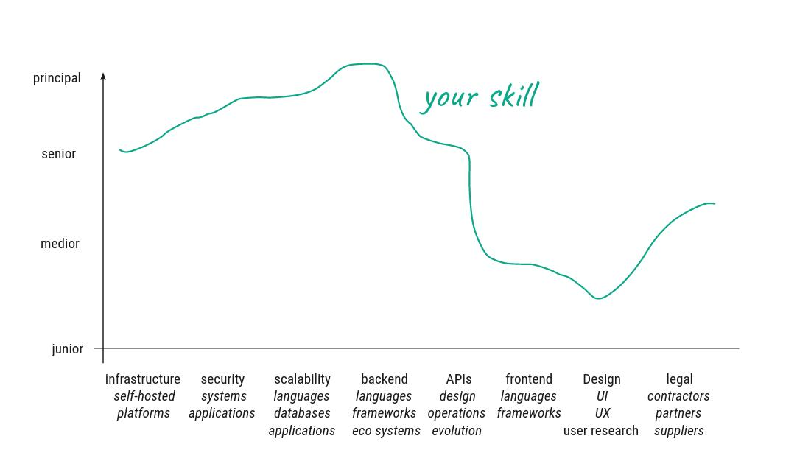
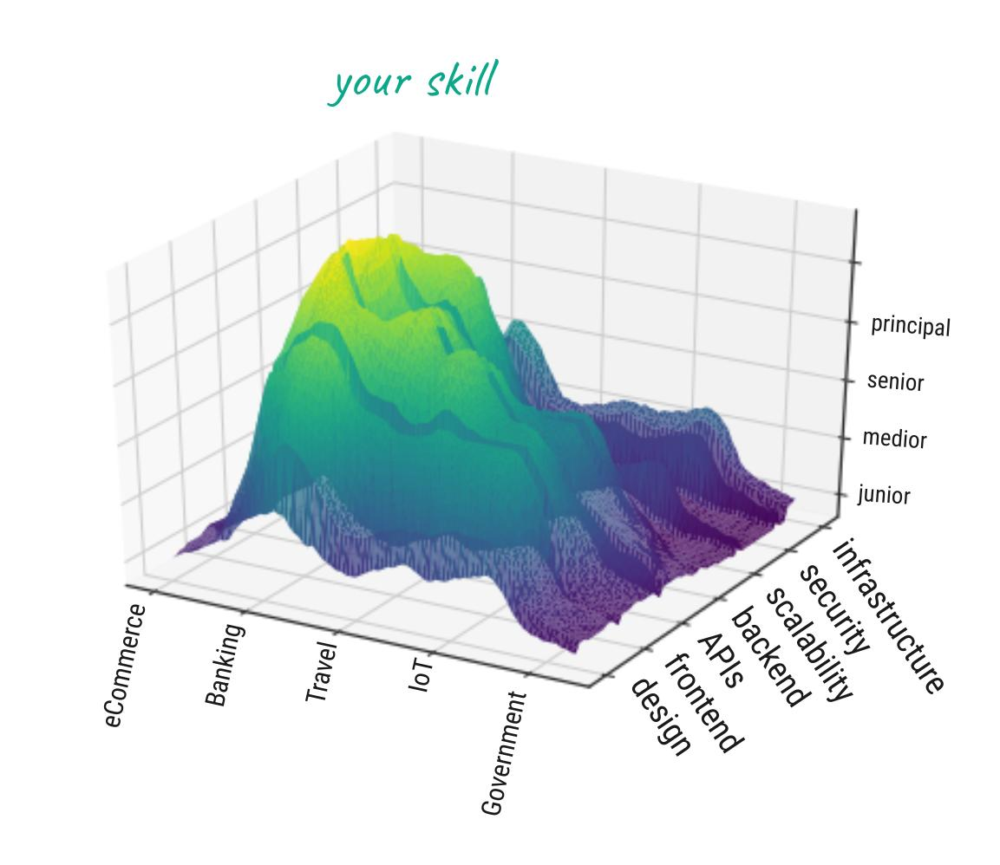
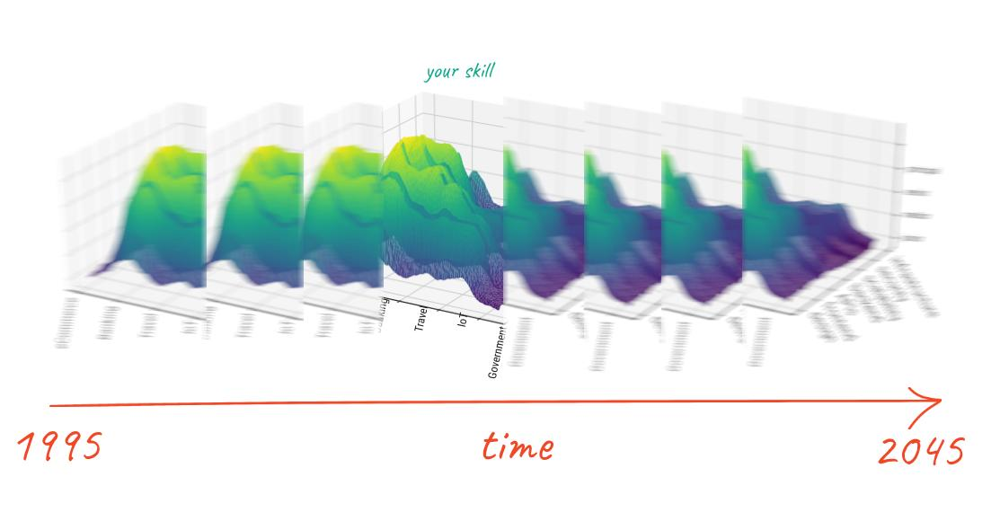

> _This blog post was originally published in June 2021 on
> [LeadDev](https://leaddev.com/):
> [Using communication frameworks to become a better engineering leader](https://leaddev.com/communication-relationships/using-communication-frameworks-become-better-engineering-leader)_.

Having had the opportunity to earn my living as a software developer since 1997,
I have lost count of the number of meetups and conferences I’ve attended as a
participant or speaker, the number of YouTube videos I’ve watched, blog posts
I’ve read and written – all in pursuit of one goal: improving my skills as a
developer and to become a god of the world wide web, a ninja, a rock star, a
full stack developer.

Many developers see themselves as artists and their works as divine creations
brought into existence by heroic acts of willpower that are only possible after
many, many years – by day as a paid software professional, and by night as an
open source contributor.

It was in 2012 when I started to interact with the community outside of my
workplace and then eventually realized that the effort to become a full stack
developer is futile.

## Stop becoming a full stack developer – your efforts are futile.

Five years later, after having met many amazing, humble people in the
[software craft community](https://www.softwarecrafters.org/) that care about
software quality the same way I do,
[I concluded](https://coderbyheart.com/the-full-stack-developer-trap) that the
aim to become a master on all levels of the stack stems from a preposterous
self-glorification. Building world class software is  a
[complex and sometimes chaotic](https://en.wikipedia.org/wiki/Cynefin_framework)
process that requires knowledge on so many different aspects (backend, frontend,
UX, privacy, accessibility, CI/CD, operations, etc.) that it’s impossible for an
individual to acquire the amount of knowledge needed to be _the_ expert on all
of them.

Being a full stack developer supposedly means that you possess the skills to
develop an application end to end. This is of course a very simplified view,
since being a full stack developer means you need to be proficient in a
multitude of areas: your skill is not a single value but varies across the
professions as shown in this graph.

Ask yourself this: what is your overall level? Your highest skill in one of
these areas (so a t-shaped skill set lets you call yourself a full stack
developer), your lowest skill (you need to master all in order to call yourself
one), or an average?

You can see that the label of ‘full stack developer’
[is problematic already](https://twitter.com/AmarachiAmaechi/status/1185891780128133120).

<https://twitter.com/coderbyheart/status/1185891780128133120?embed>

If we consider more deeply what is needed to develop software, we also need to
take into account the various requirements of the respective domain the
application is intended for.

Your skill is always relative to the sector you are working in. If you mostly
work on ecommerce projects, you will most likely have deep knowledge in
performance, payment systems, and user journeys. If you work on internal banking
systems, your fields of expertise will have an entirely different focus.

## Technical skills have a limited lifetime

All of the above also needs to be viewed through an important fourth dimension:
time!

Your skill is a function of the time you spend improving it, and since you
cannot simultaneously improve all skills at the same time, your absolute full
stack developer skill will fluctuate over the years of your career.

Software is an incredibly fast-changing field, and the skills associated with a
full stack developer usually become outdated within a few years – a fraction of
your total working life!

> This all means you will never truly be a ‘principal full stack developer’.
> _Sorry._

This realization brought me to the conclusion of focusing my learning journey on
the area where my talent, my interests, and my ability to sell these skills
[overlap](https://en.wikipedia.org/wiki/Ikigai): being a great architect and
developer for cloud native solutions, while trying to keep following the
frontend trends.

I didn’t see it in 2017, and it seems like I was still framing my function in
isolation. To you it might be obvious: building software is a team effort and
typical project sizes make it impossible to be the sole decision-maker for all
technical decisions in a project.

It took me a while to realize this. I am most likely not the only developer
going through this process. It's impossible to achieve greatness solely on your
own.

_Writing software is a team effort – you will always lack important skills to
realize the best work you have ever done._

_You will always depend on others to work with you, and the more experienced you
are, the more others depend on you enabling them to achieve their best._

If I would categorize the problems I encountered in my career into people
problems and software problems, it’s only the people problems that are the real
challenge.

I'd love to have more software problems, because dealing with software problems
is sometimes hard, but there is always a solution: fix it, hack it, or scrap it
and take another approach.

But people problems are the ones that give me sleepless nights and stress me
out. These problems are different: we can’t make the person on the other side do
what we want – we can only try to get on the same level with them to resolve
issues, but we can’t, ultimately, change them.

Somehow, as engineers, we expect people to have the same quality: to fix a
problem, I just have to explain, really slowly, what’s wrong with them for the
problem to go away.

However, in the past I’ve invested very little time in educating myself on
collaboration and communication. And I am certainly not alone.

We developers happily pay (with our money and our time) for getting up to speed
on tech topics. We don't do this for communication and collaboration skills. And
this is not because our employers don't offer this, as they rarely offer
structured tech training, either.

I want us to change this. That’s why I am writing this article.

## Where to start?

Our industry is flooded with communities, blog posts, meetups, and conferences
that revolve around technical skills.

Over time, I have developed a great sense for finding interesting content
through Twitter, Slack, and  YouTube because I know what to look for and my
trained pattern recognition skill can easily identify relevant tech content. But
when it comes to collaboration, communication, and leadership, I don’t have that
sixth sense, yet. Let’s look at the actions I’ve taken in the past couple of
years to start developing it.

### Communication frameworks

I mentioned earlier that people problems are different to software problems,
which means we cannot apply the same principles. I can’t fix another person,
however,
[I am responsible for how their actions affect me](http://threeminutetherapy.com/rebt).
I decide to feel angry, hurt, annoyed, ashamed. How I feel about something is
solely my responsibility.

There are communication frameworks we  can adopt or extend on like we do for
software. Because, as with software frameworks, communication frameworks should
prevent us from making the same mistakes over and over again and provide best
practices that will let us achieve our goals faster: less conflict when
communicating with others.

#### Nonviolent communication

[Nonviolent communication](https://en.wikipedia.org/wiki/Nonviolent_Communication)
helps to identify my emotions and separate them from the message, it also gives
you the tools to help the other party help you, by providing clear information
about how you feel (without blaming them), and providing them ways to help you.
It gives you a process to dissect communication and try to find the true
message, which might be wrapped in emotions and hard to understand initially.
But this is a one-sided method, where I do the analysis and do not work with the
other person on the way they communicate.

Lara Hogan has a talk on how to use this method for feedback on LeadDev.com:
[Navigating engineering team friction](https://leaddev.com/team/navigating-engineering-team-friction),
where she talks about the
[feedback equation](https://larahogan.me/blog/feedback-equation/). Additionally,
Bob Marshall has a great summary about
[using NVC in the workplace](https://flowchainsensei.wordpress.com/2015/09/04/nvc-in-the-workplace/).

#### Four-sides model

The [four-sides model](https://en.wikipedia.org/wiki/Four-sides_model) is a
valuable complement to non-violent communication, since it also models a message
as a composite of various aspects and it helps to identify and separate the
different aspects that were amalgamated by the sender of a message. I learned
about this model back when I was studying communication as part of my first
professional education many years ago. It's helpful to identify the aspects
within the model  in written communication in order to better understand the
true meaning of a message.

#### The five love languages

Since most people work for some kind of affirmation, the
[five love languages](https://en.wikipedia.org/wiki/The_Five_Love_Languages)
give a good model about the different ways humans are receptive of gratification
and it is important, as a collaborator, to understand what drives them and how
you can give them the feeling that you value their work. The important learning
here is that means of affirmation can be completely different to your own, so
you need to make a conscious effort to translate affirmation and gratitude in a
way the recipient understands.

#### The core protocols

A few years ago I took the time to read
[The Core Protocols](https://liveingreatness.com/core-protocols/), but they are
very regimented approaches to human interaction. This works for some, but in my
experience, requires a lot of discipline. Many that experience using it, develop
an uncanny valley feeling of being overly controlled. In my experience as an
organizational coach, these systems do not work well with heterogeneous teams
where you gradually change something; it's hard to explain to an ‘outsider’ why
this makes sense and it can actually feel inhuman. It is, however, a fascinating
source material to look into because it very explicitly highlights communication
issues and how to deal with them.

#### Structured RFC process

Phil Calçado published an article proposing a
[structured RFC process](https://philcalcado.com/2018/11/19/a_structured_rfc_process.html)
about communication which puts a spotlight on the aspect of discussion and
decision-making. His analysis and proposal are very valuable because
decision-making is one major source for conflict and often a time where power
dynamics become painfully visible.

#### Ladder of leadership

L. David Marquet’s
‘[Ladder of Leadership](https://www.youtube.com/watch?v=-sri5wyth4I)’ is a
really powerful concept that describes ‘angles of freedom’ in a collaborative
relationship. What's great about it is that it provides a model for
communication that involves everybody in making implicit rules around
decision-making explicit, and provides a road towards enabling team members to
make autonomous decisions.

### Let's explore this topic together

I am just beginning to explore this space and I already have enough material for
many years to come. I also invite you to run a session at an open-space you
attend,
[like I did at the JSCraftCamp 2019](https://twitter.com/coderbyheart/status/1152190229601820672),
this is a great way to spread awareness about this topic and also collect input
from others on the resources they use to improve their collaboration skills. One
outcome of this session was a list of book recommendations:
[Crucial Conversations](https://www.amazon.com/Crucial-Conversations-Tools-Talking-Stakes/dp/0071401946),
[Adversaries into Allies](https://www.amazon.com/Adversaries-into-Allies-Ultimate-Influence/dp/1591848164),
and
[The Coaching Habit](https://www.amazon.com/Coaching-Habit-Less-Change-Forever/dp/0978440749).

I hope I inspired you to invest more time in your real power skills: the way you
communicate and handle conflict influences your personal and your team’s
wellbeing tremendously. This is key to creating workplaces where people feel
valued, heard, and understood, and where they feel safe to voice concerns,
criticism, and can propose radical ideas.

Because, as Kelsey Hightower put it:

<https://twitter.com/coderbyheart/status/1393194153681440780?embed>
