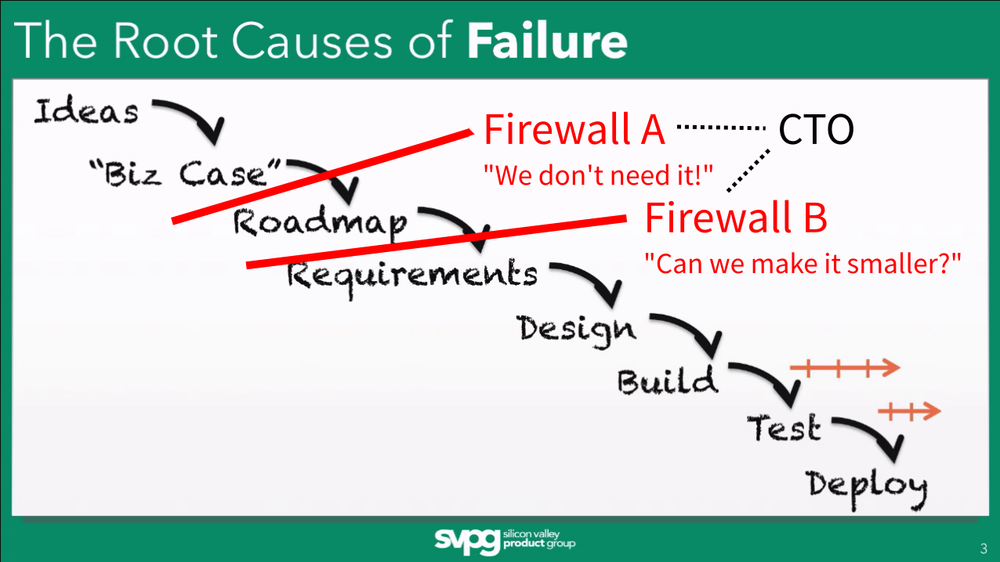

Until recently I understood that one of my roles as a CTO was to create a
_developer firewall_ that shields the developers in my team from the managers.
Those firewalls are need to create the space for developers to actually get
things done and give them task they can fully understand and thus focus in their
implementation. Otherwise management would just stand in the door every other
hour with a new idea to discuss. I create these firewalls through planning
meetings whose purpose it is to order upcoming feature request by priority. This
is my first firewall. Here I have the opportunity to _talk down_ feature
requests and eventually make them go away. If they make it through those
meetings it is because they are either actually useful and implementable given
the current resources or it is decided that they are important enough to be
shoved in the already overfull schedule. If tasks make it to the roadmap I only
have a second chance to intervene: I can try to shave off some extra
functionality to make the first version of a feature as small as possible. Once
they are after my second firewall the development team has to implement them if
they like it or not.

When I saw [Marty Cagans'](http://svpg.com/team/#marty) fantastic talk titled
["Great Engineering, Failed Product"](http://www.ustream.tv/recorded/61491014)
from this years [CraftConf](http://craft-conf.com/2015) it became clear to me
that this is one of the things that create so much friction and make my job
sometimes very dreadful: I'm fighting an uphill battle and because we are in the
end fighting for the same goal there can only be losers.

But why do I fight ideas that come from the top or the management? Fighting is a
hard word, but in the end it is exactly like that: in this pseudo-agile process
as picture above I don't have the power to deny tasks. I simply cannot say no
because how it is organized. There is a visionary boss who knows what's best.
But vision unfortunately does not entail wisdom and so many of the broad ideas
simply cannot be put in production _just like that_. It takes days of planning,
talking, conceptualizing, building, testing, bugfixing for each new feature. And
new features required changes to existing features and so forth. The more
features you have the more _noise_ you create in your project but also in the
mind of the developer.

Developers are the foundation of every tech project. Yet, they bear no power.
They don't say: stop, lets make this mess right by removing technical debt! They
don't say: no, let's first make that feature actually complete before we jump to
the next one. Why? And this is the crucial part: hierarchy. They don't get to
speak up because they don't _own_ the project. The CEO does. By now it should be
clear that Marty Cagan is right: you can't expect great products from a team of
developers who are not fully commited to the task they are doing because they
were just handed down to them. In this classical scenario not all feature
reuquest are created equal, some get a free pass to production no questions
asked.

> And interesting side note: the usual argument for why the boss gets to be the
> boss is that he holds the entrepreneurial risks. But only in the rarest cases
> is he really affected by bad decisions. The first ones that will take the
> risks are the employees. If the the numbers are bad for the business and costs
> need to be cut, the quickest fix is to lay off people. So the result of bad
> decisions is handed down to the employees, where the wins by good decisions is
> often cashed in by the CEO.

Cagan's picture of these rare but successful teams that built great products is
not new, but he makes it clear to understand in his talk: no one should be
entitled to force features. They should emerge from the team because only if and
idea attracts enough _followers_ (designers, developers, concepters) to realize
it, it can make it to production and that guarantees that the persons working on
it are actually committed to do great work. He also points out that in order for
an idea or a feature request to be understandable they should have
[OKRs](https://en.wikipedia.org/wiki/OKR) attached. This answers the _why_ but
leaves the _how_ open, which can't be figured out before anyway.

This kind of organizational structure is radically different, but if we are
honest, what are we making different than the "old economy" whose products we
are trying to replace? We've attached an agile appendix to a hundred year old
skeleton.

Imagine a place where the person that owns a majority of the company comes to
your desk and instead of saying: "Paint the shed in the backyard green by the
end of the week." he asks you: "I need your help for making our backyard
prettier." and he would expect you to decline, if you were busy. Would'nt this
be great? No firewalls in sight.
