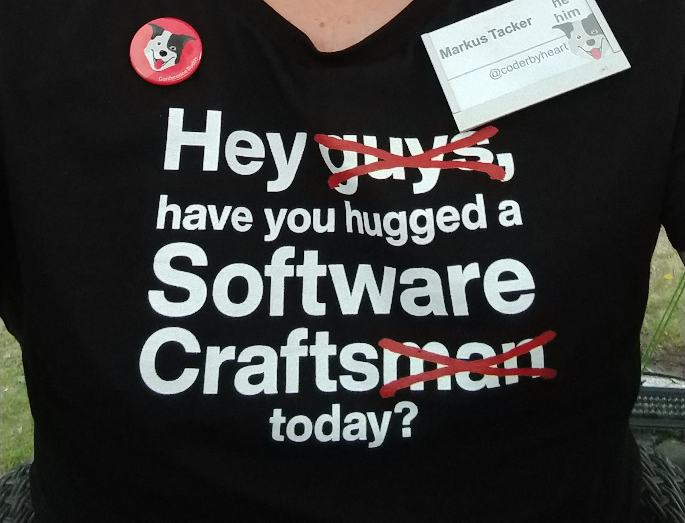

## SoCraTes 2019

I have
[previously written](https://coderbyheart.com/the-magic-of-socrates-conference/)
that the
[SoCraTes conference in Soltau, Germany](https://socrates-conference.de/) is my
absolute favorite (besides [CodeFreeze](https://codefreeze.fi/) and
[CodeBreeze](https://codebreeze.netlify.com/) which I help to organize
obviously), and I was especially amazed about the progress in terms of diversity
that took place [last year](https://coderbyheart.com/socrates-2018/). I was
confident that this year would be even better because at SoCraTes we manage to
bring a critical mass of mindful humans together that actively push for
inclusivity and safety at tech conferences. This mindset permeates permeates
every thing that happens at the conference which enables newcomers to quickly
open up and contribute with their entire self.

Nevertheless I felt the urge to make a statement.

I had visited two open-space conferences this year who are part of the
[ever growing community of Software Crafters](https://www.softwarecrafters.org/)
around the world. And at these events diversity was lacking, which was due to
their geographical situation. However, living in Norway, I totally get that it
is sometimes impossible to achieve diversity amongst event attendee if the
structure of the industry itself is absolutely dominated by men.

**The issue then arises is when attendees use English as the common language and
address the entire room as _Guys_.**

I am absolutely aware that for many it's not a conscious decision, and they did
not intend to address everyone as _men_, but are using _guys_ in a
gender-neutral form.

_However_ many are painfully aware of the literal translation because they are
non-native speakers and did not grow up with _Hey guys!_ being used as an idiom
and not as a way to selectively address the male members of a group.

After all **_Guys_ is not gender neutral**:

<https://twitter.com/etiene_d/status/994509163693838337?embed>

Not convinced? Please read [this](https://www.xaprb.com/blog/you-guys/)
extensive post about the topic.

## Calling everyone a Guy 🤵 is one of these microaggressions that keep reminding some members of our community that they are not recognized. 🤦‍♀️

Now, changing behaviour is _hard_. And especially at events I find it impolite
to interrupt someone (especially in public) if they use _Guys_. They most likely
are not aware how it makes others feel and there is a high chance that it puts
them in a spotlight which in most times will make them turn into
aggressive-defensive mode rather than considering their behaviour.

This holds true for online communities as well. It is much more helpful to reach
out to a person in a private chat and ask them to consider their wording then
pointing it out in the public thread. There they even have the chance to edit
their postings.

This obviously is not possible at events.

## This t-shirt is like a friendly virus

So I made this t-shirt:

<https://twitter.com/coderbyheart/status/1164957001438433280?embed>

You can download the layout files
[here](https://github.com/coderbyheart/inclusive-language-t-shirt), so you can
print your own version yourself (I printed this shirt at Spreadshirt for
€33,98).

Wearing a t-shirt like this at an event has some interesting aspects to it:

- I wore it the entire day, so I could reach many attendees with this message,
  without _sounding_ like a broken record.
- It is _specific_ in it's message, but does it in a way that addresses everyone
  at the event, which means it will nudge people to think about their behaviour
  but in a way that does not single out individuals
- The t-shirt got recognized and mentioned during the open-space, so others were
  building, and extending on it.

I did not witness the use of _Guys_ to address a group, but I would address this
to the lovely group of people that come to SoCraTes every year. Or maybe the
t-shirt worked, who knows?

## Privilege emphasizes the message

It is important to also recognize that _it was I_ who wore the t-shirt and what
this means for the message.

First, **I felt safe** to be able to wear a T-Shirt at my favorite conference
which clearly demanded something _specifically_ from its attendees. Newcomers
and members of underrepresented groups often do not feel safe enough to express
messages like this. As a community it is the job of the overrepresented to
recognize issues and advocate for the change.

Second, being recognized by _Softwarecraft**men**_ as one of their own makes the
recipient of the message being more likely to consider it. Change works best
peer-to-peer, if the recipient of a message can identify with the messenger they
are more likely to consider it.

We can change our industry only if we as those who have benefited for years from
its homogeneity put effort into it&mdash;and we have the luxury of being
listened to by those that need to change.
