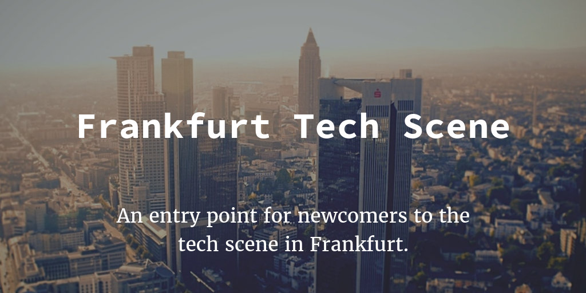

This post tries to provide an entry point for newcomers to the tech scene in
Frankfurt.

To get to know your locals, join the
[{fradev} Slack channel](https://fradev.herokuapp.com/).
[{fradev}](http://www.meetup.com/de-DE/Frankfurt-Developers/) itself is
currently the biggest generic group on Meetup where developers and of course
non-developers meet.

If you are looking for a more specific topic and want to meet people that code
in your language of your choice, check out the
[list of technology user groups](https://usergroups.rheinmainrocks.de/) or
[@ugsrock on Twitter](https://twitter.com/ugsrock). With more than 100 there is
no shortage of events to go to. We have days where you had four events on on
evening to attend. Gone are the days of the early 2010s when there was just on
event in two weeks.

An important entry point to the startup scene is the
[Founders Table](http://www.meetup.com/de-DE/Grunderstammtisch-Founders-Table-FrankfurtRheinMain/)
which meets every month. In the city of banks you can't avoid FinTech either,
the
[FinTech Meetup](http://www.meetup.com/de-DE/FinTech-in-and-around-Frankfurt/)
is hands-down the biggest regular meetup in Frankfurt.

The mother of all tech events in Frankfurt is the
[Webmontag](http://www.wmfra.de/), now in its 10th year, a great opportunity to
connect with people that are somehow doing things with the internet, and if you
have a project or are looking for support they always provide spotlight slots on
their stage. A must-go once every month!

A neighbor to the Webmontag is the Hashtag
[#RheinMainRocks](https://twitter.com/search?f=tweets&q=%23RheinMainRocks) a lot
of Tweeps from the area use it to mark up local events and news related to the
net community (_Internetgemeinde_) we affiliate ourselves with.

If you are a remote coder like me and in need of an awesome place to work from,
come visit me for a coffee at
[Die Zentrale Coworking](https://www.die-zentrale-ffm.de/) located in Bornheim
Mitte which is the Friedrichshain of Frankfurt. Zentrale offers coworking plans
from €90/mo with great coffee and awesome coworkers.

To learn more about Frankfurt in general, check out
[hallofrankfurt.de](https://hallofrankfurt.de/), written by and for Hipsters.

That should give you a good head start … but if there is anything important that
I've missed, please drop me a comment,
[tweet me](https://twitter.com/coderbyheart) or
[mail me](mailto:m@coderbyheart.com)!

P.S.: Arguably Frankfurt is just the center of the rural area we call
_Rhein-Main-Gebiet_ so it's fair to mention that there are more and more events
happening outside of Frankfurt, namely in Darmstadt given its strong tech scene
connected to the local university. But given its central location with the
biggest train station in Germany Frankfurt remains the gold standard for cities
to run an event in.
