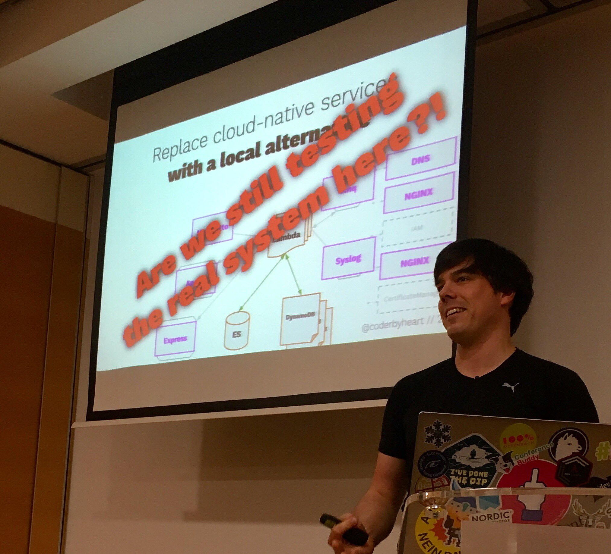

In this talk I will take you through the challenge of testing a cloud-native
application. I will cover the challenges when developing solutions on top of
serverless components which you cannot run on your own machine and how I
designed a BDD driven approach to run the integration tests.

You can find the slides
[here](https://docs.google.com/presentation/d/1EujDJq9qhI0yCu8vkndUbUSleKSXvRNyhzq_qXd32mU/edit?usp=sharing).

<https://www.youtube.com/embed/yt7oJ-To4kI>

[Here](https://github.com/coderbyheart/bdd-feature-runner-aws-example) is an
example project where you try out this approach in your own AWS account.
