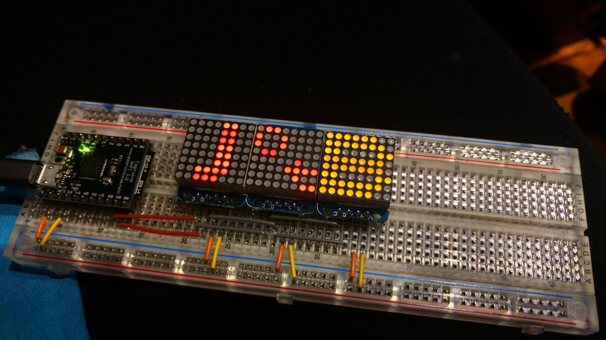

After my talk _Prototyping products for the Internet of Things using JavaScript_
([Slides](https://docs.google.com/presentation/d/1vMFDSY8kn52SxnC_iEUcmJ7SJY8jpfi__oAulxE-uvQ/edit?usp=sharing))
I was interviewed by [Alexandra M. Sims](https://twitter.com/Amsimss), part of
the questions were asked by the audience. I really loved how they added this Q&A
segment to every talk and that attendees could post questions and get them
answered even if they could not make it to a session.

You can watch the full video on YouTube:

<https://www.youtube.com/embed/6rBHje_ciGM>

I have selected some interesting questions on #JavaScript:

<https://twitter.com/coderbyheart/status/1038791853431312384?embed&conversation=none>

<https://twitter.com/coderbyheart/status/1038791857818533888?embed&conversation=none>

<https://twitter.com/coderbyheart/status/1038791862239289345?embed&conversation=none>
