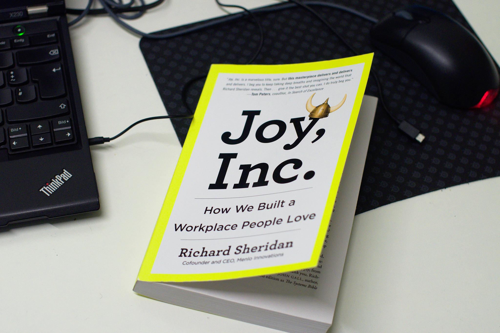

I can't remember where I stumbled upon the recommendation for
[Joy, Inc.–How We Built a Workplace People Love](http://amzn.to/1PAZgMU) by
[Richard Sheridan](https://twitter.com/menloprez) but having read it at the
beginning of this very new year couldn't have come at a better time.

In this very well told book Richard describes how coming from a dreadful time of
IT projects that were executed as _death marches_ he built
[Menlo Innovations](https://www.menloinnovations.com/) based on the believe that
aiming for _joy_ would be the highest value of his enterprise. He defines _joy_
as working on meaningful projects in an environment where fear is absent and
everyday actions have the purpose of delivering a product that customers love.

This notion in itself is not surprising or new but what makes this book an
exemption from the many Make-Your-Employess- Happy-To-Build-Great-Products-Books
which describe organizations that _are great places to work at_ he describes
what methodologies Menlo Innovations uses in great and applicable detail. In
addition he doesn't fall short in explaining how his ideas are able to enable a
sustainable and growing business with happy clients while creating a working
environment that is free from overtime, has full vacation flexibility and leaves
room for employees to engage in social community and educational work.

_Joy, Inc._ leaves no excuse to go on the pursuit of _joy_ at the workplace on
your own.
