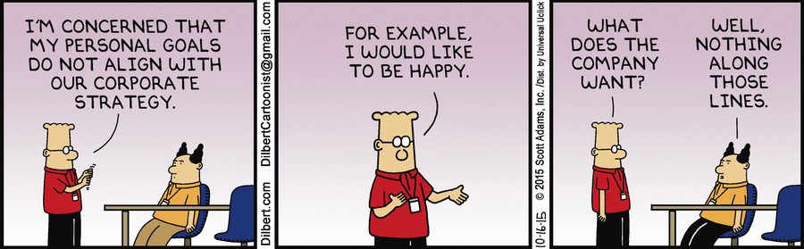

_Tobias Zander has written a blog post about
[Motivation of software engineers](http://www.travelling-developer.com/2016/01/motivation-of-software-engineers/).
This is what motivates me:_

## Freedom

Being once again in the situation of looking for my next job this question is a
very important one to answer. I can earn money by taking on a lot of roles—the
possibilities are endless. For me it is therefore important to **know** or at
least believe to know what my day to day work should look like. In the past,
I've already written about
[what I am looking for in an employer](./leaving-dothiv) and gave advice on
[How to find a CTO](./how-to-find-a-cto); both posts emphasize on the
_circumstances_ that create great working environments. And for me a great
working environment _is_ a great motivator. If you read them, you'll see that I
strive to work in an environment where I am trusted and have the tools I need.
But personal freedom in deciding where and when I work is _the_ most important
factor of motivation for me.

Because of this it is great to work as a Software Engineer—or as I would see
myself as a Software and Organization Engineer. When technology is all around
you it enables you to work on a project anytime and everywhere but still having
ways to bridge long distances in an instant. It is an enormous win to have
people from different socialisations in your team. And we can because … _the
internet_.

## Purpose

Having worked as a freelancer this didn't matter then. The short-term motivator
is getting paid good money for learning a new domain and software stack and
apply my problem-solving, pattern-matching and software-building skills. But the
_new-toy-feeling_ wears off in just a few months. Therefore the second great
motivator for me is that the time I spend in front of a keyboard is helping to
create something that is _useful_. And useful in a way that is honest and does
not harm the planet. Yes, I have the liberty to ask this question and having
spent years building consumer marketing solutions I know how huge the market is
which _creates_ demand for the consumption of stupid products by selling fake
innovations.

## Challenge

Software is about Mind and Machines and the feeling to build something by
combining smart minds and interesting technology is a never ending source of
joy—and pain, too. Working in a field where every decision you make is just a
good guess and you have to constantly adapt forces you to work on your skills
and learn something new everyday. And everyday you have the chance to improve
the system you are working on bit by bit. This cycle provides a constant stream
of frustration and triumph—and that is what makes it great. There are only a few
professions where you can see the result of your own work on a daily basis
without being repetitive.
