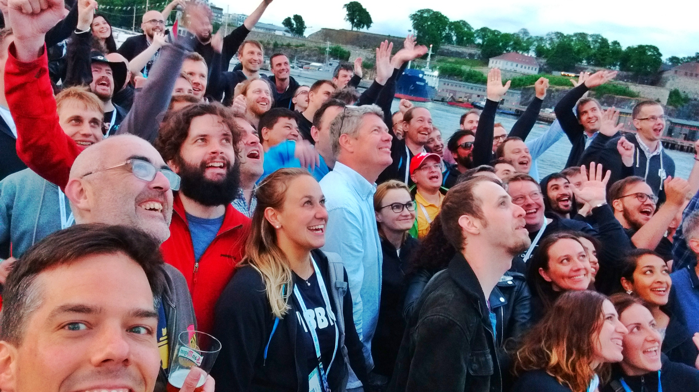

This week I flew to one of the biggest developer conference in Scandinavia:
[NDC { Oslo }](https://ndcoslo.com/) lasts a full week and is convieniently
location next to Oslo Central Station in a huge arena which is divided into 9
session rooms during the conference.

The ticket prices are hefty, but I was accepted as a speaker with my talk about
Prototyping for the Internet of Things using JavaScript which not only granted
me a free conference pass, but also my travel costs from Trondheim where covered
as well as the stay in the official conference hotel, the Radisson Blu which is
next to the venue.

Since speakers where not required to self-fund their travel costs (hint:
#paytospeak) there was a very international line-up and a noticable amount of
women speakers (out of 183 speakers, 30 were women) which resultet in a quite
diverse panel, at least for a scandinavian location.

During the conference there was access to food and drinks all-day, and free
flowing beer during the evening. The variety and quality of the food was
amazing, even given the quite expensive admission fees.

Although NDC is leaning heavily towards the Microsoft eco-system, the variety of
talks was impressive. With 9 parallel tracks on three days, one needed to select
between more than a hundred talks, many of them held by well-known keynote
speakers. I found a good mixture of inspiring talks and this that went into more
detail. The 60-minute format provided enough room for explaining a topic in
depth without needing to sacrifice on important background information.

I was also impressed by the exhibition in the main hall. Many, mostly local
companies where happy to chat and offer give-aways and raffles for the attendees
in search for the next hire. You could easily get in touch with many interesting
companies from all over Norway and learn about why it is so exciting to work for
them. Many brought their most exciting projects with them, or at least the ones
they were allowed to talk about.

You can find my pictures of the event
[on flickr](https://www.flickr.com/photos/tacker/albums/72157696327014471).
