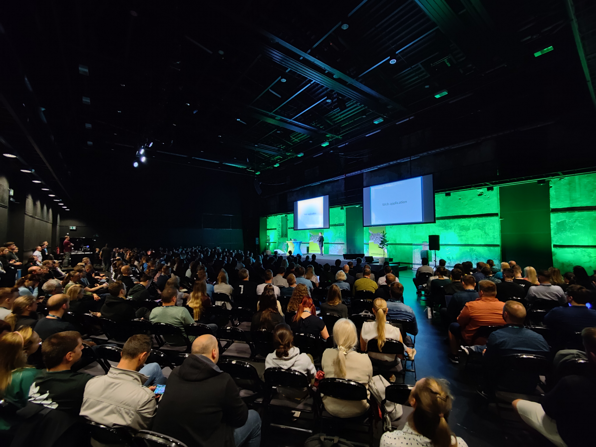

I had the opportunity to attend the Nordic Testing Days in Tallinn
[as a speaker](./firmware-test-automation-using-real-embedded-devices) for three
days and I had a blast. It's a beautiful old town with a very interesting
history, which we learned about on a guided tour. The
[#ntd2022](https://twitter.com/search?q=%23ntd2022&src=typed_query&f=live)
itself was a very well organized conference at a beautiful location (a former
coal power plant). I spoke about firmware end-to-end testing using real hardware
and got to meet many awesome people, who all care about better software.

You can find a real-time collection with a lot of pictures on Twitter:

- [Arrival and Speakers' Dinner](https://twitter.com/coderbyheart/status/1531876235135033344)
- [Day 1](https://twitter.com/coderbyheart/status/1532246341782478848)
- [Day 2](https://twitter.com/coderbyheart/status/1532618092156801024)

I will definitely go again!

_Update 2022-06-11:_ I have uploaded the photos
[here](https://photos.coderbyheart.com/album/ntd2022).

