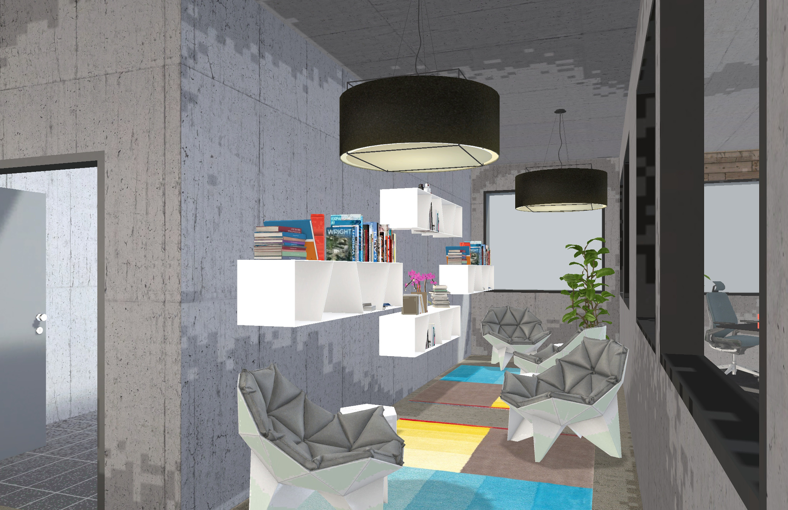

I hate offices. I feel uncomfortable in most of them because they are too loud,
too crammed, smell, are too hot or cold. Being a knowledge worker I first and
foremost need office space that helps me think; but most companies create office
space for representative reasons, to impress clients, and show off their
success, and and not with a focus on the productivity of those tasked with
creating this success.

Just last week I was visiting a tech company here in Frankfurt and was shocked
to discover what the consultants they paid for designing their new interior came
up with: an open floor plan of randomly distributed work station left and right
of a walkway and some meeting spots sprinkled within. For me this is madness:
not only is there constant sound because of the big open-floor plan, but I also
get distracted by visual noise: movement. And since the office lacked warm
colors, the few unpretentious plants only added to this depressing instance of a
creative production line.

And then I thought, that I’m making it too easy for myself to just complain. How
many interior designers have I heard of, that are coders, too? None. So how can
I expect them to come up with an office I would work in? Right, I can't.

I think it’s time that we as software craftspeople, who constantly thrive to
improve our skills and tools, start looking at the place where we are practicing
our craft and take influence in how they are built. We have everything we need
for that: I’ve been using 3D tools since I’m a teenager, I’ve built maps for
shooters like Doom and Duke Nukem, I’ve been a first-person shooter player for
ever. This makes us very well skilled to also think in the physical space of the
office world. Not to mention the whole VR thing. The tools we use are more or
less used in interior design and architecture, and this enables us to speak the
language of architects and interior designer easily.

Since I recently came around an
[awesome, browser-based tool](https://spaces.archilogic.com/explore) for this
task, I set out to create my ideal office. I tried to be very realistic and use
a simple, rectangular floor as the base. I’ve created an office for roughly 30
people, because this is known to be optimal team size for humans. Above that
size, teams should split up anyway (and move to another floor).

Because I think that open space floor plans are awful I tried to create as much
enclosed space as possible, but at the same time enabling everyone to quickly
see if a person is busy, available or not even present. Unfortunately glass
reflects sound very good that’s why the walls in the offices are made of
[sound muffling wood panels](http://swedese.com/products/accessories/noton).
Carpet floors everywhere help with reducing noise further.

## Let me take you through my dream office

The base building block is the 3 people office (my favorite!). I think this is
the ideal size for day to day work. Every office has tables that are adjustable
in height electrically and a big (55") flat screen, for pair programming,
displaying team metrics and doing video calls with those who work remotely.

Note that a wall shields the tables from the entrance, this reduces visual
noise. Teams can also use this wall to hang information about their work, or “Do
not disturb” signs.

Some tasks require bigger groups to work together. Therefore two 6 people office
rooms exist. They have the same features as the 3 people office.

For one-on-one meetings or just for some quiet alone-time, there are dedicated
places and a nice library.

For the daily stand-up everyone can gather in the big open space (the townhall)
in the middle of the office, which also brings everyone together during lunch
time, and can quickly be transformed into a space for meetups. The screens here
are touch sensitive so you can use it while standing in front of them. Iiyama
[has those](http://amzn.to/2q9qvoQ) or
[go for the Jamboard](https://gsuite.google.com/jamboard/) if you can afford it.

No dedicated meeting room? Yes, meetings should be reduced to an absolute
minimum and can be held in one of the offices or in the stand-up area. This
makes them public and everyone easily has the chance to join in. The same is
true for client meetings, which in my experience rarely take place at the office
if you are an agency, anyway. So, no dedicated meeting rooms necessary.

The unisex bathroom has a separate shower for those that come to the office by
bike.

The kitchen is very well equipped with a large stove, because cooking is a great
social activity, and you can't beat healthy, self-cooked lunch.

You can walk through [the plan](https://goo.gl/ewUBFc) yourself and even modify
it with the awesome Archilogic editor.

<iframe src="https://spaces.archilogic.com/3d/!768cc6ba-c623-4f8f-9616-ad80515a9322?mode=view&amp;main-menu=interior&amp;view-menu=camera-bookmarks&amp;presentation=loop" width="768" height="550" frameBorder="0" onmousewheel="false" allowfullscreen mozallowfullscreen webkitallowfullscreen></iframe>
 
**What do you think about this design?** Please leave your feedback in the comments.

And start spreading the word that we as developers are interested in taking part
in office space design and let me know, how your ideal workplace looks like!

## Reactions

Here are some reactions (from other developers):

<https://twitter.com/ryyppy/status/857537165944913920?embed&conversation=none>

<https://twitter.com/fhopf/status/857548445510361088?embed>

<https://twitter.com/spinscale/status/857568366357360642?embed>

<https://twitter.com/SilviaHundegger/status/857575027511898112?embed&conversation=none>

## Links

[Martin Berry](https://twitter.com/martinbarry) pointed me towards
[this post](https://www.campaignmonitor.com/blog/company/2010/08/the-new-campaign-monitor-office/)
about about an office space where everyone has their own room. The company
[did drop](https://www.businessinsider.com.au/inside-campaign-monitors-insane-new-office-almost-40-storeys-up-overlooking-the-sydney-cbd-2015-3)
the concept as they kept growing, though.

## Updates

### 2.2

Updated the bathrooms and converted the stalls into separate rooms. Also added a
wall between so there is more barrier between the bathrooms and the kitchen.

### 2.1

Updated the kitchen, thanks to [Tobias](https://twitter.com/schinkenstrudel) for
pointing this out!

> I think office kitchens desperately need a real stove-top or alternatively a
> sandwich-maker, raclette or fondue set. Preparing the shared meal together is
> really good for the community. Likewise things like sandwiches or raclette
> where everybody can bring something and then share. Another cool thing is to
> have a big salad bowl and make a huge mixed salad together where everybody can
> contribute.
