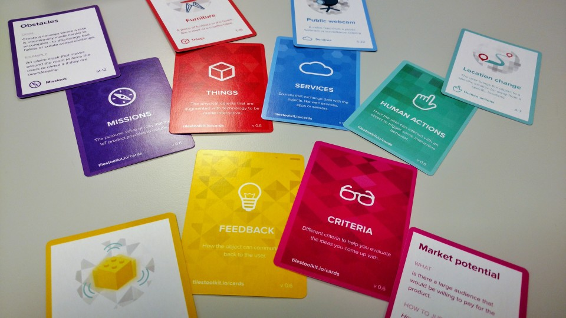

When building connected products, it will never be only the hardware which makes
for a successful product. Customers today—regardless whether they are a business
or a consumer—are looking for **connected experiences**. Our products need to
integrate in complex scenarios and a physical component may play a key role in
such a scenario but seldomly can be looked at in isolation.

The biggest challenge therefore is designing a compelling offering which
anticipates how customer will use a product and not only fulfill the basic
functionality, but extend its value beyond that. Only then will users accept a
device not only as a tool they maybe have to use, but as something that makes
the task at hand significantly easier.

Given that we are faced with this challenge and it is incredibly hard to
approach the design process with and open mind and not to get lost in details a
group of researchers at the Norwegian university NTNU here in Trondheim have
developed the IoT Tiles Toolkit and part of that is a set of playing cards which
are a fantastic support tool for generating ideas and even possible solutions.

These cards are used in a workshop format and can be used with novices and
experts likewise. They provide talking points to get creative and brainstorm on
concrete solutions while a steady influx of randomness helps to keep an open
mind.

> The journey starts with a set of problem SCENARIOS and PERSONAS given to
> participants to choose from. Participants are in turn asked to choose and
> combine THINGS, DATA CHANNELS, HUMAN ACTIONS and FEEDBACKS relevant for the
> chosen scenario. Participants then elaborate an initial concept and sketch it
> out on a storyboard. Then participants are asked to challenge their own ideas
> inspired by MISSIONS cards. A refined ideas in now visualised on the IDEA
> GENERATOR BOARD. Participants are then asked to collaboratively reflect and
> improve their concepts using CRITERIA cards and to prepare an elevator pitch
> to present their concept to the the audience.

You can learn more about the IoT Tiles Toolkit on
[tilestoolkit.io](http://tilestoolkit.io/). The cards layouts are available for
download free of charge and generously licensed under a Creative Commons
license.
