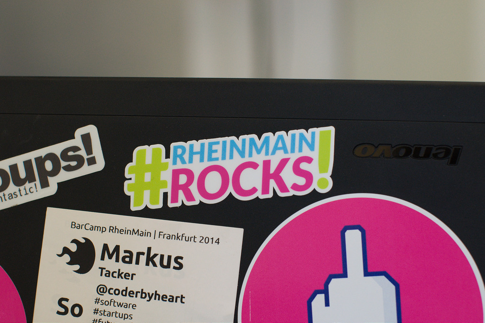

Here they are: the totally inofficial
[#RheinMainRocks](https://twitter.com/search?q=%23RheinMainRocks&src=typd&vertical=default&f=tweets)
sticker.

Back in March I started the project over on
[community.rheinmainrocks.de](https://community.rheinmainrocks.de/t/rheinmainrocks-sticker/56)
and after a
[design contest](https://community.rheinmainrocks.de/t/rheinmainrocks-sticker-voting/63),
a longish [startnext campaign](https://www.startnext.com/rheinmainrockssticker)
for which I even had to record
[a video](https://www.youtube.com/watch?v=RD4VvA9LVO4).

They'll start showing up in the RheinMain area in the coming days. Our awesome
backers will receive them on the
[Google I/O extended](https://plus.google.com/u/0/events/cpu25hhie53mnjoksofdnj2h4t8)
in May and the
[WMFRA in June](http://www.wmfra.de/webmontag-frankfurt-71-code-is-poetry-html.html)
accompanied by a little gift I was able to add to the package because …
_#RheinMainRocks_!

## The sticker

There is a
[flickr album](https://www.flickr.com/photos/tacker/sets/72157652735074258)
which shows them in all their glory.

The backers will receive a complimentary sheet with a different color version
and smaller versions.

For instance, the smaller version can be used to cover your camera:

Happy sticking!
