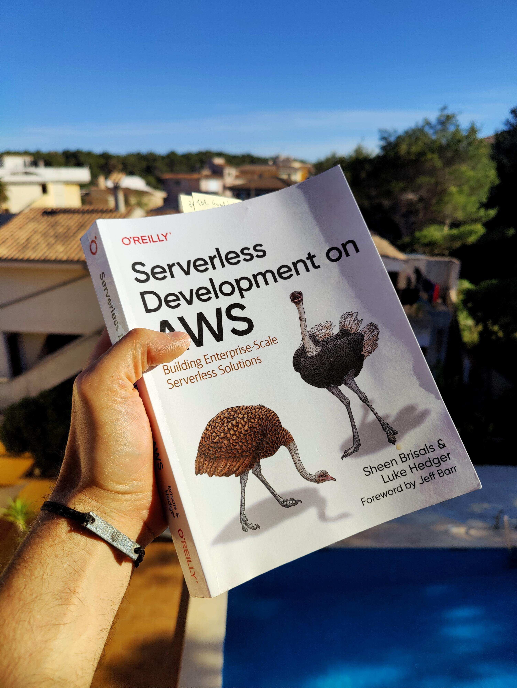

<!--  -->

I can fully recommend the book for developers who are starting to work more with
serverless but as well for technical managers who want a better understanding of
the potential of the serverless paradigm and the mindset shift needed to tap its
full potential. It’s a must read for every developer that works with AWS because
more and more powerful services on AWS are built from the ground up as
serverless offering. Making the most of them will be a skill that takes time to
master, and this book will provide you with many well explained shortcuts.

For a more seasoned serverless engineer the book is still valuable, especially
since you want it in your bookshelf to give to colleagues. Especially chapter 2
(“Enterprise Readiness for Serverless”) is a great resource that discusses the
value of serverless as an innovation and value creation enabler which is
supported by a great interview with
[David Anderson](https://theserverlessedge.com/meet-the-team-behind-the-serverless-edge/).

This chapter also discusses the serverless mindset, which is a distinctly
different approach to architecting solutions compared to instance-based
architectures. Adopting this mindset is both hard to achieve and complicated, so
this chapter does a great job of highlighting the different aspects that
serverless solution designers need to conquer.

The highlight of the book is certainly the third one (“Software Architecture for
building serverless microservices”) which does a very good job of explaining how
to design efficient serverless architectures and the important role events are
playing. If you are familiar with event-based systems this might not surprise
you: after all, serverless works well if all services are loosely coupled and
all efficient architectures are designed with this in mind. This is a good
reminder to check out my reading guide of
[REST in Practice](https://coderbyheart.com/rest-in-practice-reading-guide),
which still applies to these kinds of architectures.

The implementation of these architectural concepts is then described in chapter
five (“Serverless implementation patterns”) and I really liked that they
invested a good portion of it to describe strategies on how to deal with
third-party services … because the reality is that not everything runs smoothly
within AWS. In my day to day job, nearly every feature deals with some kind of
third party API. Dealing with those APIs failing gracefully is an important
aspect of any implementation. The chapter provides good examples of how to
actually solve this.

In this and the following chapter seven (“Implementing serverless applications”)
we find good tips on structuring and deploying applications and how to use the
serverless platform as an event flow engine so the code you write can focus on
implementing the business domain logic.

> It’s an important learning that utilizing flow control features like EventBus
> and StepFunctions will yield better observability and unlock resilience
> features like automated retries that otherwise would need to be implemented in
> software.

Of course, chapter 7 (“Testing serverless applications”) was a must read for me,
given that
[I have spoken extensively about my approach](https://coderbyheart.com/it-does-not-run-on-my-machine)
on conferences. The chapter explains very well the compromises that have to be
made when testing a serverless architecture. The promoted approach is: unit-test
your business logic implementation, and add end-to-end tests for the
business-critical paths. This way you ensure that the implementation is correct
and the solution once deployed does what it is supposed to do. This aligns very
well with my experience, so it was nice to read in the chapter’s interview with
[Sarah Hamilton](https://www.linkedin.com/in/hamilton-sarah/) how an expert
approaches this topic.

Don’t skip chapter 8 (“Operating serverless”) because it provides a good
introduction to monitoring serverless solutions and shows that it’s quite easy
to get started with building monitoring for your solutions.

Overall I really liked the interviews that conclude every chapter, because they
add more flesh to the sometimes very technical concepts discussed in the
chapters and help to support what was discussed in the preceding chapters.

You can buy “Serverless Development on AWS”
[on Amazon](https://amzn.to/4drVBjg).
