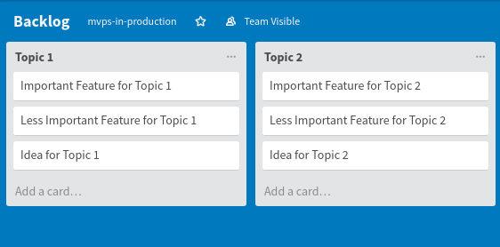
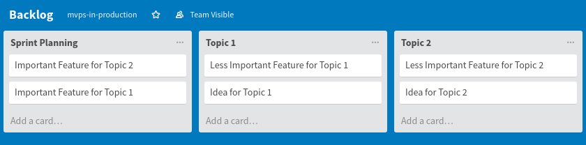
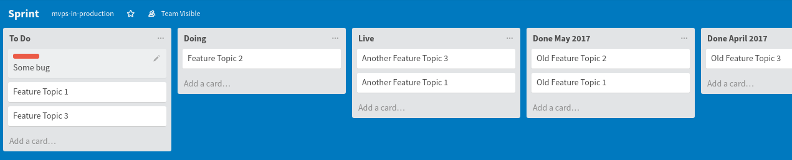

<small>_This post is part of the **MVPs in Production** series. Be sure to make
yourself familiar with the context I've set
[in the introduction](/mvps-in-production/)._</small>

In this post I will explain the way I design the process that supports one key
operation in every startup: improving the technology which delivers value to
customers—or should, if you are working towards signing your first customer.

The driving principles are two opposing needs: maximizing uninterrupted time and
agility. Developers would love to work uninterrupted for days and weeks, and
business stakeholders need to get as many things done as possible, ideally right
now and at the same time. In a startup nothing can be planned so we are charged
with the impossible situation of building new features as fast as possible,
which takes preparation and excellence to get it right, and at the same time
leaving enough wiggle room to quickly change focus or incorporate last-minute
changes.

You could as well call this an insane situation, trying to achieve both. Being
presented with this as a reality I could not change, I tried to find a balance.
When you are joining a startup your are submitting yourself to a lot of external
stimulus with extreme leverage and you are usually schlepping your company from
week to week. No amount of experience, and world class team members, and
disruptive ideas can change this.

## Decouple the Sprint from the Release

Being a product team that builds web based products means that your product
could potentially fail all the time. And you can’t wait to fix bugs until you’ve
reached the next release day. Bugs have to be fixed immediately, if they are
significant that is, of course. A bug that affects potentially all users like a
logical error or one that corrupts data must be fixed immediately. A browser bug
that makes a button unclickable for 10% of your users should be fixed within one
business day1. In any case, you will be fixing bugs every other day,
and a bugfix means: releasing a new version.

Everybody that changes code, should be able to release a new version, and
observe how the feature or fix they’ve just released behaves when it’s used by
real users. And this is especially true for feature releases. In the last five
years I have never seen the case where a new feature was thoroughly reviewed by
the story owner because for the fact that it’s really hard to get hold of domain
experts when you need them … But you can turn this to your advantage, liberate
yourself from the “review” step by the story owner and let your customers have a
go at a new feature. Their behaviour will tell you if a feature works or needs
more work. There are techniques to limit the blast radius if something goes
wrong, which I’ll talk about in another chapter.

Since the developers own the operation of their features and they are the only
ones that can judge if a feature is ready to deploy or a bug is fixed, it would
be counter-productive to release only at the end of every sprint. This only
creates more opportunity for incompatible changes and merge hell. Also since
they have just build the feature it’s easy to recollect where to look if
something does not work as expected.

Bug fixing and feature development exist at the same time, and I found this to
create a good balance on a day to day basis. I would work on one big feature in
a branch, and once I’ve reached a certain milestone in a feature (or savepoint,
where I would rebase and force push my feature branch) I could take my mind off
for some hours, fix bugs, do housekeeping tasks and release a new version of
master to production. All this also ensures that changes are released when they
are ready, at the best time, and not when they are scheduled. In my experience
having a release date will create a goal that demands to be met, and shortcuts
will be taken “Just commit this one last fix before the sprint review… Oops!”).
Let’s be honest to what we’ve learned: only one thing is certain when building
software, especially one that has never been built before: all attempts to pick
a done-date are futile and these dates are dead Schrödinger’s cats: as long as
you don’t open the box they are still dead, but they don’t smell.

<small>1 And the obscure IE bug which affects less than 3% of your
users, can be safely ignored, until you really have nothing better to do, or
these users switch to a different browser. It’s important to understand how
excluding a certain amount of users translate into lost revenue and making an
educated decision whether fixing that bug has a return on invest.</small>

## Stories, not Issues

For managing the things to be done I repeatedly had success using the
Kanban-inspired Trello. I personally don’t believe in using issue trackers like
GitHub issues, Jira, Redmine, etc to drive the implementation of a story. A card
in trello provides content in a format that is accessible and understandable by
anyone in the team but provides additional features like Checklist, linking
Commits etc. that help to keep track of the implementation work for that
feature.

Features that should be implemented are added to the Backlog board and contain a
description that explains the user goals for this feature, and provides
additional background information like wireframes and links to other concept
work. Since Trello is not able to handle collaboration on a card’s description,
I prefer to use Google Docs for writing concept documents. It’s live editing
feature is superior to anything else I’ve used and combined with the commenting
/ note feature it’s the best tool to write concept documents and even sketch
pseudo code.

Stories are organized in Topics: I have no clear rule for what makes a good
topic, just that a natural clustering for Stories will automatically emerge. I
typically have a Topic per product, for the website, for marketing. Because some
Topics can create an endless stream of new stories, these could easily create
the impression that they are more important. But it’s necessary to visualize
that each topic has it’s purpose and having stories that are never making it
into the Sprint is easier understood, if they are constantly on top of their
Topic list.

Since we are using an approach inspired by Kanban, the most important Stories
must be at the top of each Topic list. Typically I have a dedicated Owner per
Topic who is in charge of prioritizing the stories within their Topic by
sourcing information from customers and other stakeholders. This role can be
filled by any team member, that understands the Topic matter and has the
resources to do it. This not only distributes the workload of this task between
more team members but actually gives every Topic an individual advocate. This is
not optimal, though. I have worked in startups where we didn’t have a dedicated
Product Manager—which I believe to be one of the biggest mistakes any startup
can do—but owning a Topic means you have to constantly reevaluate existing
Stories and review new Stories, which takes time and requires commitment, which
can be hard to find in startups where everyone is already doing more then they
should. So, get a dedicated Product Manager!

The Backlog board is very busy and tends to accumulate stale stories. Usually
the outflow of Stories from the Backlog to the Sprint is far smaller than the
inflow of new Stories to the Backlog. Stale stories are those that are
constantly prioritized lower than newer and more important ones. Over time
grooming the Backlog takes more and more time because you have to revisit more
stories and check if they are still valid, if preconditions have changed or new
preconditions have emerged.

Try to not use it as a scratch board for personal ideas. Stories that make it to
the board should at least have a clear purpose and more important a clear value
proposition attached: if we do X how will that affect our revenue2?
As a Topic Owner look out for one-liners, nice-to-haves and use labels to mark
these and follow up with the story owners to fill in the blanks. If they can’t,
do not hesitate to remove these stories, because they are either unimportant or
if not, will resurface at a later point in time. The biggest rule here is:
listen to your users! A story is off to a bad start if it’s born out of a “I
think we need X!” … your feature will be so much better if you work with a
“Customer A said the would pay B for feature C”. If a story is missing a real
customer (A), a letter of intent (B), or a clear user story (C), invest time in
getting them!

I encourage Topic Owners to have a separate Backlog board of their personal
planning. This way they can collect ideas and organize them in a way that allows
more freedom and is more germane to their preferred work style. They would then
move Stories they want to be implemented next into the Backlog board.

<small>2 [John Cutler](https://twitter.com/johncutlefish) has a
[great set of questions](https://medium.com/@johnpcutler/answer-these-16-questions-about-your-roadmap-items-717bb9e7978f)
to consider.</small>

## The Sprint Planning

Work on the Backlog is ongoing and happens every day. Having some kind of
structure on the other hand is important, especially since coordinating
calendars in startups is so complicated that the only way to fight this flea
circus is to find a regular slot for planning meetings and stick to them no
matter what. It’s essential for everyone involved in building the product to
sync up once a while—in my experience, no tool is able to completely eliminate
synchronous meetings.

The Sprint Planning is one of two meetings that I establish during a two week
Sprint Cycle. It usually happens on a Monday, after the Weekly. In this meeting
the team decides which of the stories with the highest priority from each Topic
will be taken to the Sprint. If the Backlog Board is well maintained, this
meeting can be done swiftly: in preparation we would take the the stories with
the highest priority from each topic to the Sprint Planning column and arrange
them again in order of priority. At this point we would also discuss—given the
expected capacity of the next two weeks—which of those stories we feel confident
in building.

And two weeks is just the horizon I feel comfortable predicting. Four weeks is
ages and given that most stories are really hard to estimate because most of the
features you are building are so experimental and unique that it is nearly
impossible to draw conclusions on story size from previous ones. One week on the
other hand is too short to really get stuff done because for any given week
there may be just one or two days where you can manage to focus on one task for
half a day.

A two week cycle also provides a great opportunity for the Backlog Grooming
every other week, which is the second meeting of the Sprint Cycle, during which
the Topic Owners and me would go through the story candidates for the next
sprint and look for conflicts and missing information that would block them from
going into the next sprint.

This meeting also provides a good opportunity to introduce new, important
stories which need to be put on the fast lane, essentially trumping all other
stories that are up next. This happens quite often and therefore it’s always
good to have everybody aware about what features are in the pipeline and will be
delayed if they are put on hold for another sprint. Solving these kinds of
conflicts can’t be done through a tool (e.g. voting in Trello) but can only be
coordinated in a synchronous meeting. Doing this dance every week, in the Spring
Planning and in the Backlog Grooming, will keep everyone’s understanding of the
progress of the product development fresh and reduce discussions to a minimum.

If you have every tried finding a lunch date for five people, try rescheduling
that date: impossible. That’s why you stick to the meeting schedule, no matter
what. You start the meeting on point and everyone receives the meeting notes
afterwards3. Preparation is key and if the backlog board is managed
well, the result of the sprint planning won’t be a surprise.

<small>3
[Pre-written meetings notes can help you so much with that](https://coderbyheart.com/speed-up-your-meetings-with-pre-written-meeting-minutes/).</small>

## The Sprint

After the Sprint Planning the stories that made it into the Sprint are moved to
the Sprint Board’s To Do list4. The owner of the Sprint Board is the
development team and only they move cards around there. It also serves as a
history record of the features that have been implemented. A story moves from
the To Do list to the Doing list once developers start implementing it. When
they deploy it to production, the card moves to Live. Live means “It’s public
but still needs some work”, this happens for so features which start as
experiments and are getting polished while (some) of your real users use it and
provide feedback. Here again is where Trello really shines as a tool for product
management: the discussion feature and the check lists are great for keeping
track of the progress of each story.

The Sprint board is also used to track bugs, which don’t follow the typical
lifecycle of a story. Each of them is represented by a dedicated card in Trello
but giving them a distinct label (I chose a red “Bug” one) makes them easy to
find or filter out. Bugs don’t require the same exhaustive description like
Stories do, because they are usually self-explanatory: A bug is when a feature
does not behave as defined—which also means: it’s not a bug if it’s not defined.
Bug cards trump every other card in the To Do list and move quickly from there
to Done. They should not hang around in the To Do column for more than a day.

Once a story or bug is done—the definition of that highly depends on your
individual requirements, but must be defined in a living document
nevertheless—it’s moved to the Done list for the current month. Using this gives
you nice history of the things that happened and the monthly grouping makes it
easy to recollect and find features to revisit them later, when you are
reviewing how accurate the assumptions about the expected outcome were that you
made when describing the Story. This is also the time to document the final
implementation of the story by updating the description and providing a detailed
explanation of how the end result behaves and looks like (the use of screen
recordings here greatly helps to easily understand what changed).

<small>4 [Butler for Trello](https://butlerfortrello.com/) can help
with that.</small></small>

## What’s a release?

… when you deploy to production every day?  
… when your product is composed of microservices?  
… when you had a feature for weeks for a selected group of users?

It’s the point in time when you decide to activate a feature for all your users.
As mentioned earlier, the software release cycle is decoupled from the product
management process. There is no need to orchestrate them but will just create
more unnecessary coupling between collaborators who can perfectly work in their
own pace.

The release of a feature is announced on the Story card and this is observable
by anyone interested (who did subscribe to the card) and you would also post a
message on the related Slack channels.

## It’s a team effort

This way of managing a product allows everyone to get involved in the product
development and the progress becomes observable and transparent without taking
up too much time. It’s flexible and fosters a strong degree of self-organization
within the whole team. Having one source of truth for everyone is a key factor
in keeping everyone in the loop.

<small>This was part one of the [MVPs in Production](/mvps-in-production/) post
series. A big thank you goes out to
[Sebastian Nell](https://www.linkedin.com/in/sebastiannell/),
[Ralf D. Müller](https://rdmueller.github.io/) and Sven Kloppenburg for taking
the time to review this post and for providing great feedback and
thoughts!</small>

<small>**Want to read more?** In order to unlock the next chapter, I want 10
additional readers to sign up for my influencer group for this series before I
start the second post, and you'll get to pick which one I'll continue with!
[Fill out this form and make your choice!](https://coderbyheart.typeform.com/to/wxURIj)</small>
