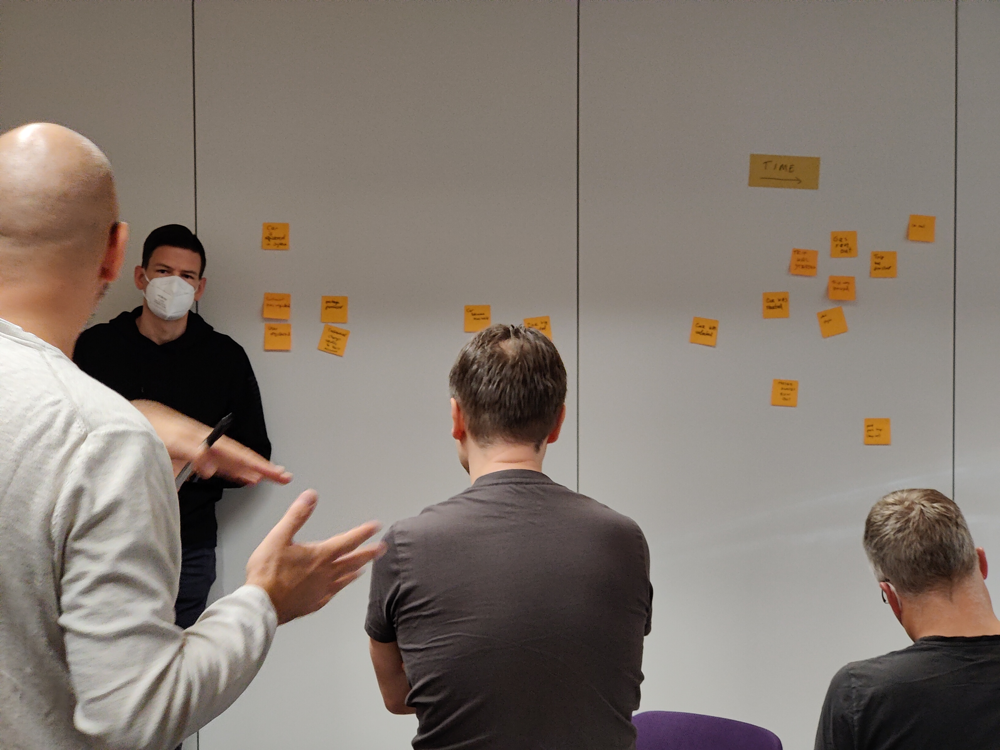

1,096 days had passed since the previous SoCraTes in 2019. Because of the
COVID-19 pandemic, there was not SoCraTes in Soltau in 2020 and 2021. Therefore
this year was especially exciting for me to return Soltau to isolate for a long
weekend to meet with fellow [Software Crafters](https://softwarecrafters.org) at
the 10th
[International Software Craft and Testing Conference](https://www.socrates-conference.de/)
to share about our experience working in teams that build software.

Having been a sponsor in previous years, I did have the pleasure this year to
extend my budget allocation which allowed a total of eight colleagues from
[Nordic Semiconductor](https://www.nordicsemi.com/About-us/Careers/Working-at-Nordic)
to attend a SoCraTes, **six of them for the first time**!

_From top left to bottom right:_ Lena Kråkevik Haraldseid,
[Jørgen Kvalvaag](https://www.linkedin.com/in/j%C3%B8rgen-kvalvaag-5b303822/),
[Maximilian Deubel](https://www.linkedin.com/in/maximilian-deubel-343462218/),
[Vassilis Papanikolaou](https://twitter.com/m0vas),
[Mauro López Jiménez](https://twitter.com/MauroLopezJ),
[Marko Schulz](https://twitter.com/datenreisender),
[Balaji Srinivasan](https://twitter.com/balajisriniv), and
[me](https://twitter.com/coderbyheart).

## The unconference, re-invented for inclusiveness

The previous years had shown that since the "introduction" of the lottery system
a large portion of the attendees were first-timers and attendees who haven't
been part of the community as long as people like me.
[I have written previously](/bring-your-inexperience-to-a-conference), why I
think this is a necessary and fantastic feat of this unconference. SoCraTes has
shown year after year to be an inclusive and welcoming space to for sharing and
learning, and it is by word of mouth and through the many interactions on
Twitter and via Software Craft user groups that keeps the circle of software
crafters growing in Europe and beyond.

This year, around 138 of the 197 attendees checked the diversity box when
applying for the ticket, and while this number includes people who are traveling
to SoCraTes from outside of Germany, it felt even more diverse compared to the
previous years.

This can in part be attributed to another big change this year brought: the
[Foundations Day](https://www.socrates-conference.de/foundations) offers short
and intense introduction workshops one day before the open-space. In two tracks
on Thursday before the open-space, world-class coaches held one or two hour long
sessions which gave around 60 attendees a introduction to topics, every
professional software developer should have heard about, like TDD, Refactoring,
Hexagonal Architecture, Exploratory testing, and much, much more.

<!--

- [Emily Bache](https://twitter.com/emilybache "Follow Emily on Twitter!"):
  [TDD Foundations](https://www.socrates-conference.de/foundations/abstract/tdd_foundations)
- [Julian Godeša](https://www.linkedin.com/in/julian-gode%C5%A1a-17a166238/ "Follow Julian on LinkedIn!")
  &
  [Kateryna Oliferchuk](https://www.linkedin.com/in/kateryna-oliferchuk-a52b7967/ "Follow Kateryna on LinkedIn!"):
  [Trunk Based Development - unlock fast feedback and deliver high quality](https://www.socrates-conference.de/foundations/abstract/trunk_based_development)
- [Seb Rose](https://twitter.com/sebrose "Follow Seb on Twitter!"):
  [Example Mapping: Slice Any Story into Testable Examples](https://www.socrates-conference.de/foundations/abstract/example_mapping)
- [Michelle Avomo](https://twitter.com/michelle_avomo "Follow Michelle on Twitter!"):
  [Legacy code: Add a reliable test harness (quickly) and refactor!](https://www.socrates-conference.de/foundations/abstract/golden_master)
- [Markus Gärtner](https://twitter.com/mgaertne "Follow Markus on Twitter!"):
  [Automating your examples with ATDD/BDD](https://www.socrates-conference.de/foundations/abstract/atdd_bdd)
- [Nicole Rauch](https://twitter.com/NicoleRauch "Follow Nicole on Twitter!"):
  [Refactoring for Deeper Understanding](https://www.socrates-conference.de/foundations/abstract/refactoring)
- [Romeu Moura](https://twitter.com/malk_zameth "Follow Romeu on Twitter!") &
  [Dorra Bartaguiz](https://twitter.com/DorraBartaguiz "Follow Dorra on Twitter!"):
  [Different ways of using Property Based testing in your code next Monday](https://www.socrates-conference.de/foundations/abstract/property_based_testing)
- [Thomas Pierrain](https://twitter.com/tpierrain "Follow Thomas on Twitter!"):
  [Hexagonal Architecture & Beyond](https://www.socrates-conference.de/foundations/abstract/hexagonal_architecture)
- [Lisi Hocke](https://twitter.com/lisihocke "Follow Lisi on Twitter!"):
  [Ensemble Exploratory Testing](https://www.socrates-conference.de/foundations/abstract/ensemble_exploratory_testing)
- [Samir Talwar](https://twitter.com/SamirTalwar "Follow Samir on Twitter!"):
  [Designing for Longevity](https://www.socrates-conference.de/foundations/abstract/design_for_longevity)

-->

It is yet another step towards making the biggest gathering of Software Crafters
even more welcoming for newcomers. And for my colleagues who were both junior
software engineers and first time attendees of an open-space this helped them
greatly in the following days because it provided an introduction to the
techniques, terminology and lingo that often is used during the open-space
without considering whether it is understood by all participants.

This created a clearly needed and safe learning space for them so they could
make much more out of the following two open-space days and the Sunday
workshops.

Of course, [Conference Buddy](https://www.conferencebuddy.io/) was present again
this year, and 5 participants were volunteering as buddies for this conference.

## Conclusion

Conferences like SoCraTes are for me a place where I can challenge my
assumptions, skills and beliefs exactly because it is such a safe space where
everybody pays attention and listens. It's rare in a professional setting that
there is the opportunity to have this form of exchange that only happens without
organizational power structures. It's the environment I need to keep growing.

My colleagues, too, were absolutely happy with the unconference, and all want to
come back. In the closing session we drew a spider chart that sums it up nicely:

<https://twitter.com/coderbyheart/status/1563554925615120386?embed>

<https://twitter.com/coderbyheart/status/1565292728845565963?embed>

## Photos

You can see all photos I've taken
[over here](https://photos.coderbyheart.com/album/socrates-2022).

## Session log

I've managed to attend a good amount of sessions, and
[live-tweeted my experience](<https://twitter.com/search?f=live&q=(%23SoCraTes2022)%20(from%3Acoderbyheart)%20until%3A2022-08-28%20since%3A2022-08-26&src=typed_query>)
(for your _inconvenience_ displayed in reverse order) using the hashtag
[#SoCraTes2022](https://twitter.com/hashtag/SoCraTes2022?src=hashtag_click&f=live).

Nevertheless, for completeness I've collected the tweets below for you in the
correct order:

### Friday: Open-Space Day 1

<https://twitter.com/coderbyheart/status/1563065904971128832?embed>
<https://twitter.com/coderbyheart/status/1563100104474918913?embed>
<https://twitter.com/coderbyheart/status/1563079699391463426?embed>
<https://twitter.com/coderbyheart/status/1563093870728351746?embed>
<https://twitter.com/coderbyheart/status/1563138705195278336?embed>
<https://twitter.com/coderbyheart/status/1563161713481961475?embed>
<https://twitter.com/coderbyheart/status/1563181885395648518?embed>
<https://twitter.com/coderbyheart/status/1563229277101105153?embed>

### Saturday: Open-Space Day 2

<https://twitter.com/coderbyheart/status/1563428280065134592?embed>
<https://twitter.com/coderbyheart/status/1563443216351133697?embed>
<https://twitter.com/coderbyheart/status/1563442274729873408?embed>
<https://twitter.com/coderbyheart/status/1563457164064174081?embed>
<https://twitter.com/coderbyheart/status/1563501080230907907?embed>
<https://twitter.com/coderbyheart/status/1563517525312573441?embed>
<https://twitter.com/coderbyheart/status/1563533539488169984?embed>
<https://twitter.com/coderbyheart/status/1563548367128444930?embed>
<https://twitter.com/coderbyheart/status/1563623742919655426?embed>

## Workshop Day

<https://twitter.com/coderbyheart/status/1563802156142137344?embed>
<https://twitter.com/coderbyheart/status/1563802399222947841?embed>
<https://twitter.com/coderbyheart/status/1563818007549321217?embed>
