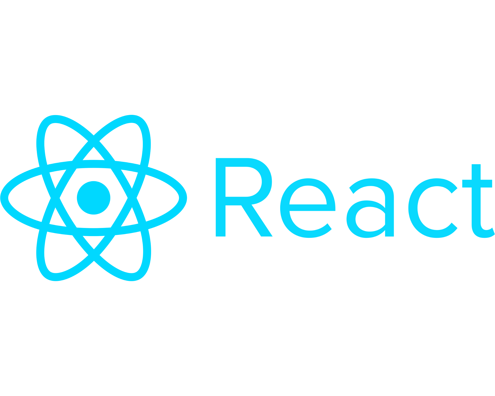

Depending on your preferred learning style, check out these starter guides.

- this
  [React Video Tutorial by LearnCode.academy](https://www.youtube.com/watch?v=MhkGQAoc7bc&list=PLoYCgNOIyGABj2GQSlDRjgvXtqfDxKm5b)
- also
  [David Tanzer has a nice paid course](http://www.quickglance.at/react.html)
- an interactive way to learn React can be found at
  [react.express](http://www.react.express/)
- if you like to read, check out Robin Wieruch's free
  [Road to Learn React](https://www.robinwieruch.de/the-road-to-learn-react/)
