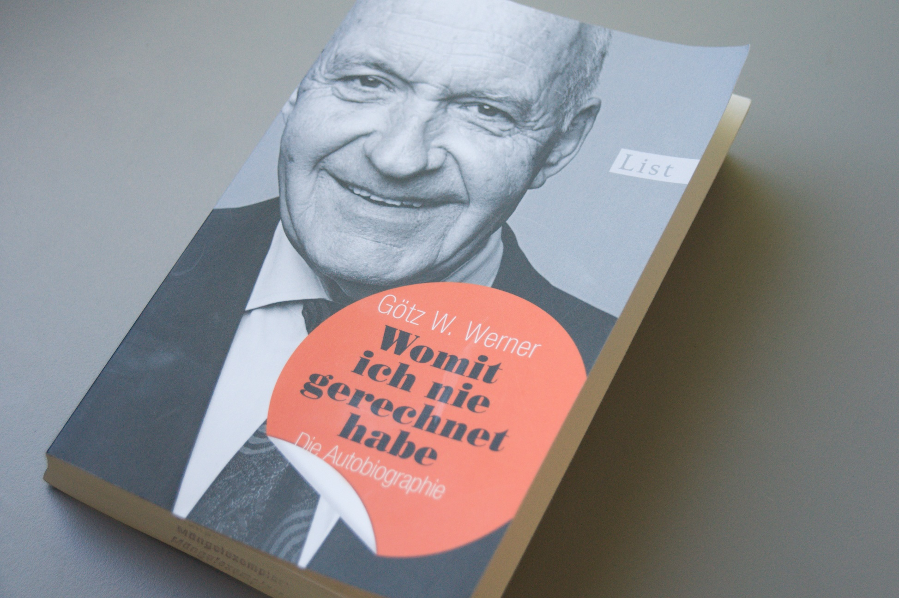

[Womit ich nie gerechnet habe][1] is the (German) autobiography by the founder
of _dm_, today the largest pharmacy retailer in Europe. Within 35 years, Werner
build an organization of 30,000 employees and 2,000 stores in 2008 based on
[anthroposophical principles developed by Rudolf Steiner][2]: putting the human
first, within the organization but also in relation to the customer.

The book is unique because it offers a fascinating insight into a journey of a
founder who learned that you can run a profitable, agile and antifragile
business while ignoring industries best practices and putting the individual
first.

In this book Werner describes his way from a young pharmacist when he started
seeing opportunities where others wouldn't to the CEO of a successful pharmacy
retailer and describes multiple occasions where the organization needed to be
completely restructured. The reasons were never due to a crisis but due to
Werner's strive to build a company that _serves_ its employees, customers and
the society. By questioning the status quo and pushing for his idealistic views,
often answered with strong hesitation by colleagues and friends, he enabled _dm_
to be truly agile: change was achieved by engaging everyone in the organization,
which often took years. But because everyone _owned_ the change it never failed
to stick. His effort to improve the human factor in the organization proved to
be a win-win for everyone: the company never made losses, it holds the highest
rating in independent consumer satisfaction rankings, is a highly favored
employer and the market leader in Europe.

Werner's legacy is proof that it is possible to build a successful business in a
highly competitive market without sacrificing purpose and generosity. A business
that includes the human needs and messiness into the business model will be at
least as successful as _classical_ meat-grinders. Examples like the Schlecker
bankruptcy showed that this approach pays off.

I recommend this book to everyone who is facing problems like high turnover
rates, inefficiency due to bureaucracy and incompetence or is, like me,
interested in alternative operating-systems for organizations.

[1]: http://amzn.to/1YyyHvl
[2]: https://en.wikipedia.org/wiki/Anthroposophy
