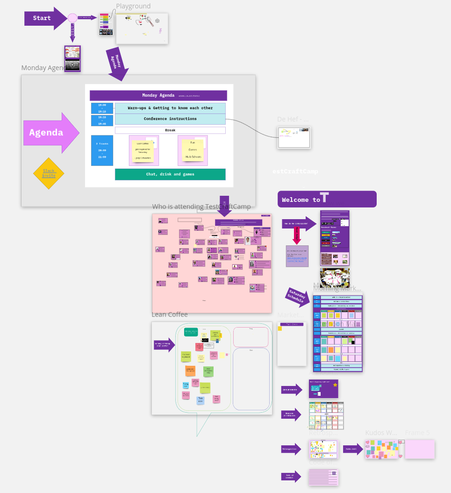
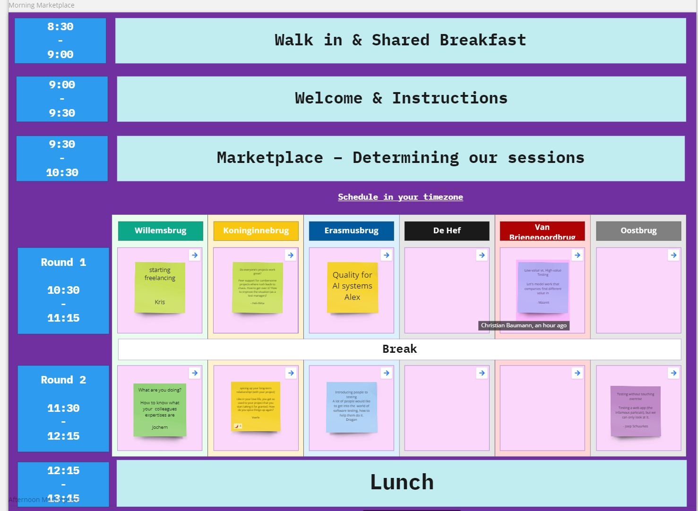
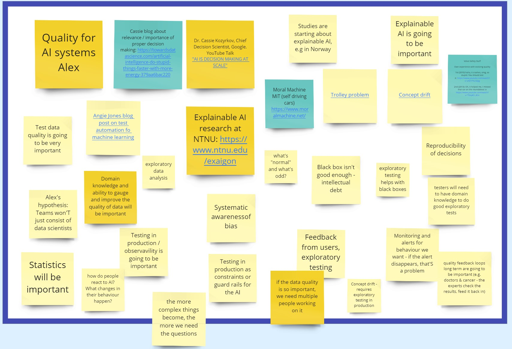
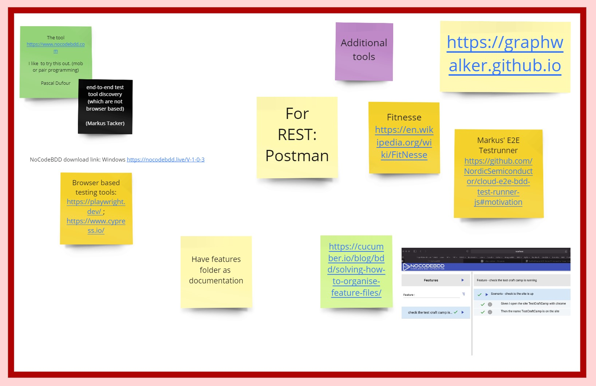

One year into the pandemic I spent yet another day in front of a computer screen
to virtually connect with fellow computering humans who care about software
quality at the [TestCraftCamp](https://TestCraftCamp.nl/).

After all, the tester community aligns very closely with the software crafters
community, so I feel very much at home in both of them:

<https://twitter.com/S_2K/status/1368924555486564360?embed>

Before I dive into the sessions I have attended and what I've learned, I'd like
to share the set-up that was used for this conference, because this is a now
proven combination of tools and it works really well.

The two main tools in use are a real-time whiteboard (in this case
[miro](https://miro.com/), but I have seen [Mural](https://www.mural.com/) to
work equally well). **One whiteboard** is used for all content of the
conference, from the introduction, to the marketplace, the schedule and the
feedback. This means everyone can easily navigate around the virtual venue.

Each slot in the marketplace links to a section on the whiteboard for taking
notes during the session.

Miro supports many different styles of taking notes, like Post-its, plain text,
or even mind maps.

[Zoom](https://zoom.us/) was used for face-to-face communication, and all the
break out rooms were clearly labeled (with name and color) so it was easy to
find the right room to switch to. It also supports remote controlling a
presenters computer, which we used extensively during ensemble testing session,
where the entire group tests a program.

The tools in use have clearly evolved over the last year, but so did the
attendees. Interacting with everyone using them felt much more _natural_
compared to a year ago and this led to a very noticeable level of interactivity
and tangible levels of energy.

It felt great to be around people who embrace these digital tools and try to
make the best out of it.

## Remote conferences make for different sessions

Especially Irja's session on ensemble testing was designed with all participants
being remote in mind and it would not have happened like this at a physical
conference ... there we typically try to stay away from screens, or have only
one person sit in front of a screen while everybody else watches. This leads to
a different experience compared to having everybody being remote.

<https://twitter.com/irjastraus/status/1370791393946374150?embed>

The omni-presence of a digital whiteboard also leads to much better note-taking,
because everyone is logged in, and _on_ the board, there is much less hesitation
to add notes, or correct and improves the notes of others. The result is not
necessary usable standalone; having a recording would improve the experience for
those who were not present during the session. This is one of the main
advantages of a remote conference, recordings are basically free, however I see
the issue that not everyone wants themselves (or their children who happen to
walk in the room) to be recorded.

## Sessions I attended

I've tried to summarize some of the learnings from the sessions I've attended
[on Twitter](https://twitter.com/search?q=%23tcc2021%20from%3Acoderbyheart&src=typed_query),
and if you are interested to learn more about what happened at the conference,
check out the hashtag
[#TCC2021](<https://twitter.com/search?f=live&q=(%23tcc2021%20OR%20%23testcraftcamp)&src=typed_query>).
Writing up good session summaries on Twitter while in parallel attending a great
session is not that easy ... so I'll try to give a summary here as well.

### Quality for AI systems

This session was a very interesting discussion around the challenges that AI
brings with a focus on testing and ensuring it's quality. We collected many
interesting aspects and I'd consider this my preferred style of session: you get
way too much input to handle, but it gives you a direction towards further
research ... which brings more confusion, obviously. This is a topic we will
most likely revisit at future events.

It also revolved around testing strategies for black box systems, and those that
make highly complex, expert decision, and how the development and proliferation
of these systems could lead to the availability of (new) experts being
influenced by their existence, which could lead to some professions not getting
developed further.

### Spicing up your relationship with your projects

This was a wild and fun session. A tester was wondering what they could be doing
differently when testing their software, because they felt a little bit stuck.
We spent 45 minutes brainstorming a huge list of ideas and techniques that would
add additional elements to their test strategy or even the way the product is
co-designed with customers and users. Again, this session also lived off the
good use of the available tools and the fact that everyone felt included and
safe to contribute to their ideas mostly because of the amazing session host.

The outcome then resulted also in the last session I've attended in which we
ensemble-tested the app, which was pure joy to see a group of testers poking
wildly at a production app and finding at least 50 problems, and running into
network errors, bad recommendations, performance and usability issues.

### End-to-End BDD tools

I joined the session which was initially proposed by
[Pascal Dufour](https://twitter.com/Pascal_Dufour) where he wanted to have a
look at [NoCodeBDD](https://www.nocodebdd.com/). I wanted to talk about
end-to-end testing tools that others are using so for me this was a great match.
Besides NoCodeBDD, which we only managed to get to run on one machine, and the
widely known end-to-end testing frameworks that drive web browsers (Selenium,
Cypress, and Playwright), there weren't much other tools, that take the
[low-code approach I use](./it-does-not-run-on-my-machine). Most teams work with
high-level BDD scenarios written in domain-specific language and implement step
definitions.

Nevertheless this discussion was great to get feedback on the advantages of this
approach and hear about concerns against too much low-level language in feature
files.

### Ensemble Testing

I've mentioned this earlier, Irja facilitated a great session where we tried to
figure out what a software does (which we didn't really), and find bugs (which
we did). For me it was great to see how enabling a group of people to poke at
the same piece of software makes testing much more fun but is at the same time
very effective. Taking turns in being the driver, the navigator and observer
also gives everyone enough time to complete notes. The output of testing like
this is much more _complete_ as if individual tests would have given it a look
individually.

## Summary

I guess for me one of the main takeaways was about the power of timeboxed group
collaboration. This worked so well in this event, not only because the
technology is now working reliably, but also because the event created a safe
and welcoming space, where every opinion is heard and everyone is invited to
contribute and ask any kind of question. This is an event format that more teams
and companies can also use for internal events ... who knows what you might
discover?!
